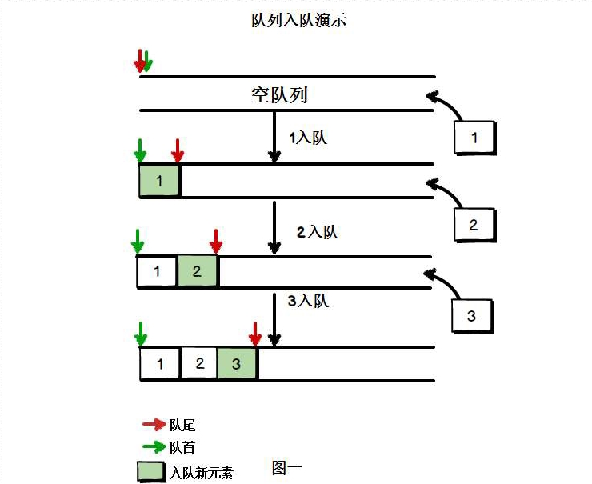
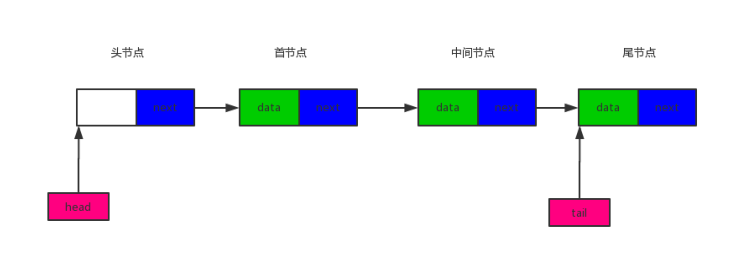
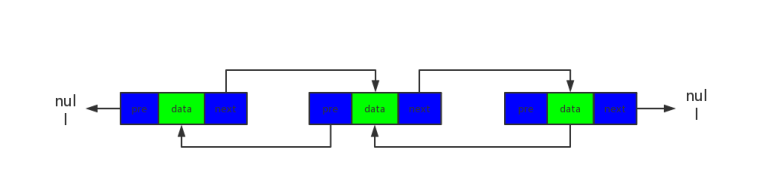

### 栈结构
栈是一种特殊的线性代表, 仅能够在栈顶仅进行操作, 有着先进后出的特性; 


栈的常用方法:
- push      添加一个元素到栈顶
- pop       弹出栈顶元素
- top       返回栈顶元素
- isEmpty   判断栈是否为空
- size      返回栈里元素个数
- clear     清空栈

```javascript
// Stack.js

class Stack{
    constructor(){
        this.stack = [];
    }
    // 添加
    push(ele){
        this.stack.push(ele);
    }
    // 弹出栈顶元素
    pop(){
        return this.stack.pop();
    }
    // 返回栈顶元素
    top(){
        return this.stack[this.stack.length - 1];
    }
    // 判断栈是否为空
    isEmpty(){
        return this.stack.length == 0;
    }
    // 返回栈的大小
    size(){
        return this.stack.length;
    }
    // 清空栈
    clear(){
        this.stack = [];
    }
}
```

#### 合法括号
下面的字符串中包含小括号, 编写函数判断字符串中的括号是否合法, 所谓合法就是括号成对出现 `(` `)`;

```
sdf(ds(ew(we)rw)rwqq)qwewe 
(sd(qwqw)sd(sd)) 
()()sd()(sd()fw))( 
```
分析: 遇到左边的括号就压入栈中, 遇到右边的括号就看一下栈中是否存在左括号, 若存在就弹出栈顶元素, 与右括号消除; 循环结束之后如果栈为空那就说明字符串合法;

```javascript
var isValid = function(str){
    var stack = new Stack();
    for(let i = 0; i < str.length; i++){
        var item = str[i];
        if(item == '('){
            stack.push(item);
        }else if(item == ')'){
            if(stack.isEmpty()) return false;
            stack.pop();
        }
    }
    return stack.isEmpty();
}

/*
console.log(isValid('sdf(ds(kjh(dd)kjh)jkjl)jjlj'));            // true
console.log(isValid('(sdjhg(kjhgj)skjh(hjkkl))'));              // true
console.log(isValid('()()jhghj()(hjgji()lkjfh)('));             // false
*/
```

### 队列
队列是一种特殊的线性表, 其特殊的地方就在于, 它只允许在队列的头部删除元素, 尾部添加新元素; 日常生活中, 排队结账就是队列实例; 



队列方法:
- enqueue       从队列尾部添加一个元素
- dequeue       从队列头部删除一个元素
- head          返回头部元素(不删除)
- size          返回队列大小
- clear         清空队列
- isEmpty       队列是否为空
- tail          返回队列尾部节点

```javascript
class Queue{
    constructor(){
        this.queue = [];
    }
    // 从队列的尾部添加一个元素
    enqueue(item){
        this.queue.push(item);
    }
    // 从队列头部删除一个元素
    dequeue(){
        return this.queue.shift();
    }
    // 返回头部的元素 (不是删除)
    head(){
        return this.queue[0];
    }
    // 返回队列尾部元素
    tail(){
        return this.queue[this.queue.length - 1];
    }
    // 返回队列大小
    size(){
        return this.queue.length;
    }
    // 清除
    clear(){
        this.queue = [];
    }
    // 判断队列是否为空
    isEmpty(){
        return this.queue.length == 0;
    }
}
```
#### 寻路
元素为 0 , 表示这个点可以通过, 元素为 1 , 表示不可以通过, 设置起点为 `maze_array[2][1]`, 终点为  `maze_array[3][5]` ; 用程序计算两点是否相通, 如果相通就输出两点之间最短的距离; (从起点到终点所经过的每一个点);

```javascript
var maze_array = [
    [0,0,1,0,0,0,0],
    [0,0,1,1,0,0,0],
    [0,0,0,0,1,0,0],
    [0,0,0,1,1,0,0],
    [1,0,0,0,1,0,0],
    [1,1,1,0,0,0,0],
    [1,1,1,0,0,0,0]
]
```
分析:从 maze_array[2][1] 开始, 把这个点邻近能到达的点都标记为 1 (表示起始点距离为 1 ), 然后把标记为 1 的点能够到达的邻近点标记为 2 (表示起始点距离为2), 如此处理, 直到到达终点, 或者找不到可以到达的邻近点为止;

```javascript
var Nodes = function(x,y){
    this.x = x;
    this.y = y;
    this.step = 0;
}

var Postions = function(x,y){
    this.x = x;
    this.y = y;
}

function findPostion(pos,maze){
    var x = pos.x;
    var y = pos.y;
    var pos_arr = [];
    // 上
    if(x - 1 >= 0){
        pos_arr.push(new Postions(x - 1, y));
    }
    // 右
    if(y + 1 < maze[0].length){
        pos_arr.push(new Postions(x, y + 1));
    }
    // 下
    if(x + 1 < maze.length){
        pos_arr.push(new Postions(x + 1, y));
    }
    // 左
    if(y - 1 >= 0){
        pos_arr.push(new Postions(x, y - 1));
    }
    return pos_arr;
}

function printNode(maze_node){
    for(var i = 0; i < maze_node.length; i++){
        var arr = [];
        for(var j = 0; j < maze_node[i].length; j++){
            arr.push(maze_node[i][j].step);
        }
        console.log(arr);
    }
}

function findPath(maze,start_pos,end_pos){
    var maze_node = [];
    // 初始化 maze_node 用于记录距离出发点的距离
    for(var i = 0; i < maze_array.length; i++){
        var arr = maze_array[i];
        var node_arr = [];
        for(var j = 0; j < arr.length; j++){
            var node = new Nodes(i,j);
            node_arr.push(node);
        }
        maze_node.push(node_arr);
    }

    // 先把出发点放入队列
    var queue = new Queue();
    queue.enqueue(start_pos);
    var b_arrive = false;
    var max_step = 0;
    while(true){
        // 从队列中弹出一个点, 计算这个点可以到达的位置
        var position = queue.dequeue();
        var pos_arr = findPostion(position,maze);
        for(var i = 0; i < pos_arr.length; i++){
            var pos = pos_arr[i];
            // 判断是否到达终点
            if(pos.x == end_pos.x && pos.y == end_pos.y){
                b_arrive = true;
                max_step = maze_node[position.x][position.y].step;
                break;
            }
            // 起始点
            if(pos.x == start_pos.x && pos.y == start_pos.y) continue;
            // 不能通过
            if(maze[pos.x][pos.y] == 1) continue;
            // 已经标识过步数
            if(maze_node[pos.x][pos.y].step > 0) continue;
            // 这个点的步数 +1
            maze_node[pos.x][pos.y].step = maze_node[position.x][position.y].step + 1;
            queue.enqueue(pos);
        }
        // 到达终点
        if(b_arrive) break;
        // 栈为空, 说明没有路可以到达
        if(queue.isEmpty()) break;
    }

    // 方向查找路径
    var path = [];
    if(b_arrive){
        // 能找到路径
        path.push(end_pos);
        var old_pos = end_pos;
        var step = max_step;
        while(step > 0){
            var pos_arr = findPostion(old_pos,maze);
            for(var i = 0; i < pos_arr.length; i++){
                var pos = pos_arr[i];
                if(maze_node[pos.x][pos.y].step == step){
                    step -= 1;
                    old_pos = pos;
                    path.push(pos);
                    break;
                }
            }
        }
        path.push(start_pos);
    }
    return path.reverse();
}

var start_pos = new Postions(2, 1);
var end_pos = new Postions(3, 5);

console.log(findPath(maze_array,start_pos,end_pos));

/*
*   [
*       { x: 2, y: 1 },
*       { x: 2, y: 2 },
*       { x: 3, y: 2 },
*       { x: 4, y: 2 },
*       { x: 4, y: 3 },
*       { x: 5, y: 3 },
*       { x: 5, y: 4 },
*       { x: 5, y: 5 },
*       { x: 4, y: 5 },
*       { x: 3, y: 5 }
*   ]
*/
```

### 链表
数组不总是数据结构的最佳数据结构, 因为在很多编程语言中, 数组的长度是固定的, 所以当数组被数据填满时, 再要加入新的元素会比较困难, 在数据中再添加和删除也是比较麻烦的(通常需要将数组的其他元素向前或者是向后平移);

链表是由一组节点组成的集合, 每一个节点包含两部分, 一部分是存储数据元素的数据域, 一部分是存储指向下一个节点的指针域;



链表方法:
- append        添加一个新的元素
- insert        在指定位置插入一个新的元素
- remove        删除指定位置的节点
- remove_head   删除首节点
- remove_tail   删除尾结点
- indexOf       返回指定元素的索引
- get           返回指定索引位置的元素
- head          返回首节点
- tail          返回尾部节点
- length        返回链表长度
- isEmpty       判断链表是否为空
- clear         清空链表
- print         打印整个链表


```javascript
function LinkList(){
    // 定义节点
    var Node = function(data){
        this.data = data;
        this.next = null;
    }
    var length = 0;        // 长度
    var head = null;       // 头节点
    var tail = null;       // 尾节点
    // 添加一个新元素
    this.append = function(data){
        // 创建新节点
        var node = new Node(data);
        // 如果是空链表
        if(head==null){
            head = node;
            tail = head;
        }else{
            tail.next = node;       // 尾节点指向新创建的节点
            tail = node;            // tail指向链表的最后一个节点
        }
        length += 1;                // 长度加1
        return true;
    };
    // 返回链表大小
    this.length = function(){
        return length;
    };
    // 获得指定位置的节点
    var get_node = function(index){
        if(index < 0 || index >= length){
            return null;
        }
        var curr_node = head;
        var node_index = index;
        while(node_index-- > 0){
            curr_node = curr_node.next;
        }
        return curr_node;
    };
    // 在指定位置插入新的元素
    this.insert = function(index, data){
        // index == length,说明是在尾节点的后面新增,直接调用append方法即可
        if(index == length){
            return this.append(data);
        }else if(index > length || index < 0){
            // index范围错误
            return false;
        }else{
            var new_node = new Node(data);
            if(index == 0){
                // 如果在头节点前面插入,新的节点就变成了头节点
                new_node.next= head;
                head = new_node;
            }else{
                // 要插入的位置是index,找到索引为index-1的节点,然后进行连接
                var pre_node = get_node(index-1);
                new_node.next = pre_node.next;
                pre_node.next = new_node;
            }
            length += 1;
            return true;
        }
    };
    // 删除指定位置的节点
    this.remove = function(index){
        // 参数不合法
        if(index < 0 || index >= length){
            return null;
        }else{
            var del_node = null;
            // 删除的是头节点
            if(index == 0){
                // head指向下一个节点
                del_node = head;
                head = head.next;
                // 如果head == null,说明之前链表只有一个节点
                if(!head){
                    tail = null;
                }
            }else{
                // 找到索引为index-1的节点
                var pre_node = get_node(index-1);
                del_node = pre_node.next;
                pre_node.next = pre_node.next.next;
                // 如果删除的是尾节点
                if(del_node.next==null){
                    tail = pre_node;
                }
            }

            length -= 1;
            del_node.next = null;
            return del_node.data;
        }
    };
    // 删除尾节点
    this.remove_tail = function(){
        return this.remove(length-1);
    };
    // 删除头节点
    this.remove_head = function(){
        return this.remove(0);
    };
    // 返回指定位置节点的值
    this.get = function(index){
        var node = get_node(index);
        if(node){
            return node.data;
        }
        return null;
    };
    // 返回链表头节点的值
    this.head = function(){
        return this.get(0);
    }
    // 返回链表尾节点的值
    this.tail = function(){
        return this.get(length-1);
    }
    // 返回指定元素的索引,如果没有,返回-1
    // 有多个相同元素,返回第一个
    this.indexOf = function(data){
        var index = -1;
        var curr_node = head;
        while(curr_node){
            index += 1
            if(curr_node.data == data){
                return index;
            }else{
                curr_node = curr_node.next;
            }
        }
        return -1;
    };
    // 输出链表
    this.print = function(){
        var curr_node = head;
        var str_link = ""
        while(curr_node){

            str_link += curr_node.data.toString() + " ->";
            curr_node = curr_node.next;
        }
        str_link += "null";
        console.log(str_link);
        console.log("长度为"+ length.toString());
    };
    // isEmpty
    this.isEmpty = function(){
        return length == 0;
    };
    // 清空链表
    this.clear = function(){
        head = null;
        tail = null;
        length = 0;
    };
};

var list = new LinkList();

list.append("javascript");
list.append('java');
list.append('php');
list.append('python');


list.print();
// javascript ->java ->php ->python ->null
// 长度为4
```

#### 链表实现栈
之前的栈 (Stack) 是基于数组实现的, 有了链表后可以基于链表实现:

```javascript

function Stack(){
    var linklist = new LinkList();
    // 从栈顶添加元素
    this.push = function(item){
        linklist.append(item);
    };
    // 弹出栈顶元素
    this.pop = function(){
        return linklist.remove_tail();
    };
    // 返回栈顶元素
    this.top = function(){
        return linklist.tail();
    };
    // 返回栈的大小
    this.size = function(){
        return linklist.length();
    };
    // 判断是否为空
    this.isEmpty = function(){
        return linklist.isEmpty();
    };
    // 清空栈
    this.clear = function(){
        linklist.clear()
    };
};
```

#### 链表实现队列

```javascript
function Queue(){
    var linklist = new LinkList();
    // 入队列
    this.enqueue = function(item){
        linklist.append(item);
    };
    // 出队列
    this.dequeue = function(){
        return linklist.remove_head();
    };
    // 返回队首
    this.head = function(){
        return linklist.head();
    };
    // 返回队尾
    this.tail = function(){
        return linklist.tail();
    };
    // size
    this.size = function(){
        return linklist.length();
    };
    //clear
    this.clear = function(){
        linklist.clear();
    };
    // isEmpty
    this.isEmpty = function(){
        return linklist.isEmpty();
    };
};
```

#### 双向链表
和单向链表不同的是, 双向链表的每一个节点都多出来一个 `pre` 指针, 指向它的上一个节点;



[双向链表](docs/Algorithm/resouce/链表/doubleLink.md)


### 两数之和
给定一个整数数组 `nums ` 和一个目标值 `target`, 请你在该数组中找出和为目标值的那两个整数, 并返回他们的数组下标.

你可以假设每种输入只会对应一个答案.但是, 你不能重复利用这个数组中同样的元素.

 1. 暴力循环
    ````javascript
    var twoSum = function(nums,target){
        for(var i = 0; i < nums.length; i++){
            for(var j = 0; j < nums.length; j++){
                if(nums[i] + nums[j] == target && i != j){
                    return [i,j];
                }
            }
        }
    }
    console.log(twoSum([5,6,4,7,8,3],10));      // [1,2]
    ````
 2. 空间换时间
    ````javascript
    var twoSum = function(nums,target){
        let obj = {};
        for(let i = 0; i < nums.length; i++){
            let num = nums[i];
            if(num in obj){
                return [obj[num],i];
            }else{
                obj[target-num] = i;
            }
        }
    }
    console.log(twoSum([5,6,2,7,8,3],10));      // [2,4]
    ````

### 斐波那契
斐波那契数列(Fibonacci sequence), 又称黄金分割数列; 通常用 F(N) 表示, 形成的数列成为斐波那契数列, 该数列由 0 和 1 开始, 后面的每一项数字都是前面两项数字的和;

 1. 递归
    ````javascript
    var fib = function(N){
        if(N == 1 || N == 0) return N;
        return fib(N - 1) + fib(N - 2);
    }
    console.log(fib(10));                       // 55
    ````
 2. 递推
    ````javascript
    var cache = [];
    var fib = function(N){
        for(let i = 0; i <= N; i++){
            if(i == 0 || i == 1){
                cache[i] = i;
            }else{
                cache[i] = cache[i - 1] + cache[i - 2];
            }
        }
        return cache[N];
    }
    console.log(fib(10));                       // 55
    ````


