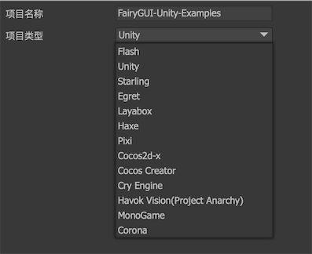
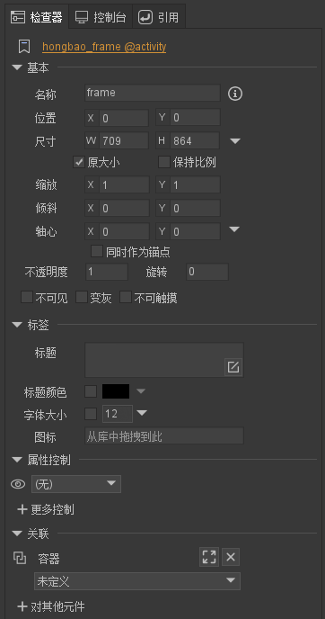
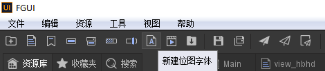
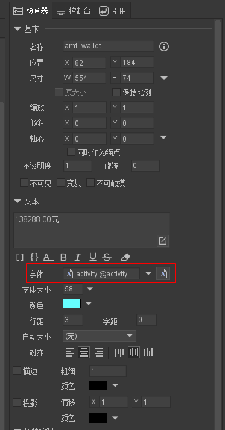
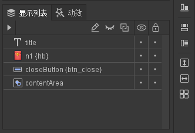
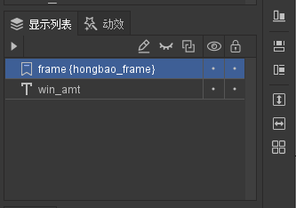

### 概述
工作中无意接触到 `unity` + `fairyGui` 的项目, 一直以为 `fairygui` 是 `unity` 的 ui 库, 后来看它的文档才发现 `fairygui ` 支持主流游戏引擎的跨平台 ui 编辑器; 使用 `fairygui` 开发者可以很快的完成游戏引擎的 ui 界面, 并且部分逻辑不需要开发者用代码实现, 可以提高实际开发项目的开发效率和质量;

更惊喜的是, `fairygui` 可以结合 `PIXI` 引擎实现 h5 端的 ui 效果; 下面是 `fairygui` 和 `PIXI` 的完整笔记; `fairygui` 的编辑器操作这里就不做过多的介绍, 官网的 `demo` 上都基本操作;  

[fairyGui 入门视频教程](https://www.bilibili.com/video/BV1NW411977N?from=search&seid=9645648650131724079)

[fairyGui-PixiJS 示例项目](https://github.com/jcyuan/FairyGUI-PixiJS/releases)

[fairyGui 编辑器官方文档](https://www.fairygui.com/docs/guide/editor/index.html)

### 初始化 pixi 项目

打开 `fairygui` 的编辑器, 点击新建项目, 选择项目类型为 `pixi`; 这里需要注意的是发布的平台不同, 发布结果也不一样, 开发 h5 端就选择 `pixi` 项目类型;



```txt
|-- assets
|-- settings
|-- fairygui.fairy 
```
新建好项目之后, `fairy` 会自动生成上面的目录结构, `.fairy` 为 `fairygui` 编辑器的项目启动文件; `assets` 为资源目录, 在编辑器里面操作的资源(包, 组件, 图片资源等) 都放在这个目录下;


### 包 Package

`fairygui` 是以包为单位组织资源的, 包在文件系统中提现为一个目录, `assets` 目录下每一个子目录都是一个包, 包内的资源是可以设置为导出和不导出的, 只有设置为导出的资源才可以直接在代码里面加载使用;

每一个包里都有一个 `packeage.xml`, 这个是包的数据文件; 项目中用到包的资源的时候需要先加载包, 才能使用;

***Main.ts***
```typescript
class Main extends PIXI.Application {

    private loadingView: LoadingView;
    private contentlayer: fgui.GComponent;
    private stats:{ update:() => void, dom:HTMLElement };

    public constructor() {

        super({
            view: document.querySelector("#canvasContainer canvas") as HTMLCanvasElement,
            backgroundColor: 0xb5b5b5,
            antialias: true
        });

        this.stats = new window["Stats"]();
        document.body.appendChild(this.stats.dom);

        /**global settings */
        fgui.UIConfig.verticalScrollBar = "ui://test/ScrollBar_VT";
        fgui.UIConfig.horizontalScrollBar = "ui://test/ScrollBar_HZ";
        fgui.UIConfig.popupMenu = "ui://test/PopupMenu";
        fgui.UIConfig.globalModalWaiting = "ui://test/GlobalModalWaiting";
        fgui.UIConfig.windowModalWaiting = "ui://test/WindowModalWaiting";

        fgui.GRoot.inst.attachTo(this, {
            designWidth: 1136,
            designHeight: 640,
            scaleMode: fgui.StageScaleMode.FIXED_WIDTH,
            orientation: fgui.StageOrientation.LANDSCAPE,
            alignV: fgui.StageAlign.TOP,
            alignH: fgui.StageAlign.LEFT
        });

        this.contentlayer = new fgui.GComponent();
        fgui.GRoot.inst.addChild(this.contentlayer);

        //test.jpg actually is a binary file but just ends with fake postfix.
        let loader = new fgui.utils.AssetLoader();

        // 这里的资源地址为 fairygui 导出到项目里的路径  test.fgui 编辑器导出的包名, 默认导出后缀为 .fgui, 也可以使用编辑器的自定义扩展名;
        loader.add("test", "images/test.fgui", { loadType: PIXI.loaders.Resource.LOAD_TYPE.XHR, xhrType: PIXI.loaders.Resource.XHR_RESPONSE_TYPE.BUFFER })
            .add("test@atlas0", "images/test@atlas0.png")
            .add("test@atlas0_1", "images/test@atlas0_1.png")
            .add("test@atlas0_2", "images/test@atlas0_2.png")
            .add("test@atlas0_3", "images/test@atlas0_3.png")
            .add("test@atlas0_4", "images/test@atlas0_4.png")
            .on("progress", this.loadProgress, this)
            .on("complete", this.resLoaded, this)
            .load();
    }

    private loadProgress(loader: PIXI.loaders.Loader): void {
        let p = loader.progress;
        console.log(p);
    }

    private resLoaded(loader: PIXI.loaders.Loader): void {

        loader.destroy();
        // 加载一个ui包
        fgui.UIPackage.addPackage("test");
        // 从资源包实例化一个场景, test 为包名, main 为导出的组件入口名;
        let ins = fgui.UIPackage.createObject("test", "main") as fgui.GComponent;
        ins.setSize(fgui.GRoot.inst.width, fgui.GRoot.inst.height);
        ins.addRelation(fgui.GRoot.inst, fgui.RelationType.Size);
        this.contentlayer.addChild(ins);
        
    }
}
```
### 组 Group
在场景中选定多个元素或者是组件, 按 `ctrl + G` 键就可以将多个元素合并成一个组, `fairygui` 的组分为 `普通组` 和 `高级组`;

普通组的作用一般是将场景中某个功能模块的所有组件合并在一起, 便于对组件进行查找, 移动等操作;

高级组除了有普通组的所有功能以外, 还可以像普通组件一样可以设置关联和属性控制; 高级组具有简单的布局功能, 能对一个组内的元素进行水平布局和垂直布局, 可以很轻松的搭建出 ui 界面;

代码里面对组操作的 api:

```typescript
const group:fgui.GGroup = ins.getChild("n3") as fgui.GGroup;
const cnt = ins.numChildren;

for(let i = 0; i < cnt; i++){
    if(ins.getChildAt(i) == group){
        // todo
    }
}
```
还可以直接使用 `getChildInGroup` 方法, 直接查找某个组内的元素:

```typescript
const text:fgui.GTextField = ins.getChildInGroup("text",ins.getChild("n3") as fgui.GGroup) as fgui.GTextField;
```

### 组件 Component

组件是 `fairygui` 的基础容器, 一个组件可以包含一个或者是多个显示的对象, 也可以包含任意组件;

点击编辑器内的空白处, 就可以看到右边的检查器面板上的组件属性; 编辑器内可以对组件进行大小, 位置等操作;



`fairygui` 内置了许多开发中常用的组件, `按钮`, `列表`, `文本`, `图形`, `装载器` 等; 操作 `fgui` 的需要先让 `loader` 加载完成之后才能进行操作;

```typescript
const main:fgui.GComponent = ins.getChildInGroup("view",ins.getChild("views") as fgui.GGroup) as fgui.GComponent;

// 设置组件是否可见
main.visible = true;
```
`GObject` 为 `fgui` 的基类, `GComponent` 继承自 `GObject`, 也是每个组件的基类, 所有的组件都是继承自 `GComponent`; 上面的语句是从组 `views` 里面获取元素将元素转换为 `GComponent`;


### 文本组件 TextField

文本组件是 `fairygui` 的基础控件之一, 不支持交互; 文本组件支持动态创建, 例如:

```typescript

const text:fgui.GTextField = new fgui.GTextField();
text.setSize(100,100);
text.text = "这是动态创建的文本";

```
还可以对 fgui 导出的模块进行操作:

```typescript
const text:fgui.GTextField = ins.getChild("text") as fgui.GTextField;
text.text = "这是对fgui导出的组件进行操作";
text.color = 0x66FF00;
```
除了编辑器里面对文字设置的样式外, 我们还可以使用位图字体, 顾名思义是将图片资源制作成位图, 然后将资源拖拽给编辑器检查器栏里面的字体;

点击菜单栏上的新建位图字体; 



使用的时候只需要将制作好的字体资源拖给文本组件, 就可以对字体进行美化了; 通常这种场景用在计分板, 对数字进行美化操作;



### 控制器 Controller
控制器是 `fairygui` 核心功能之一, 它为 ui 制作提供了便捷的操作界面的功能; 需要注意的是, 控制器只在当前组件内有效;

操作控制器的 api:

```typescript
const ctrl = ins.getController("ctrl");

// 监听控制器切换事件
ctrl.on(fgui.StateChangeEvent.CHANGED,e =>{
    console.log(e)
})

// 代码主动切换控制器选项
ctrl.setSelectedIndex(1);
```

### 按钮 Button

按钮组件也是 `fairygui` 里常用的组件, `fairy` 提供了不同的按钮功能, `普通按钮`, `复选按钮`, `单选按钮`; 按钮也是用户交互行为的基础元素, 可以通过属性面板里面对按钮添加点击效果, 音效等;

按钮常用操作 api：

```typescript
const btn:fgui.GButton = ins.getChild("btn_back") as fgui.GButton;

// 为按钮添加点击事件
btn.click(e=>{
    // todo
})

// 单选按钮设置选中
btn.selected = true;

// 设置组件为禁用状态, fairygui 会将组件置灰;
btn.enabled = false;
```

### 列表 List
列表是组件的一种特殊扩展, 在编辑器中场景的侧边栏上点击列表就可以直接新建一个列表; 列表对应的类型是 `GList`, `GList` 也是从 `GComponent` 派生来的, 所以可以直接使用 `GComponent` 的 api 直接访问列表内容;

在实际应用中, 列表的内容通常被频繁的更新, 典型的用法是当接收到后台数据的时候, 先清空列表, 然后在重新添加列表项渲染, 如果每次都创建和销毁 ui 对象, 将消耗很多的内存, 因此 `GList` 内建了对象池;

`AddItemFromPool`: 从对象池里面取出或新建一个对象添加到列表中, 如果不使用参数, 则使用列表的项目资源设置; 也可以指定 url 创建指定对象;

`GetFromPool`: 从对象池里面取出或新建一个对象;

`ReturnToPool`: 将对象返回给对象池;

`RemoveChildToPool`: 删除一个 item, 并将对象返回对象池;

`RemoveChildToPoolAt`: 删除指定位置的 item, 并将对象返回对象池;

`RemoveChildrenToPool`: 删除所有的 item, 并将对象返回对象池;

列表常用 api:

```typescript
let list: fgui.GList = ins.getChild("list") as fgui.GList;
list.removeChildrenToPool();
const testNames: string[] = ["iOS", "Android", "WinPhone", "PC", "Mac", "Unknown"];
const testColors: number[] = [0xFFFF00, 0x660033, 0xFFFFFF, 0x123456];
testNames.forEach((n, i) => {
    // 这一步的时候, 列表里面已经有数据, 下面的操作是修改 每个 item 里面的数据
    let item: fgui.GButton = list.addItemFromPool() as fgui.GButton;
    item.getChild("t0").text = String(i + 1);
    item.getChild("t1").text = testNames[i];
    (item.getChild("t2") as fgui.GTextField).color = testColors[Math.floor(Math.random() * 4)];
    (item.getChild("star") as fgui.GProgressBar).value = (Math.floor(Math.random() * 3) + 1) / 3 * 100;
});
```


### 弹窗 Window

`fairygui` 的窗口比较特殊, 编辑器内没有窗口的概念, 因为窗口可以设置任意组件作为它的显示内容; 一个完整的窗口通常需要放置一个名为 `frame` 的组件, 这个组件作为窗口的背景或者是框架; 这个组件的扩展通常为一个 `标签`;

新建一个标签, 设置名称为 `frame`, 这个标签包含:

`closeButton`:  一个名为 `closeButton` 的按钮, `fairygui` 内部处理为当点击这个按钮的时候, 关闭窗口;

`dragArea`: 一个名为 `dragArea` 的图形, 将自动设置为窗口的拖拽区域, 当用户鼠标点击当前区域内并安装拖动时, 窗口随之被拖动; 

`contentArea`: 一个名为 `contentArea` 的空白图形, 如果用户需要操作窗口里面的内容, 那内容区必须在 `contentArea` 内;



新建组件, 将新建好的 `frame` 放在组件上, 并命名为 `frame`;



这样一个完整的窗口组件就制作完了; 在代码里面我们如果需要对窗口进行操作:

***Window.ts***
```typescript
export class WindowA extends fgui.Window {
    public constructor() {
        super();
    }

    protected onInit(): void {
        // 第一个参数为 fairygui 导出的包名, 第二个参数为 编辑器内制作的组件名
        this.contentPane = fgui.UIPackage.createObject("packeageName", "WindowComponentName") as fgui.GComponent;
        this.center();
    }

    protected onShown(): void {
        // 如果窗口内包含 contentArea , 就可以使用 this.contentPane 来对内容进行操作;
        this.contentPane.getChild("text").text = "这是窗口内的内容啊~";
    }
}
```
其他组件如果需要使用窗口:

***component.ts***
```typescript
import { WindowA } from './Window.ts'

class Main extends PIXI.Application{
    private Window:fgui.Window

    constructor(ins:fgui.GComponent){
        super();
        this.Window = new WindowA();
        this.initClicks();
    }

    private initClicks():void{
        this.getChild("btn_model").click(e =>{
            this.Window.modal = true;
            this.Window.show();
        })
    }
}
```

上面是在编辑器里面制作 window 组件, 我们还可以将任意组件加到 GRoot 上当做 window 组件弹出; 这类界面的特点是在游戏底层, 且比较固定; 操作 api 为:

```typescript
export default class ViewJbcj extends fgui.GComponent{
    private ins:fgui.GComponent;
    private main:fgui.GComponent;
    private keyborad:fgui.Window;

    constructor(ins:fgui.GComponent){
        super();
        this.ins = ins;
        this.main = ins.getChildInGroup("view_jbcj",ins.getChild("views") as fgui.GGroup) as fgui.GComponent;
        this.keyborad = fgui.UIPackage.createObject("activity","Keyborad") as fgui.Window;

        this.init();
    }

    /**
     * 页面初始化
     */
    private init():void{
        this.initClicks();
    }

    /**
     * 初始化点击事件
     */
    private initClicks():void{

        // 点击按钮弹出弹框
        this.main.getChild("btn_towallet").click(e =>{
            
            fgui.GRoot.inst.showWindow(this.keyborad);
            // fgui.GRoot.inst.addChild(this.keyborad);

            // 弹出框遮罩点击
            this.keyborad.getChild("mask").removeAllListeners();
            this.keyborad.getChild("mask").click(ev =>{

                fgui.GRoot.inst.hideWindow(this.keyborad);
                //fgui.GRoot.inst.removeChild(this.keyborad);
            })
        })
    }
}
```