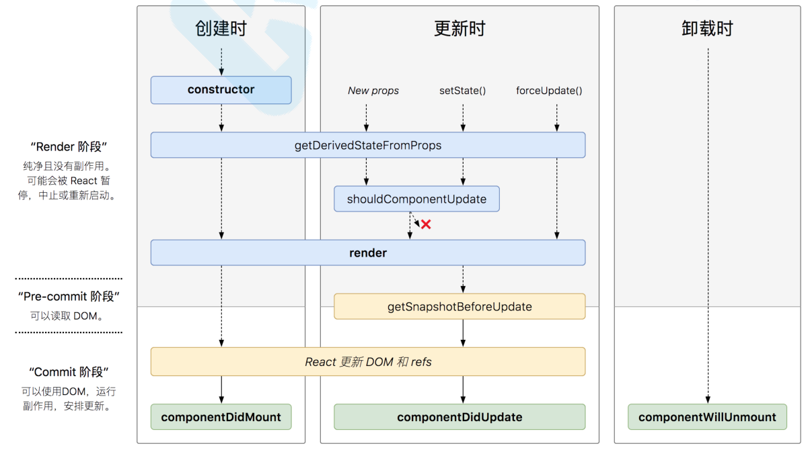
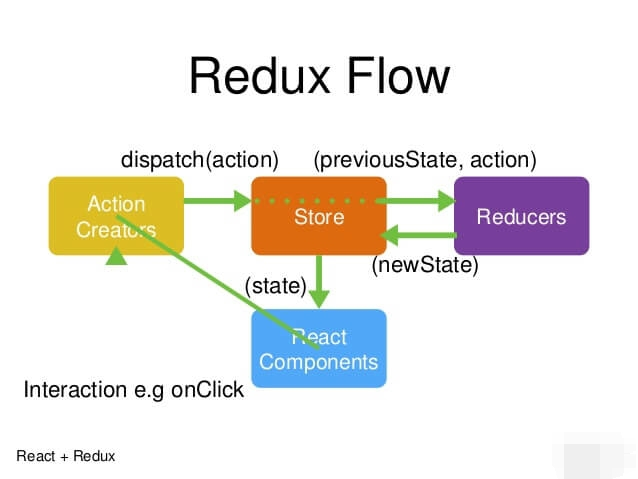
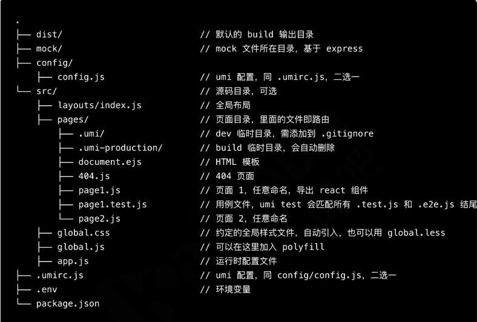

### 概述
[react 揭秘](https://react.iamkasong.com/#%E7%AB%A0%E8%8A%82%E5%88%97%E8%A1%A8)
[react 小书](http://huziketang.mangojuice.top/books/react/lesson1)
[react redux](http://cn.redux.js.org/docs/basics/UsageWithReact.html)
[react router](http://react-guide.github.io/react-router-cn/docs/Introduction.html)
[mobx](https://cn.mobx.js.org/)
[dva](https://dvajs.com/guide/concepts.html)
[dva知识地图](https://dvajs.com/knowledgemap/#%E5%BC%82%E6%AD%A5%E8%AF%B7%E6%B1%82)
[react hooks](https://juejin.cn/post/6850418117534253069)

> 这里记录的是 `react` 开发中遇到的问题, [`react-native`](docs/Web/React/react-native.md)环境;

在[`webpack`](docs/Web/Webpack/index.md) 配置里面, 我们可以通过`webpack` 来构建一个 `react` 的开发环境; 不过这里推荐使用 `Facebook` 官方推荐的脚手架工具 `create-react-app`;

Create React App 是一个官方支持的创建 React 单页应用程序的方法;

`````bash
# 全局安装脚手架工具
npm install create-react-app -g

# 用脚手架创建一个 my-project 的工程目录
create-react-app my-project
`````
### JSX
JSX是⼀一种JavaScript的语法扩展, 其格式⽐比较像模版语⾔言, 但事实上完全是在 JavaScript 内部实现的;

#### 表达式
`{ }` 为 jsx 的表达式;
````javascript
const name = "react";
const jsx = <h2>{name}</h2>
````

jsx 中, 函数也是合法的表达式:
````javascript
const user = {
    firstName:"Tom",
    lastName:"Jerry"
}

function GetName(user){
    return user.firstName + ' ' + user.lastName;
}

const jsx = <h2>{GetName(user)}</h2>
````

条件语句也可以基于上面的结论实现:
````javascript
const show = true;
const title = show ? <h2>这是显示的title</h2> : null;
const jsx = (
    <div>
        { title }
    </div>
)
````

数组也可以作为一组子元素, 数组中存放一组 jsx 可用于显示列表:
````javascript
const arr = [1,2,3].map(num =>{ <li key={num}>{num}</li> });
const jsx = (
    <div>
        <ul>
            { arr }
        </ul>
    </div>
)
````

### 组件
组件是抽象的独⽴立功能模块, react应⽤用程序由组件构建⽽而成; 组件有两种形式, `class` 组件和  `function ` 组件;

#### 生命周期


````javascript
import React, { Component } from "react";

export default class LifeCyclePage extends Component {
    constructor(props) {
        super(props);
        this.state = {
            counter: 0
        };
    }
    // 组件即将挂载的时候执行
    componentWillMount() {
      console.log("componentWillMount", this.state);
    }
    // 组件挂载完成之后执行
    componentDidMount() {
        console.log("componentDidMount", this.state);
    }
    // 组件更新之前执行
    componentWillUpdate(nextProps, nextState) {
      console.log("componentWillUpdate", this.state, nextState);
    }
    // 组件更新之后执行
    componentDidUpdate() {
        console.log("componentDidUpdate", arguments);
    }
    // 组件更新之前先判断一下, 如果返回值时 false , 则后面的 render 不再执行; 常用于页面优化
    shouldComponentUpdate() {
        const { counter } = this.state;
        console.log("shouldComponentUpdate", this.state);
        return counter !== 3;
    }
    setCounter = () => {
        this.setState({
            counter: this.state.counter + 1
        });
    };
    render() {
        const { counter } = this.state;
        return (
            <div>
                <button onClick={this.setCounter}>{counter}</button>
                {!!(counter % 2) && <Foo counter={counter} />}
            </div>
        );
    }
}

class Foo extends Component {
    // 组件即将卸载之前执行
    componentWillUnmount() {
        console.log("componentWillUnmount");
    }
    render() {
        const { counter } = this.props;
        return (
            <div>
                <p>{ counter }</p>
            </div>
        );
    }
}
````
以上是 v17 版本之前的生命周期, v17 版本之后又引入了两个新的生命周期: `static getDerivedStateFromProps`, `getSnapshotBeforeUpdate`;



原来( React v16.0前) 的生命周期在 React v16 推出的 `Fiber`之后就不不合适了, 因为如果要开启 `async rendering`, 在 `render` 函数之前的所有函数, 都有可能被执行多次;

如果开发者开了`async rendering`, 而且又在以上这些 `render` 前执行的生命周期方法做 `AJAX` 请求的话, 那 `AJAX` 将被无谓地多次调用. 明显不是我们期望的结果, 而且在   `componentWillMount` 里发起 `AJAX`, 不管多快得到结果也赶不不上首次 `render`, 而且 `componentWillMount` 在服务器端渲染也会被调用到, 这样的 IO 操作放在  `componentDidMount` 里更合适;

所以除了 `shouldComponentUpdate`, 其他在 `render` 函数之前的所有函数 ( `componentWillMount`, `componentWillReceiveProps`, `componentWillUpdate` ) 都被`getDerivedStateFromProps` 替代;

````javascript
import React, { Component } from "react";

export default class LifeCyclePage extends Component {
    constructor(props) {
        super(props);
        this.state = {
            counter: 0
        };
    }
    
    static getDerivedStateFromProps(props, state) {
        console.log("getDerivedStateFromProps", state);
        return state.counter < 6 ? null : { counter: 0 };
    }

    // return 回去的参数将传递给 componentDidUpdate 函数;
    getSnapshotBeforeUpdate(prevProps, prevState) {
        console.log("getSnapshotBeforeUpdate", prevState);
        return { ...prevState, omg: "omg" };
    }

    // 这里的 arguments 就是  getSnapshotBeforeUpdate 的返回值;
    componentDidUpdate() {
        console.log("componentDidUpdate", arguments);
    }

    setCounter = () => {
        this.setState({
            counter: this.state.counter + 1
        });
    };
    render() {
        const { counter } = this.state;
        return (
            <div>
                <button onClick={this.setCounter}>{counter}</button>
            </div>
        );
    }
}
````
> `getDerivedStateFromProps` 会在调用 `render` 方法之前调用, 并且在初始挂载及后续更新时都会被调用. 它返回⼀个对象来更新state, 如果返回 null 则不更新任何内容;

`getSnapshotBeforeUpdate(prevProps, prevState)` 在 `render`之后, 在 `componentDidUpdate` 之前执行; 要和 `componentDidUpdate` 配合使用; 此生命周期的任何返回值都会作为参数传递给 `componentDidUpdate`;

#### class 组件
class 组件通常拥有状态和⽣生命周期, 继承于 Component, 实现 render ⽅方法;
````javascript
import React , {Component} from "react";

export default class ClassComponent extends Component{
    constructor(props){
        super(props);
        this.state = {
            date:new Date()
        }
    }

    componentDidMount(){
        this.timer = setInterval(()=>{
            this.setState({
                date:new Date()
            })
        },1000)
    }

    componentWillUnmount(){
        clearInterval(this.timer);
    }

    render(){
        const { date } = this.state;
        return(
            <div>
                { date.toLocaleTimeString() }
            </div>
        )
    }
}
````
#### setState 特性
+ 用 setState 设置状态, 而不能直接改变状态; 
````javascript
this.state.counter += 1;   // 错误的
````
+ setState 是批量执行的, 因此对同一状态执行多次只有一次起作用, 多个状态更新可以放在同一个 setState 中进行;
````javascript
// 假如couter初始值为0，执⾏行行多次以后其结果是多少？
this.setState({counter: this.state.counter + 1});
this.setState({counter: this.state.counter + 2});
````
+ setState 通常是异步的, 因此如果要获得到最新的状态值有以下三种方法:

 1. 传递函数给 setState 方法:

    ````javascript
    this.setState(nextState => ({
        counter:nextState.counter + 1
    }));// 1
    this.setState(nextState => ({
        counter:nextState.counter + 1
    }));// 2
    this.setState(nextState => ({
        counter:nextState.counter + 1
    }));// 3
    ````
 2. 使用定时器

    ````javascript
    componentDidMount(){
        setTimeout(()=>{
            this.changeValue();
        },0)
    }
    changeValue = () => {
        this.setState({
            counter: this.state.counter + 1
        })
        console.log(this.state.counter)
    }
    ````

 3. 原生事件中修改
    ````javascript
    componentDidMount(){
        document.body.addEventListener('click',this.changeValue, false);
    }
    changeValue = () => {
        this.setState({
            counter: this.state.counter + 1
        })
        console.log(this.state.counter)
    }
    ````
> setState 只有在合成事件和生命周期函数中是异步的, 在原生事件和setTimeout中都是同步的, 这里的异步其实是批量更新;


#### function 组件
函数组件通常无状态, 仅关注内容展示, 返回渲染结果即可;

````javascript
import React from 'react';

function App() {
    return (
        <div className="App">
            <ClassComponent/>
        </div>
    );
}
export default App;
````
#### 函数组件中的状态处理
函数组件通过 `hooks api `维护状态;

````javascript
import React, {useState,useEffect} from 'react';

export default function (props){
    const [date,setDate] = useState(new Date());
    const [counter,setCounter] = useState(0);

    // 第二个参数 [] 代表不需要重复执行; 不写就相当于 update 函数, 每次组件更新都执行; 
    useEffect(()=>{
        const timer = setInterval(()=>{
            setDate(new Date());
        },1000) 
        // 组件卸载的时候执行 return;
        return ()=> clearInterval(timer);
    },[])

    return(
        <div>
            { date.toLocaleTimeString() }
            <button onClick={()=>{ setCounter(counter + 1) }}> { counter }</button>
        </div>
    )
}
````
`useState` 函数返回两个变量, 第一个变量是 `state` 状态, 第二个是修改 `state` 状态的方法;

可以把 `useEffect` `Hook` 看做 `componentDidMount` , `componentDidUpdate` 和 `componentWillUnmount` 这三个函数的组合;

第二个参数的数组里面可以添加依赖项, 表示依赖的变量变化的时候需要重新执行一次
````javascript
//...
useEffect(()=>{
    const timer = setInterval(()=>{
        setDate(new Date());
    },1000) 
    // 组件卸载的时候执行 return;
    return ()=> clearInterval(timer);
},[counter])
//...
````

#### 事件处理
react 中使用 onXXX 写法来监听事件; 例如用户输入事件;

````javascript
import React, {Component} from 'react';

export default class Serch extends Component{
    constructor(args){
        super(args);
        this.state = {
            name:""
        }
    }

    submit = ()=>{
        console.log(this.state.name)
    }

    onChange(e){
        this.setState({
            name:e.target.value
        })
    }

    render(){
        return(
            <div>
                <input value={this.state.name} onChange={(e)=>{this.onChange(e)}}/>
                <button onClick={ this.submit }>按钮</button>
            </div>
        )
    }
}
````
react里遵循单向数据流, 没有双向绑定, 输⼊入框要设置 `value` 和 `onChange`, 称为受控组件;

>受控组件绑定 `value` 的方式和 `vue` 不一样, 如果要给受控组件绑定 `value` , 就需要添加一个 `onChange` 事件

事件回调函数注意绑定 `this` 指向, 常⻅见三种⽅方法:
+ 1. 构造函数中绑定并覆盖:
    ````javascript
    //...
    constructor(args){
        super(args);
        this.state = {
            name:""
        }
        this.onChange = this.onChange.bind(this);
    }
    onChange(e){
        this.setState({
            name:e.target.value
        })
    }
    //...
    ````
    或 `apply` 和 `bind`;
    ````javascript
    <button onClick={() => this.submit.apply(this)}>提交</button>
    <button onClick={() => this.submit.call(this)}>提交</button>
    ````
+ 2. 将方法定义为箭头函数:
    ````javascript
    submit = ()=>{
        console.log(this.state.name)
    }
    //...
    <button onClick={ this.submit }>按钮</button>
    //...
    ````
+ 3. 事件中定义直接写表达式:
    ````javascript
    <input value={this.state.name} onChange={(e)=>{this.onChange(e)}}/>
    ````
### 组件通信

#### Props 属性传递
Props 属性传递可⽤用于⽗父⼦子组件相互通信;

````javascript
// index.js
ReactDOM.render(<App title="这是组件传递的数据" />,
document.querySelector('#root'));

// App.js
<h2>{this.props.title}</h2>
````
如果⽗父组件传递的是函数, 则可以把子组件信息传入父组件, 这个常称为状态提升;

***app.js***
````javascript
import React from 'react';
import Serch from './components/serch';

function call(args){
    console.log(args);
}

function App() {
    return (
        <div className="App">
            <Serch Func={ call }/>
        </div>
    );
}

export default App;
````

***serch.js***
````javascript
import React, {Component} from 'react';

export default class Serch extends Component{
    submit = ()=>{
        this.props.Func("这是子组件内调用的");
    }

    render(){
        return(
            <div>
                <button onClick={ this.submit }>按钮</button>
            </div>
        )
    }
}
````
#### 组件跨层级通信 Context

`React` 中使用 `Context` 实现祖代组件向后代组件跨层级传值. `Vue` 中的 `provide & inject` 来源于 `Context`

在 `Context` 模式下有两个角色:
+ Provider: 外层提供数据的组件;
+ Consumer: 内层获取数据的组件;

***App.js***
````javascript
import React from 'react';
import HomePage from './pages/HomePage';

const Context = React.createContext();
const Provider = Context.Provider;
const Consumer = Context.Consumer;

const store = {
    user:{
        name:"小明"
    }
}

function App() {
    return (
        <div className="App">
            <Provider value = { store }>
                <Consumer>
                    {
                        ctx => (
                            <>
                                <div>{ store.user.name }</div>
                                <HomePage { ...ctx }/>
                            </>
                        )
                    }
                </Consumer>
            </Provider>
        </div>
    );
}
export default App;
````

***HomePage.js***
````javascript
import React, { Component } from 'react';

export default  class extends Component {
    constructor(props) {
        super(props);
        console.log(this.props);
    }
    render() { 
        return ( 
            <div>
                HomePage
            </div>
        )
    }
}
````
在 `React` 的官方文档中, `Context` 被归类为高级部分 `(Advanced)`, 属于 `React` 的高级 `API`, 但官方并不建议在稳定版的 App 中使用 `Context`;

不过, 这并非意味着我们不需要关注 `Context`. 事实上, 很多优秀的 `React ` 组件都通过 `Context` 来完成自己的功能, 比如 `react-redux` 的 `<Provider />` , 就是通过 `Context`  提供一个全局态的 `store` , 路由组件 `react-router` 通过 `Context`  管理路由状态等等. 在 `React` 组件开发中, 如果用好 `Context`, 可以让你的组件变得强大, 而且灵活;

范例: 模拟 `redux` 存放全局状态, 在组件间共享:

***AppContext.js***
````javascript
import React, { Component } from 'react'

export const Context = React.createContext()
export const Provider = Context.Provider
export const Consumer = Context.Consumer
````

***App.js***
````javascript
import React from 'react';
import Home from './pages/Home'
import User from './pages/User'
import { Provider } from './AppContext' //引入Context的Provider

const store = {
    home: {
        imgs: [
            {
                "src": "//m.360buyimg.com/mobilecms/s700x280_jfs/t1/49973/2/8672/125419/5d679259Ecd46f8e7/ 0669f8801dff67e8.jpg!cr_1125x445_0_171!q70.jpg.dpg"
            }
        ]
    },
    user: {
        isLogin: true,
        userName: "Rabbit"
    }
}
function App() {
    return (
        <div className="app">
            <Provider value={ store }>
                <Home />
            </Provider>
        </div>
    );
}
export default App;
````

***Home.js***
````javascript
import React, { Component } from 'react'
import { Consumer } from '../AppContext';

export default class Home extends Component {
    render() {
        return (
            <Consumer>
                {
                    ctx => <HomeCmp {...ctx} />
                }
            </Consumer>
        )
    }
}
function HomeCmp(props) {
    const { home, user } = props
    const { isLogin, userName } = user
    return (
        <div>
            {
                isLogin ? userName : '登录'
            }
        </div>
    )
}
````

***User.js***
````javascript
import React, { Component } from 'react'
import { Consumer } from '../AppContext';
import TabBar from '../components/TabBar';

export default class User extends Component {
    render() {
        return (
            <>
                <Consumer>
                    {
                        ctx => <UserCmp {...ctx} />
                    }
                </Consumer>
                <TabBar />
            </>
        )
    }
}
function UserCmp(props) {
    const { home, user } = props
    const { isLogin, userName } = user
    return (
        <div>
            {
                isLogin ? userName : '登录'
            }
        </div>
    )
}
````

***TabBar.js***
````javascript
import React from 'react'
import { Consumer } from '../AppContext';

export default function TabBar() {
    return (
        <div>
            <Consumer>
                {
                    ctx => <TabBarCmp {...ctx} />
                }
            </Consumer>
        </div>
    )
}
function TabBarCmp(props) {
    const { home, user } = props
    const { isLogin, userName } = user
    return (
        <div>
            {
                isLogin ? userName : '登录'
            }
        </div>
    )
}
````

### 高阶组件
为了提高组件复用率, 可测试性, 就要保证组件功能单一性; 但是若要满足复杂需求就要扩展功能单一的组件, 在 `React` 里就有了 `HOC(Higher-Order Components)`的概念;

>定义: 是一个函数, 它接收一个组件并返回另一个组件, 该组件必须是 function 组件或者是 class 组件;

````javascript
import React, { Component } from 'react';

// 高阶组件就是一个函数, 接收一个组件并返回一个组件
function Child(props){
    return <div>Child + { props.name }</div>
}

/*const foo = Cmp =>{
    return props =>{
        return(
            <div>
                <Cmp { ...props }/>
            </div>
        )
    }
}*/

// 上面的函数可以简写为
const foo = Cmp => props =>{
    return(
        <div>
            <Cmp { ...props }/>
        </div>
    )
}

export default class HocPage extends Component{
    
    render(){
        const Comp = foo(Child);
        return(
            <div>
                <h1>HocComponent</h1>
                <Comp name="高阶组件"/>
            </div>
        )
    }
}
````
#### 链式调用
链式调用的好处是可以将组件进行颗粒化, 可以给基础组件增强功能; 
````javascript
import React from 'react'
function Child(props) {
    return <div>Child</div>
}
const foo = Cmp => props => {
    return (
        <div style={{ background: 'red' }}>
            <Cmp {...props} />
        </div>
    )
}
const foo2 = Cmp => props => {
    return (
        <div style={{ border: 'solid 1px green' }}>
            <Cmp {...props} />
        </div>
    )
}
// 将 foo 组件再进行包装一次;
const Foo = foo2(foo(Child))
export default function HocPage() {
    return (
        <div>
            HocPage
            <Foo />
        </div>
    )
}
````
> 链式调用的弊端是如果层级太多, 对后面的代码比较难维护; 所以就有了装饰器的写法;
#### 装饰器
装饰器只能用于 Class 组件, 不能在函数组件上使用;

高阶组件本身是对装饰器模式的应用, 自然可以利用 `ES7` 中出现的装饰器语法来更优雅的书写代码; 但是我们需要先修改项目配置:

1. 弹出 webpack 配置
````bash
yarn eject
# 这一步如果报错的话, 就看以下我们本地的文件里面有一个 .gitignore , 我们需要将本地的文件添加到版本控制再执行这个命令
# git add --all
# git commit -m "..."
# yarn eject
````
2. 在 `package.json` 里面添加以下代码:
````json
"babel":{
    "presets":[
        "react-app"
    ],
    "plugins":[
        [
            "@babel/plugin-proposal-decorators",
            {
                "legacy": true
            }
        ]
    ]
}
````
3. 安装装饰器插件
````bash
yarn add @babel/plugin-proposal-decorators
````
4. 如果介意`vscode`的 `warning`, vscode设置里加上:
````json
"javascript.implicitProjectConfig.experimentalDecorators": true
````
> `create-react-app` 项目中默认不支持 js 代码使用装饰器语法, 可以修改后缀名为 tsx 则可以直接支持;

上面的高阶组件可以修改为:
````javascript
import React, { Component } from 'react';

const foo = Cmp => props =>{
    return(
        <div>
            <Cmp { ...props }/>
        </div>
    )
}

@foo
class Child extends Component{
    render(){
        return (
            <div>Child + { this.props.name }</div>
        )
    }
}

export default class HocPage extends Component{
    
    render(){
        return(
            <div>
                <h1>HocComponent</h1>
                <Child name="message"/>
            </div>
        )
    }
}
````
#### 处理原生 Dom 标签
高阶组件的定义是, 必须接受 function 组件和 class 组件, 如果我们需要对原生的 dom 标签进行包装, 就要使用 `React.cloneElement()` 或 `React.createElement()` 方法;

````javascript
import React, { Component } from 'react';

const FuncComp = cmp =>{
    // 1. 直接返回原生标签
    // return cmp;

    // 2. React.cloneElement()
    // return React.cloneElement(cmp, {
    //     className:"border"
    // })

    // 3. React.createElement()
    // return React.createElement(cmp.type,{
    //     ...cmp.props,
    //     className:"border"
    // })

    // 4. 
    return <cmp.type {...cmp.props}>
}
````
#### 高阶组件复写 Context

***AppContext.js***
````javascript
import React from 'react';
// @ts-ignore
export const Context = React.createContext();
export const Provider = Context.Provider;
export const Consumer = Context.Consumer;

export const CtxComp = Cmp => props =>{
    return (
        <Consumer>
            {
                ctx => <Cmp {...props} {...ctx}/>
            }
        </Consumer>
    )
}
````

***HomePage.js***
````javascript
import React , { Component } from 'react';
import { CtxComp } from '../AppContext';

function RangeComp(props){
    return(
        <div className="component">
            自定义组件 {JSON.stringify(props)}
        </div>
    )
}

export default class ContextFun extends Component{
    render(){
        const HandleView = CtxComp(RangeComp);
        return(
            <div>
                <HandleView/>
            </div>
        )
    }
}
````

***App.js***
````javascript
//...
render(){
    return(
        <Provider value={ store }>
            <Home/>
        </Provider>
    )
}
````
这样, 我们就将 `Consumer` 包装成了一个高阶组件, 可以在任何组件里面使用了;

### 复合组件
复合组件给与你足够的敏捷去定义自定义组件的外观和行为, 这种方式更明确和安全. 如果组件间有公用的非 UI 逻辑, 将它们抽取为 JS 模块导入使用而不是继承它;

#### 基本使用(匿名插槽)
基本用法跟 vue 的插槽 (slot) 的用法差不多;

***App.js***
````javascript
import Layout from './components/Layout';

function App() {
    return (
        <div className="App">
            <Layout>
                <h2>这是APP组件的内容</h2>
                <div className="content">随便写点什么内容</div>
            </Layout>
        </div>
    );
}
export default App;
````
***Layout.js***
````javascript
import React, { Component } from 'react';

export default class Layout extends Component{
    render(){
        return(
            <div>
                { this.props.children }
            </div>
        )
    }
}
````
#### 具名插槽
很多时候我们的业务需要将多个不同的元素放入一个 Layout 容器内, 这个时候就可以用到具名插槽;
***App.js***
````javascript
import Layout from './components/Layout';

function App() {
    return (
        <div className="App">
            <Layout>
                {{
                    header:<span>头部</span>,
                    content:"内容",
                    btn:<button>确认</button>
                }}
            </Layout>
        </div>
    );
}
export default App;
````
***Layout.js***
````javascript
import React, { Component } from 'react';

export default class Layout extends Component{
    render(){
        const { children } = this.props;
        return(
            <div>
                <header>
                    { children.header }
                </header>
                <div className="main">{ children.content } </div>
                <footer> { children.btn } </footer>
            </div>
        )
    }
}
````
### Hooks
`Hook` 是 `React16.8` 一个新增项, 它可以让我们在不编写 `class` 的情况下使用 `state` 以及其他的 `React` 特性;

Hooks 特点:
+ 在无需修改组件结构的情况下复用状态逻辑;
+ 可将组件中相互关联的部分拆分成更小的函数, 复杂组件将变得更容易理解;
+ 更简洁、更易理解的代码

#### 状态钩子 State Hook
`useState` 返回两个值相当于 `class` 组件内的 `state` 和 `setState`; 方便了函数组件进行状态的存储和使用;

[react-use](https://github.com/zenghongtu/react-use-chinese/blob/master/README.md)

自定义 Hook (custom hook)
````javascript
import React , {useState,useEffect} from 'react';

// 自定义 hooks (custom hook), 方法名一定要是 use 开头
function useClock(){
    const [date,setDate] = useState(new Date());
    useEffect(()=>{
        const timer = setInterval(() => {
            setDate(new Date());
        }, 1000);
        return ()=> clearInterval(timer);
    },[])
    return date;
}

export default function(props){
    const [counter,setCounter] = useState(0);
    return(
        <div>
            Hooks Page
            <h2>{ useClock().toLocaleTimeString() }</h2>
            <button onClick={ ()=>{ setCounter(counter + 1) } }>按钮++</button> <span> { counter } </span>
        </div>
    )
}
````
#### 副作用钩子 Effect Hook
`useEffect` 给函数组件增加了执行副作用操作的能力; React 保证了每次运行 `effect` 的同时, DOM 都已经更新完毕;

在 `useEffect` 我们可以做很多操作:
+ ajax 异步获取数据, 更新状态;
    ````javascript
    useEffect(()=>{
        axios.get().then(res =>{
            //code
        });
    })
    ````
+ 设置依赖
    ````javascript
    // 设置空数组意为没有依赖，则副作用操作仅执行一次
    useEffect(()=>{...}, [])
    ````
+ 清除工作: 有一些副作用是需要清除的, 清除工作非常重要的, 可以防止引起内存泄露;
    ````javascript
    useEffect(()=>{
        const timer = setInterval(() => {
            setDate(new Date());
        }, 1000);
        return ()=> clearInterval(timer);
    },[])
    ````

#### Hooks 实现 TodoList 
***TodoList.js***
````javascript
import React, { useState , useEffect } from 'react';
import AddItem from './AddItem';

export default function(props){
    const [list , updateList] = useState(["Wath TV","Read Book","Learing English","Do Work"]);

    const delItem = (index)=>{
        let tem = [...list];
        tem.splice(index,1);
        updateList(tem);
    }

    return(
        <div>
            <AddItem list={ list } addItem={ updateList }/>
            <ul>
                {
                    list.map((item,index)=>{
                        return <li key={ index } onClick={()=>{ delItem(index) }}>{ item }</li>
                    })
                }
            </ul>
        </div>
    )
}
````
***AddItem.js***
````javascript
import React, { useState , useEffect } from 'react';

export default function({list,addItem}){
    const [name,setName] = useState('');
    
    return(
        <div>
            <input value={ name } onChange={ (ev)=>{ setName(ev.target.value) } }/>
            <button onClick={()=>{ addItem([...list,name]) }}>添加一条</button>
        </div>
    )
}
````
#### Reducer Hook
`useReducer` 就是一个纯函数, 接收旧的 `state` 和 `action`, 返回新的 `state`;

`useReducer`是 `useState` 的可选项, 常用于组件有复杂状态逻辑时, 类似于 `redux` 中 `reducer` 概念;

`useReducer` 改写 TodoList:

***TodoList.js***
````javascript
import React, { useReducer, useEffect } from 'react';
import AddItem from './AddItem';

function ListReducer(state = [],action){
    switch(action.type){
        case "replace":
        case "init":
            return [...action.payload];
        case "add":
            return [...state,action.payload];
        default:
            return state;
    }
}

export default function(){
    // useReducer 和 useState 的返回值一样, 第一个参数是处理函数, 第二个参数是初始化 state 的值;
    const [list,dispath] = useReducer(ListReducer,[]);

    useEffect(()=>{
        // setTimeout 模拟 ajax 请求;
        const timer = setTimeout(() => {
            dispath({
                type:"init",
                payload:["Wath TV","Read Book","Learing English","Do Work"]
            })
        }, 2000);
        return ()=> clearTimeout(timer);
    },[])

    const delItem = (index)=>{
        let tem = [...list];
        tem.splice(index,1);
        dispath({
            type:'replace',
            payload:tem
        })
    }

    return(
        <div>
            <AddItem addItem={(item) => dispath( {type:'add',payload:item}) }/>
            <ul>
                {
                    list.map((item,index)=>{
                        return <li key={ index } onClick={(index)=>{ delItem(index) }}>{ item }</li>
                    })
                }
            </ul>
        </div>
    )
}
````
***AddItem.js***
````javascript
import React, { useState } from 'react';

export default function({addItem}){
    const [name,setName] = useState('');
    
    return(
        <div>
            <input value={ name } onChange={ (ev)=>{ setName(ev.target.value) } }/>
            <button onClick={()=>{ addItem(name) }}>添加一条</button>
        </div>
    )
}
````
#### Context Hook
`useContext` 用于在快速在函数组件中导入上下文;

改写 `Context` 状态
````javascript
//  App.js
import React from 'react';
import {Provider} from './AppContext';
import ContextPage from './pages/ContextPage';

const store = {
    user:{
        name:"小明"
    }
}

function App() {
    return (
        <div className="App">
            <Provider value={ store }>
                <ContextPage/>
            </Provider>
        </div>
    );
}
export default App;


//  AppContext.js
import React from 'react';
export const Context = React.createContext();
export const Provider = Context.Provider;
export const Consumer = Context.Consumer;


//  ContextPage.js
import React , { Component,useContext } from 'react';
import { Context } from '../AppContext';

export default function(){
    const Ctx = useContext(Context);
    return(
        <div>
            { Ctx.user.name }
        </div>
    )
}
````
#### Hook 总结

[React Hooks Api](https://react.docschina.org/docs/hooks-reference.html)

Hook 使用规则:
+ 只在最顶层使用 Hook, 不能在循环, 条件或嵌套函数中调用 Hook; 如果我们想要有条件地执行一个 effect, 可以将判断放到 Hook 的内部;
+ 只能在 React 函数中调用 Hook, 不能在普通 JavaScript 函数中调用 Hook;

### 第三方组件

#### antd-design
首先, 我们需要用 `yarn` 来安装 `antd` 库, 而且需要注意的是, 这里最好是只使用 `yarn`, 不要用其他的包管理工具;
````bash
yarn add antd
````
##### 配置 antd 库按需加载
上面的安装命令是我们将 `antd` 所有的组件都下载到 `node_modules` 里面了, 很多时候项目里面是用不到所有的组件, 所以我们还需要配置按需加载;

安装 `react-app-rewired ` 取代 `react-scripts`, 可以扩展 `webpack `的配置 , 类似 `vue.config.js`

````bash
yarn add react-app-rewired customize-cra babel-plugin-import
````
安装完成之后需要修改一些配置, 首先我们需要在根目录下面新建一个 `config-overrides.js`:
````javascript
const { override, fixBabelImports, addDecoratorsLegacy } = require("customize-cra");
module.exports = override(
    //antd按需加载
    fixBabelImports("import", {
        libraryName: "antd",
        libraryDirectory: "es",
        style: "css"
    }),
    //配置装饰器
    addDecoratorsLegacy()
);

//  修改 package.json
"scripts": {
    "start": "react-app-rewired start",
    "build": "react-app-rewired build",
    "test": "react-app-rewired test",
    "eject": "react-app-rewired eject"
}
````
支持装饰器配置
````bash
yarn add @babel/plugin-proposal-decorators
````
配置完成之后, 我们也可以将 `webpack` 配置弹出, 自定义配置, 使用 `yarn eject` 命令;

完成之后, 我们就可以在  `react` 组件里面按需加载 `antd` 的组件了:
````javascript
import { Button } from 'antd';
````
#### antd-design 表单使用案例
````javascript
import React, { Component } from 'react';
import { Button , Form, Input, message} from 'antd';

export default class FromPage extends Component{
    constructor(args){
        super(args);
        this.formRef = React.createRef();
    }

    submit = ()=>{
        const { getFieldValue , validateFields } = this.formRef.current;

        validateFields().then(res=>{
            if(!res.userName){
                message.error("用户名不能为空~");
            }
        })
        console.log(getFieldValue('userName'))
    }

    render(){
        console.log(this.formRef);
        return (
            <Form ref={ this.formRef }>
                <Form.Item label="用户名" name="userName">
                    <Input/>
                </Form.Item>
                <Form.Item label="密码" name="password">
                    <Input.Password/>
                </Form.Item>
                <Form.Item>
                    <Button onClick={()=>{ this.submit() }}>提交</Button>
                </Form.Item>
            </Form>
        )
    }
}
````
#### 自定义 Dialog 组件实现

弹窗类组件的要求弹窗内容在A处声明, 却在B处展示. react 中相当于弹窗内容看起来被 `render` 到一个组件里面去, 实际改变的是网页上另一处的 `DOM `结构, 这个显然不符合正常逻辑. 但是通过使用框架提供的特定 `API` 创建组件实例并指定挂载目标仍可完成任务;

***Dialog.js***
````javascript
import React, { Component } from 'react';
import { createPortal } from 'react-dom';
import '../index.css';

export default class Dialog extends Component{
    constructor(args){
        super(args);
        const doc = window.document;
        this.node = doc.createElement("div");
        doc.body.appendChild(this.node);
    }
    
    destory(){
        document.body.removeChild(this.node);
    }

    UNSAFE_componentWillUnmount(){
        this.destory();
    }

    render(){
        const { hide } = this.props;
        return createPortal(
            <div className="dialog" onClick={(e)=>{ typeof hide == "function" && hide();this.destory();e.stopPropagation();}}>
                <div className="content">
                    这里是弹出框的内容
                    {
                        typeof hide == "function" &&(
                            <button onClick={ (e)=>{ hide();this.destory();e.stopPropagation()} }>关闭弹窗</button>
                        )
                    }
                </div>
            </div>,
            this.node
        )
    }
}
````
### Redux
[Redux Book 中文文档](http://cn.redux.js.org/)

`Redux` 是 `JavaScript` 应用的状态容器, 它保证程序行为一致性且易于测试;



安装 redux:
````bash
yarn add redux
````
Redux 核心概念:
+ 1. createStore 创建 stroe;
+ 2. reducer 初始化数据, 修改 state 状态;
+ 3. getState 获取初始化状态;
+ 4. dispatch 提交订阅, 通知 reducer 修改状态;
+ 5. subscribe 变更订阅, state 发生改变的时候会通知;

#### 累加器示例
应用中所有的 `state` 都以一个对象树的形式储存在一个单一的 `store` 中. 惟一改变 `state` 的办法是触发 `action`, 一个描述发生什么的对象. 为了描述 `action` 如何改变 `state` 树. 需要编写 `reducers`; 下面我们通过一个小的示例来看一下 `redux` 怎么使用;

***store.js***
````javascript
import { createStore } from 'redux';

// reducer 负责数据的初始化和修改
function conterReducer(state = 0, action){
    switch(action.type){
        case "increment":
            return state += 1;
        case "decrement":
            return state -= 1;
        default:
            return state;
    }
}

const store = createStore(conterReducer);

export default store;
````
***ReduxPage.js***
````javascript
import React, { Component } from 'react';
import store from '../store';

export default class ReduxPage extends Component{

    increment = ()=>{
        store.dispatch({ type:"increment" })
    }

    decrement = ()=>{
        store.dispatch({ type:"decrement" })
    }

    componentDidMount(){
        // 订阅, stroe 中的 state 发生改变时候会触发;
        store.subscribe(()=>{
            // 强制更新页面, dispatch 过去的值其实是已经发生改变了, 但是视图没有更新;
            this.forceUpdate();
        })
    }

    render(){
        console.log(store);
        return(
            <div>
                <h2>Redux;</h2>
                <h3>{ store.getState() }</h3>
                <div>
                    <button onClick={ this.increment }>加加</button>  <button onClick={ this.decrement }>减减</button>
                </div>
            </div>
        )
    }
}
````
#### Redux 中间件
中间件就是一个函数, 对 `store.dispatch` 方法进行改造, 在发出 `Action` 和执行 `Reducer` 这两步之间, 添加了其他功能;

`Redux` 只是个纯粹的状态管理器, 默认只支持同步, 实现异步任务; 比如延迟, 网络请求, 需要中间件的支持, 比如我们试用最简单的 `redux-thunk` 和 `redux-logger`;

````bash
yarn add redux-thunk redux-logger
````
***stroe.js***
````javascript
import { createStore, applyMiddleware } from 'redux';

import thunk from 'redux-thunk';
import logger from 'redux-logger';

// reducer 负责数据的初始化和修改
function conterReducer(state = 0, action){
    switch(action.type){
        case "increment":
            return state += 1;
        case "decrement":
            return state -= 1;
        default:
            return state;
    }
}

const store = createStore(conterReducer,applyMiddleware(thunk,logger));

export default store;
````

***ReduxPage.js***
````javascript
import React, { Component } from 'react';
import store from '../store';

export default class ReduxPage extends Component{

    increment = ()=>{
        store.dispatch({ type:"increment" })
    }

    decrement = ()=>{
        store.dispatch({ type:"decrement" })
    }

    asyncAdd = ()=>{
        // dispatch 提交过去的只能是一个 action , 这里是中间件增强了 redux 的功能;
        store.dispatch(dispatch =>{
            // setTimeout 模拟ajax 异步请求
            setTimeout(()=>{
                dispatch({ type:"increment" })
            },1000)
        })
    }

    componentDidMount(){
        // 订阅, stroe 中的 state 发生改变时候会触发;
        store.subscribe(()=>{
            // 强制更新页面, dispatch 过去的值其实是已经发生改变了, 但是视图没有更新;
            this.forceUpdate();
        })
    }

    render(){
        console.log(store);
        return(
            <div>
                <h2>Redux;</h2>
                <h3>{ store.getState() }</h3>
                <div>
                    <button onClick={ this.increment }>加加</button>  
                    <button onClick={ this.decrement }>减减</button> 
                    <button onClick={ this.asyncAdd }>异步调用</button>
                </div>
            </div>
        )
    }
}
````

### Rreact-Redux
`redux` 在解决了 `react` 数据管理的问题, 但是当我们每次使用的时候, 都需要重新调用 `render (this.forceUpdate())` 和 `getState` , 这样做比较 `low`, 想用更 `react` 的方式来写, 需要 `react-redux` 的支持;

> 类似 `vue` 的 `vuex` , 直接将 `vuex` 挂载到 `vue` 的原型链上, 我们不用每一个组件里面引入, 就可以使用 `vuex` 的功能;

安装:
````bash
yarn add react-redux
````
`react-redux` 提供了两个 api 
+ 1. Provider 为后代组件提供store;
+ 2. connect 为组件提供数据和变更更⽅方法

#### react-redux 累加器
用 `react-redux` 改写上面的 `redux` 的累加器:

***store.js***
````javascript
import { createStore } from 'redux';

function countReducer(state = 0, action){
    switch(action.type){
        case "increment":
            return state += 1;
        case "decrement":
            return state -= 1;
        default:
            return state;
    }
}

const store = createStore(countReducer);

export default store;
````
***App.js***
````javascript
import React from 'react';
import ReactReduxPage from './pages/ReactReduxPage';
import { Provider } from 'react-redux';
import store from './store';

function App() {
    return (
        <Provider store={ store }>
            <ReactReduxPage/>
        </Provider>
    );
}

export default App;
````
***ReactReduxPage.js***
````javascript
import React, { Component } from 'react';
import { connect } from 'react-redux';

class ReactReduxPage extends Component{
    render(){
        const { counter , dispatch } = this.props;
        console.log(this.props)     // {counter: 0, dispatch:ƒ }
        return(
            <div>
                <h1>React Redux Page</h1>
                <h2>{ counter }</h2>
                <button onClick={()=>{ dispatch({ type:"increment" }) }}>加加</button>
                <button onClick={()=>{ dispatch({ type:"decrement" }) }}>减减</button>
            </div>
        )
    }
}

// connect 是个高阶组件, 第二个参数接收的是个组件, 返回一个新的组件;
// 第一个函数里面给我们提供了两个参数, mapStateToProps , mapDispatchToProps 可以将 state 和 dispatch 传递给组件的 props;
export default connect(
    // mapStateToProps
    state => ({ counter : state }),
    // mapDispatchToProps
)(ReactReduxPage);
````
如果我们不想使用 `dispatch` , 就可以使用 `connect` 第一个函数的第二个参数, 将 `dispatch` 方法映射到 `props` 里面:

***ReactReduxPage.js***
````javascript
import React, { Component } from 'react';
import { connect } from 'react-redux';

class ReactReduxPage extends Component{
    render(){
        const { counter ,  increment, decrement } = this.props;
        console.log(this.props)  // {counter: 0, increment: ƒ, decrement: ƒ}
        return(
            <div>
                <h1>React Redux Page</h1>
                <h2>{ counter }</h2>
                {/* 或者是我们可以直接在 mapDispatchToProps 映射两个方法, 就不需要写 dispatch 了*/}
                <button onClick={ increment }>加加</button>
                <button onClick={ decrement }>减减</button>
            </div>
        )
    }
}
export default connect(
    // mapStateToProps
    state => ({ counter : state }),
    // mapDispatchToProps
    {
        increment:()=> ({ type:"increment" }),
        decrement:()=> ({ type:"decrement" })
    }
)(ReactReduxPage);
````
#### 多个状态管理
累加器只是状态中的一个, 通常情况下, 我们开发项目的时候, 同时需要管理多个状态, 有很多个 `reducer`, 如果每个 `reducer` 都写一个文件, 那就有点乱了, 使用 `redux` 里面的 `combineReducers` 可以同时管理多个 `reducer`:

***store.js***
````javascript
import { createStore, combineReducers } from 'redux';

function countReducer(state = 0, action){
    switch(action.type){
        case "increment":
            return state += 1;
        case "decrement":
            return state -= 1;
        default:
            return state;
    }
}

const store = createStore(combineReducers(
    {
        counter:countReducer
    }
));

export default store;
````
引用的时候就需要使用 `state` 的某个具体属性了:
````javascript
//....
export default connect(
    // mapStateToProps
    state => ({ counter : state.counter }),
    // mapDispatchToProps
    {
        increment:()=> ({ type:"increment" }),
        decrement:()=> ({ type:"decrement" })
    }
)(ReactReduxPage);
````

#### 在 react 中使用 redux 完整实例

`redux` 的基本用法就是: 用户发出 `Action`, `Reducer` 函数算出新的 `State`, `View` 重新渲染. 但是现在有一个问题就是, 异步操作怎么办? `Action` 发出以后, `Reducer` 立即算出 `State`, 这叫做同步; `Action` 发出以后, 过一段时间再执行 `Reducer`, 这就是异步. 


怎么才能 `Reducer` 在异步操作结束后自动执行呢? 这就要用到新的工具: 中间件 `(middleware)` . 本次用到的中间件有 `redux-thunk`, `redux-logger`;

- 1. 目录结构

```txt
--- store
  |-- action.js
  |-- index.js
  |-- reduces.js
  |-- state.js  
```

- 2. action.js

```javascript
export const SETPAGETITLE = "SETPAGETITLE";
export const SETINFOLIST = "SETINFOLIST";

export function setPageTitle(data){
    return {type:SETPAGETITLE,data:data};
}

export function setInfoList(data){
    return (dispatch,getState)=>{
        /**
         *  这里可以进行异步请求;
         *  请求发起之前可以先 dispatch 一个加载状态
         *  例如: dispatch({type:SETLOADINGSTATE,data:"loading"})
         */
        axios.get('api/xxx').then(res =>{
            dispatch({ type: SETINFOLIST, data: res});

            /**
             * 请求结束之后可以发起一个结束状态
             * 例如: dispatch({type:SETLOADINGSTATE,data:"loaded"}) 
             */
        })
    }
}
```
可以看出第一个 `action` 是直接返回了一个 `action：{type: SETPAGETITLE, data: data}` , 而第二个则返回了一个函数, 这个函数接受两个参数 `dispatch` 与 `getState`, `dispatch` 可以在异步加载完成以后发出一个`action`; 在不使用 `redux-thunk` 这个中间件的时候 `dispatch` 接受的只能是一个 `action` ,  使用这个中间件就可以接受上文所说的参数, 也就实现了 `Reducer` 在异步操作结束后自动执行;

- 3. reduces.js

```javascript
// combineReducers 工具函数, 用于组织多个reducer, 并返回 reducer 集合
import {combineReducers} from 'redux';
import defaultState from './state';
import { SETPAGETITLE, SETINFOLIST } from './action';

function pageTitle(state = defaultState.pageTitle, action){
    switch(action.type){
        case SETPAGETITLE:
            return action.data;
        default:
            return state;
    }
}

function infoList(state = defaultState.infoList, action){
    switch(action.type){
        case SETINFOLIST:
            return action.data;
        default:
            return state;
    }
}

export default combineReducers({
    pageTitle,
    infoList
})
```

- 4. state.js

```javascript
/**
 * 存放 state 的默认值 
 */
export default{
    pageTitle:"首页",
    infoList:[]
}
```

- 5. index.js

```javascript
// applyMiddleware: redux通过该函数来使用中间件
// createStore: 用于创建store实例
import { applyMiddleware, createStore } from 'redux';

/** 
 *  中间件,作用：如果不使用该中间件, 当我们dispatch一个action时, 需要给dispatch函数传入action对象; 
 *  但如果我们使用了这个中间件, 那么就可以传入一个函数, 这个函数接收两个参数:dispatch和getState. 
 *  这个 dispatch 可以在将来的异步请求完成后使用, 对于异步action很有用
 */
import thunk from 'redux-thunk';
import logger from 'redux-logger';
import reducers from './reducers';

const store = createStore({
    reducers,
    applyMiddleware(thunk,logger)
})

export default store;
```

- 6. 入口文件

```javascript
import React from 'react';
import ReactDOM from 'react-dom';
import {BrowserRouter as Router,Route} from "react-router-dom";
import {Provider} from "react-redux";
import store from './store'
import App from './App'
import * as serviceWorker from './serviceWorker';
 
 
ReactDOM.render(
    <Provider store={store}>
        <Router >
            <Route component={App} />
        </Router>
    </Provider>
, document.getElementById('root'));
 
serviceWorker.unregister();
```

- 7. 测试  test.js

```javascript
import React, { Component } from 'react'
import { Route, Link } from 'react-router-dom'

// connect方法的作用：将额外的props传递给组件，并返回新的组件，组件在该过程中不会受到影响
import { connect } from 'react-redux'

// 引入action
import { setPageTitle, setInfoList } from '../store/actions.js'

class Test extends Component {
    constructor(props) {
        super(props)
        this.state = {}
    }

    componentDidMount() {
        let { setPageTitle, setInfoList } = this.props

        // 触发setPageTitle action
        setPageTitle('新的标题')

        // 触发setInfoList action
        setInfoList([{ data: 1 }])
    }

    render() {
        // 从props中解构store
        let { pageTitle, infoList } = this.props

        // 使用store
        return (
            <div>
                <div>
                    <Link to="/courses/ii">Courses</Link>
                </div>
                <h1>{pageTitle}</h1>
                {
                    infoList.length > 0 ? (
                        <ul>
                            {
                                infoList.map((item, index) => {
                                    return <li key={index}>{item.data}</li>
                                })
                            }
                        </ul>
                    ) : null
                }
            </div>
        )
    }
}

// mapStateToProps：将state映射到组件的props中
const mapStateToProps = (state) => {
    return {
        pageTitle: state.pageTitle,
        infoList: state.infoList
    }
}

// mapDispatchToProps：将dispatch映射到组件的props中
const mapDispatchToProps = (dispatch, ownProps) => {
    return {
        setPageTitle(data) {
            // 如果不懂这里的逻辑可查看前面对redux-thunk的介绍
            dispatch(setPageTitle(data))
            // 执行setPageTitle会返回一个函数
            // 这正是redux-thunk的所用之处:异步action
            // 上行代码相当于
            /*dispatch((dispatch, getState) => {
                dispatch({ type: 'SET_PAGE_TITLE', data: data })
            )*/
        },
        setInfoList(data) {
            dispatch(setInfoList(data))
        }
    }
}

export default connect(mapStateToProps, mapDispatchToProps)(Test)
```
代码的重点在 `connect` 函数. 这个函数也是由 `react-redux` 提供的. 使用它可以包装普通的展示组件 (这里的Test——只负责展示数据), 然后返回一个容器组件. `connect` 函数通过第一个参数让展示组件订阅了来自 `store` 的数据; 通过第二个参数让展示组件默认可以 `dispatch` 各种 `action`;


### React-Router
[React Router 中文文档](https://react-guide.github.io/react-router-cn/index.html)

`react-router` 包含3个库, `react-router` 、`react-router-dom` 和 `react-router-native`;  `react-router` 提供最基本的路路由功能, 实际使用的时候我们不会直接安装`react-router`, 而是根据应用运行的环境选择安装 `react-router-dom` (在浏览器器中使用) 或 `react-router-native`( 在 rn 中使用); `react-router-dom` 和`react-router-native` 都依赖 `react-router`, 所以在安装时, `react-router` 也会⾃自动安装;

安装:
````bash
yarn add react-router-dom
````

#### 基本使用
`react-router` 中奉行一切皆组件的思想, 路由器- `Router`、链接- `Link`、路由-`Route`、独占-`Switch`、重定向-`Redirect` 都以组件形式存在;

````javascript
import React, { Component } from 'react';
import {BrowserRouter,Link,Route} from 'react-router-dom';

import HomePage from './HomePage';
import UserPage from './UserPage';

export default class ReactRouterPage extends Component{
    render() {
        return (
            <BrowserRouter>
                <Link to="/">首页</Link>
                <Link to="/user">用户中心</Link>

                {/* exact 为精准匹配, 如果不写就是模糊匹配, 这个时候会同时显示两个页面 */}
                <Route exact path="/" component={ HomePage }/>
                <Route 
                    path="/user" 
                    component={ UserPage }
                    // render={()=> <div> Router Render </div>}
                    // children = {()=> <div> Router Children </div>}
                />
            </BrowserRouter>
        );
    }
}
````
#### Route渲染内容的三种方式
`Route`渲染优先级: `children > component > render`;

三者能接收到同样的 `[route props]`, 包括 `match`,  `location and history`, 但是当不匹配的时候, `children` 的 `match` 为 `null`;

这三种⽅方式互斥, 只能用其中一种, 它们的不不同之处可以参考下文:

##### children:func
有时候, 不管 `location` 是否匹配, 都需要渲染一些内容, 这时候可以用 `children`. 除了不管 `location` 是否匹配都会被渲染之外, 其它工作⽅方法与 `render` 完全一样;

##### render:func
当我们用 `render` 的时候, 调用的只是个函数. 但是它和 `component` 一样, 能访问到所有的 `[route props]`;

##### component:component
只在当`location` 匹配的时候渲染; 

当我们用 `component` 的时候, `Router`会用指定的组件和 `React.createElement` 创建一个新的 `[React element]`. 这意味着提供的是一个内联函数的时候. 每次 `render`都会创
建一个新的组件.  这会导致不再更新已经现有组件, 而是直接卸载然后再去挂载一个新的组件. 因此, 当用到内联函数的内联渲染时, 请使用`render` 或者 `children`;

````javascript
import React, { Component } from "react";
import ReactDOM from "react-dom";
import { BrowserRouter, Route } from "react-router-dom";

class Foo extends Component {
    componentDidMount() {
        console.log("Foo componentDidMount");
    }
    componentWillUnmount() {
        console.log("Foo componentWillUnmount");
    }
    render() {
        const { counter } = this.props;
        return <div>Foo: {counter}</div>;
    }
}

export default class RouterPage extends Component {
    constructor(prop) {
        super(prop);
        this.state = { counter: 1 };
    }
    render() {
        const { counter } = this.state;
        return (
            <div>
                <button onClick={() => this.setState({ counter: counter + 1 })}>{ counter }</button>
                <BrowserRouter>
                    {/* 渲染component会调用React.createElement, 如果使⽤用下⾯面这种匿匿名函数的形式，
                        每次都会生成一个新的匿名函数，导致生成的组件的type总不相同，会产生重复的卸载和挂载。
                    */}

                    {/* <Route component={() => <Foo counter={this.state.counter} />} /> */}

                    {/* 以下才是正确使⽤用 */}
                    <Route render={() => <Foo counter={this.state.counter} />} />
                </BrowserRouter>
            </div>
        );
    }
}
````
点击按钮, 每次 `state` 发生改变的时候, 如果是用的 `component` , `<Foo>` 组件就会每一次都执行 `componentDidMount` 和 `componentWillUnmount`; 这种情况下, 我们就可以使用 `render`;

#### 独占路由 (404 页面)
设定一个没有 `path` 的路由在路由列表最后面, 表示⼀一定匹配; 没有匹配到 `url` 的时候会进到 404 页面; 

````javascript
//... 
<Switch>
    {/* exact 为精准匹配, 如果不写就是模糊匹配, 这个时候会同时显示两个页面 */}
    <Route exact path="/" component={ HomePage }/>
    <Route path="/user"  component={ UserPage } />
    <Route render={()=> <div> 404 Not Found</div>}/>
</Switch>
````
> 需要注意的是这里的独占路由只能是放在路由的最后一个, 不然每一个路由都会第一个匹配到 404;

#### 动态路由

路由路径是匹配一个(或一部分) URL 的 一个字符串模式. 大部分的路由路径都可以直接按照字面量理解, 除了以下几个特殊的符号:
+ `:paramName`  匹配一段位于 `/`, `?` 或者是 `#` 之后的 URL, 匹配到的内容将会作为参数传递给组件;
+ `()`  括号内部的内容是可选的, 有或者没有都可以;
+ `*`   匹配任意字符, 直到到下一个字符或者整个 URL 的末尾, 并创建一个 `splat` 参数;

````javascript
<Route path="/hello/:name">         // 匹配 /hello/michael 和 /hello/ryan
<Route path="/hello(/:name)">       // 匹配 /hello, /hello/michael 和 /hello/ryan
<Route path="/files/*.*">           // 匹配 /files/hello.jpg 和 /files/path/to/hello.jpg
````

````javascript
import React, { Component } from 'react';
import {BrowserRouter,Link,Route, Switch} from 'react-router-dom';

import HomePage from './HomePage';
import UserPage from './UserPage';

function Serch(props){
    console.log(props);
    // history  location  match
    const { id } = props.match.params;
    return(
        <div>Serch 页面 + { id }</div>
    )
}

export default class ReactRouterPage extends Component{
    render() {
        const id = 224;
        return (
            <BrowserRouter>
                <Link to="/">首页</Link>
                <Link to="/user">用户中心</Link>
                <Link to={"/serch/" + id }>搜索</Link>
                <Switch>
                    <Route exact path="/" component={ HomePage }/>
                    <Route path="/user"  component={ UserPage }/>
                    <Route path="/serch/:id" component={ Serch }/>
                    <Route render={()=> <div> 404 Not Found</div>}/>
                </Switch>
            </BrowserRouter>
        );
    }
}
````
#### 路由嵌套
`Route` 组件嵌套在其他页面组件中就产生了嵌套关系; 修改 `Search`, 添加详情;
````javascript
import React, { Component } from 'react';
import {BrowserRouter,Link,Route, Switch} from 'react-router-dom';

import HomePage from './HomePage';
import UserPage from './UserPage';

// Detail 作为 Serch 页面的子页面
function Detail(props){
    console.log("详情页面的props",props);
    const { id } = props.match.params;
    return(
        <div>
            <h2>这是 { id } 详情页面</h2>
        </div>
    )
}

function Serch(props){
    console.log(props);
    // history  location  match
    const { id } = props.match.params;
    return(
        <div>
            <h1>Serch 页面 + { id }</h1>
            <Link to={"/serch/" + id + "/detail"}>{ id }的详情页</Link>
            <Route path="/serch/:id/detail" component={ Detail }/>
        </div>
    )
}

export default class ReactRouterPage extends Component{
    render() {
        const id = 224;
        return (
            <BrowserRouter>
                <Link to="/">首页</Link>
                <Link to="/user">用户中心</Link>
                <Link to={"/serch/" + id }>搜索</Link>
                <Switch>
                    <Route exact path="/" component={ HomePage }/>
                    <Route path="/user"  component={ UserPage }/>
                    <Route path="/serch/:id" component={ Serch }/>
                    <Route render={()=> <div> 404 Not Found</div>}/>
                </Switch>
            </BrowserRouter>
        );
    }
}
````
#### 路由守卫
思路: 创建高阶组件包装 `Route` 使其具有权限判断功能;

创建一个 `PrivatePage` 来包装一下 `Route`, 用 `redux` 存储用户的在线状态;

***store.js***
````javascript
import { createStore, combineReducers } from 'redux';
// 模拟一个用户的状态
const initLogin = {
    isLogin:false,
    user:{
        name:""
    }
}
function userReducer(state = {...initLogin},action){
    switch(action.type){
        case "success":
            return {
                isLogin:true,
                user:{
                    name:"张三"
                }
            }
        default:
            return state;
    }
}
const store = createStore(combineReducers(
    {
        user:userReducer
    }
));

export default store;
````

***PrivatePage.js***
````javascript
import React, { Component } from 'react';
import { Route, Redirect } from 'react-router-dom';
import { connect } from 'react-redux';

class PrivatePage extends Component{
    render(){
        const {isLogin, path , component} = this.props;
        if(isLogin){
            return <Route path={ path } component = { component }/>
        }else{
            // 在路由的 state 上扩展一个参数, 如果登录成功之后就回到登录之前的页面上去;
            return (
                <Redirect to={{
                    pathname:"/login",
                    state:{
                        redirect:path
                    }
                }}/>
            )
        }
    }
}

export default connect(
    state => ({isLogin:state.user.isLogin})
)(PrivatePage);
````
***Login.js***
````javascript
// 登录页面
import React, { Component } from 'react';
import { Redirect } from 'react-router-dom';
import { connect } from 'react-redux';

class Login extends Component{
    render(){
        const {isLogin, location , login} = this.props;
        // 拿到 PrivatePage 上给路由扩展的参数, 点击登录 登录成功之后需要重定向到登录之前的页面;
        const { redirect = '/' } = location.state || {};
        if(isLogin){
            return <Redirect to={ redirect }/>
        }else{
            return( 
                <div>
                    <h3>Login Page</h3>
                    <button onClick={ login }>登录</button>
                </div>
            )
        }
    }
}

export default connect(
    state => ({isLogin:state.user.isLogin}),
    {
        login:()=>({type:"success"})
    }
)(Login);
````

***RouterPage.js***
````javascript
//...
<Switch>
    <Route exact path="/" component={ HomePage }/>
    <PrivatePage path="/user"  component={ UserPage }/>
    <Route path="/login" component={Login}/>
    <Route render={()=> <div> 404 Not Found</div>}/>
</Switch>
````
[Router 原理](/docs/Web/React/res/router-origin.md);

### redux-saga 
`redux-saga` 是一个用于管理应用程序 `SideEffect`(副作用，例如异步获取数据，访问浏览器缓存等) 的 library, 它的目标是让副作用管理更容易, 执行更高效, 测试更简单, 在处理故障时更容易; 与 `redux-thunk` 的功能有点相同;

[Redux Saga中文文档](https://redux-saga-in-chinese.js.org/)

#### `redux-thunk` 方式写异步操作:

***App.js***
```javascript
import React from 'react';
import './index.css';
import { Provider } from 'react-redux';
import store from './store';
import { BrowserRouter,Link,Switch,Route } from 'react-router-dom';  
import HomePage from './pages/HomePage';
import PrivatePage from './pages/PrivatePage';
import LoginPage from './pages/LoginPage';
import UserPage from './pages/UserPage';

function App() {
    return (
        <Provider store={ store }>
            <BrowserRouter>
                <Link to="/">首页</Link>&nbsp;&nbsp;&nbsp;&nbsp;
                <Link to="/user">用户中心</Link>&nbsp;&nbsp;&nbsp;&nbsp;
                <Link to="/login">登录</Link>&nbsp;&nbsp;&nbsp;&nbsp;

                <Switch>
                    <Route exact path="/" component={ HomePage }/>
                    <PrivatePage path="/user" component={ LoginPage }/>
                    {/* <Route path="/user" component={ UserPage }/> */}
                    <Route path="/login" component={ LoginPage }/>
                    <Route render={()=><h2>404 Not Found</h2>}/>
                </Switch>
            </BrowserRouter>
        </Provider>
    );
}

export default App;
```
***PrivatePage.js***
```javascript
import React, { Component } from 'react';
import { Route , Redirect} from 'react-router-dom';
import { connect } from 'react-redux';


class PrivatePage extends Component{
    render(){
        const { isLogin , path , component } = this.props;
        console.log(this.props)
        if(isLogin){
            return <Route path={ path } component= { component }/>
        }else{
            return (
                <Redirect to={{
                    pathname:'/login',
                    state:{
                        redirect:path
                    }
                }}/>
            )
        }
    }
}
export default connect(
    state=> ({isLogin:state.isLogin})
)(PrivatePage)
```
***LoginPage.js***
```javascript
import React, { Component } from 'react';
import { Redirect } from 'react-router-dom';
import { connect } from 'react-redux';
import { Button } from 'antd';
 
class LoginPage extends Component{
    render(){
        const { isLogin , location , login , loading} = this.props;
        const { redirect = '/' } = location.state || {};

        if(isLogin){
            return <Redirect to={ redirect }/>
        }else{
            return (
                <div>
                    <h3>请登录</h3>
                    <Button type="primary" onClick={ login }>{ loading ? "loading..." : "点击登录" }</Button>
                </div>
            )
        }
    }
}

export default connect(
    state=>({isLogin:state.isLogin,loading:state.loading}),
    {
        login:()=> dispatch =>{
            // 登录的时候先让 loading 为 true;
            dispatch({type:"loginRequest"});
            // 模拟ajax异步操作
            setTimeout(() => {
                dispatch({type:"loginSuccess"})
            }, 1000);
        }
    }
)(LoginPage)
```

***store.js***
```javascript
import { createStore, applyMiddleware } from 'redux';
import thunk from 'redux-thunk';

const loginInfo = {
    isLogin: false,
    loading: false,
    userName: ''
}

function loginReducer(state = { ...loginInfo },action) {
    //console.log("action", action.payload);
    switch (action.type) {
        case "loginRequest":
            return {
                ...state, 
                ...loginInfo, 
                loading:true
            };
        case "loginSuccess":
            return {
                ...state, isLogin: true,
                loading: false, 
                ...action.payload
            };
        case "loginFailure":
            return {
                ...state, 
                ...loginInfo,
                ...action.payload
            };
        default:
            return state;
    }
}
const store = createStore(loginReducer, applyMiddleware(thunk));

export default store;
```

#### redux-saga 模拟异步操作

安装:
````bash
yarn add redux-saga
````
用 saga 处理一个用户请求:
+ `call` : 调用异步操作;
+ `put`  : 状态更新;
+ `takeEvery`: 做 saga 监听;

创建一个 Saga.js 文件;

***Saga.js***
```javascript
import { call, put, takeEvery } from 'redux-saga/effects';

// 模拟异步登录操作
const UserService = {
    login(userName) {
        return new Promise((resolve, reject) => {
            setTimeout(() => {
                if (userName === "小明") {
                    resolve({ userName: "小明" });
                } else {
                    reject({ err: "用户名或密码错误" });
                }
            }, 1000);
        });
    }
}

// worker saga
function* loginHandle(action) {
    yield put({
        type:"loginRequest"
    })
    try {
        // 调用登录
        const res = yield call(UserService.login,action.payload);
        // 拿到调用结果后更新页面
        yield put({
            type:"loginSuccess",
            payload:{...res}
        })
        console.log("Login-success")
    } catch (err) {
        yield put({
            type:"loginFailure",
            payload:err
        })
        console.log("Login-error")
    }
}

// watcher saga
function* MySaga(){
    yield takeEvery("login",loginHandle);
}

export default MySaga;
```

***store.js***
```javascript
import { createStore, applyMiddleware } from 'redux';
import createSagaMiddleware from 'redux-saga';
import MySaga from '../components/Saga';

const SagaMiddleware = createSagaMiddleware();

const loginInfo = {
    isLogin: false,
    loading: false,
    userName: ''
}

function loginReducer(state = { ...loginInfo },action) {
    //console.log("action", action.payload);
    switch (action.type) {
        case "loginRequest":
            return {
                ...state, 
                ...loginInfo, 
                loading:true
            };
        case "loginSuccess":
            return {
                ...state, isLogin: true,
                loading: false, 
                ...action.payload
            };
        case "loginFailure":
            return {
                ...state, 
                ...loginInfo,
                ...action.payload
            };
        default:
            return state;
    }
}

const store = createStore(loginReducer, applyMiddleware(SagaMiddleware));

SagaMiddleware.run(MySaga);

export default store;
```
使用 saga 里面注册的事件监听:
***LoginPage.js***
```javascript
import React, { Component } from 'react';
import { Redirect } from 'react-router-dom';
import { connect } from 'react-redux';
import { Button } from 'antd';
 
class LoginPage extends Component{
    render(){
        const { isLogin , location , login , loading} = this.props;
        const { redirect = '/' } = location.state || {};

        if(isLogin){
            return <Redirect to={ redirect }/>
        }else{
            return (
                <div>
                    <h3>请登录</h3>
                    <Button type="primary" onClick={ login }>{ loading ? "loading..." : "点击登录" }</Button>
                </div>
            )
        }
    }
}

export default connect(
    state=>({isLogin:state.isLogin,loading:state.loading}),
    {
        // 这里的 login 是在 saga 里面 takeEvery 监听的;
        login:()=>({type:"login",payload:"小明"})
    }
)(LoginPage)
```
`redux-saga ` 使用了 ES6 的 `Generator` 功能, 让异步的流程更易于读取, 写入和测试;  通过这样的方式, 这些异步的流程看起来就像是标准同步的 Javascript 代码;

不同于 `redux thunk` 不会再遇到回调地狱了, 可以很容易地测试异步流程并保持 `action` 是干净的;


### Umi
中文可发音为乌米, 是一个可插拔的企业级 react 应用框架; [Umi 中文文档](https://umijs.org/zh-CN)

#### 与 dva, roadhog 的关系
+ `roadhog` 是基于 `webpack` 的封装工具,目的是简化 `webpack` 的配置;
+ `umi` 可以简单地理解为 `roadhog` + 路由, 思路类似 `next.js/nuxt.js`, 辅以一套插件机制, 目的是通过框架的方式简化 `React` 开发;
+ `dva` 目前是纯粹的数据流, 和 `umi` 以及 `roadhog` 之间并没有相互的依赖关系, 可以分开使用也可以一起使用;

#### dva 
[dva 中文文档](https://dvajs.com/api/)

[dva 知识中文地图](https://dvajs.com/knowledgemap/#jsx)

`dva` 首先是一个基于 `redux` 和 `redux-saga` 的数据流方案, 然后为了简化开发体验, `dva` 还额外内置了 `react-router` 和 `fetch`, 所以也可以理解为一个轻量级的应用框架;


#### dva + umi 的约定
+ src 源码
    + pages 页面
    + components 组件
    + layout 布局
+ model 存储数据
+ config 配置
+ mock 开发环境测试数据



1. `Page` 负责与用户直接打交道: 渲染页面, 接收用户的操作输入, 侧重于展示, 操作逻辑;
2. `Model` 负责业务逻辑处理, 为 `Page` 做数据, 状态的读写变换, 存储等;
3. `Service` 负责与 http 接口对接;

`dva` 是基于 `redux`、`redux-saga` 和 `react-router` 的轻量级前端框架及最佳实践沉淀, 核心 api 如下:
1. `model`
    + state 状态
    + action
    + dispatch
    + reducer
    + effect
2. `subscriptions` 订阅
3. `router` 路由
    + `namespace` Model的命名空间, 只能用字符串, 一个大型的应用有多个 Model, 通过 namespace 区分;
    + `reduecer` 用于修改 state, 由 action 触发, reducer 是一个纯函数, 它接收当前的 state 和一个 action 对象, action 里包含数据体 (payload) 作为参数传递, 返回一个新的 state;
    + `effects` 用于做异步操作处理 (例如: 与服务端交互), 也是由 action 触发, 但是不可以修改 state, 需要通过触发 action 调用 reducer 去操作 state;
    + `action` 是 reducer 和 effects 的触发器, 一般是一个形象 `({payload:todo,type:'add'})`, 通过 type 属性可以匹配到某个 reducer;


#### 安装
````bash
# 新建一个空的文件夹
mkdir umi-project
cd umi-project

# 创建 umi 项目
yarn create umi
# 选择 antd-design-pro
# 选择 JavaScript

# 安装依赖
yarn 

# 启动
yarn dev
````
##### umi 的基本使用
创建页面:
````bash
# 表示在  page 目录下面新建一个 about.js 的页面;
umi g page about
````
创建文件夹:
````bash
# 在 page 目录下面新建一个文件夹 channel 并新建文件 index.js
umi g page channel/index
````
umi 默认使用的是 `.css` 文件, 如果我们想使用 `less`, 只需要创建的时候加参数;
````bash
# 使用 less 作为页面的样式文件
umi g page channel/index --less
```` 

### 扩展

#### 扩展 create-react-app

`create-react-app` 官方推荐的工具是讲一些复杂的 `webpack` 配置封装了起来, 让开发者不用再关心这些工具的具体配置, 从而降低了工具的使用难度;

但是对于熟悉`webpack` 的开发者, 并且想要定制化 `webpack` 配置, 适应自己的开发环境, 这个时候我们就需要使用一些其他的方法去修改配置了; 因为 `create-react-app` `webpack` 的配置是没有暴露在外面的;

##### 配置 alias

很多时候我们开发项目的时候都会把项目目录划分成多个文件夹, 每个文件夹下面又分为多个不同功能的模块子文件夹, 这个时候, 如果组件里面需要引入外层的公用的组件, 那我们得这么写:
`````javascript
import { Common } from '../../../src/common';
`````
而且, 目录层次越多, 后面的文件查找越复杂, 那么我们就可以通过去修改 `webpack` 的 `resolve` 里面的 `alias` 别名, 为我们制定文件目录别名;

`create-react-app`会安装一个 `react-scripts`的依赖包, 我们可以打开 `node_modules/react-scripts/config/webpack.config.js` 这里才是 `webpack` 的配置部分, `react-scripts` 里面对 `path` 进行了封装, `node_modules/react-scripts/config/paths.js`:
`````javascript
module.exports = {
    dotenv: resolveApp('.env'),
    appPath: resolveApp('.'),
    appBuild: resolveApp('build'),
    appPublic: resolveApp('public'),
    appHtml: resolveApp('public/index.html'),
    appIndexJs: resolveModule(resolveApp, 'src/index'),
    appPackageJson: resolveApp('package.json'),
    appSrc: resolveApp('src'),
    appTsConfig: resolveApp('tsconfig.json'),
    appJsConfig: resolveApp('jsconfig.json'),
    yarnLockFile: resolveApp('yarn.lock'),
    testsSetup: resolveModule(resolveApp, 'src/setupTests'),
    proxySetup: resolveApp('src/setupProxy.js'),
    appNodeModules: resolveApp('node_modules'),
    publicUrl: getPublicUrl(resolveApp('package.json')),
    servedPath: getServedPath(resolveApp('package.json')),
};
`````
借用 `paths` 模块我们可以直接在 `node_modules/react-scripts/config/webpack.config.js` 里面添加 `alias`：
`````javascript
//...
const paths = require('./paths');
//...
module.exports = {
    //...
    resolve:{
        //...
        alias:{
            '@':path.resolve(__dirname,paths.appSrc),
            '@view':path.resolve(__dirname,paths.appSrc + '/view'),
            '@components':path.resolve(__dirname,paths.appSrc + '/components'),
            '@assets':path.resolve(__dirname,paths.appSrc + '/assets')
        }
    }
}
`````
修改完配置之后再一次运行 `npm start` 就可以直接在 `react` 组件里面写 `import { Button } from '@component/Button'` 了;

#### 路由自动挂载
开发中不想要每次编写页面的时候都去手动注册路由, 就可以使用 `webpack` 提供的 API `require.context()` 可用来创建自己的( 模块 )上下文; 

`require.context` 函数接收三个参数：
- 要搜索的文件夹目录
- 是否还应该搜索它的子目录
- 以及一个匹配文件的正则表达式

创建一个自动路由组件 `AutoRouter.js`:

```javascript
import React from 'react';
import { BrowserRouter, Route , Switch } from 'react-router-dom';
import Home from '@/pages/Home';

function getComponent() {
    const files = require.context('../pages',true, /\.js$/);
    const pages = [];
    files.keys().forEach( key => {
        let origin = key.replace(/(\.\/|\.js)/g, '');
        let Comp = files(key).default;
        let path = origin.indexOf('/index') !== -1 ? origin.split('/index')[0] : origin;

        pages.push({
            path,
            component:Comp,
            origin
        });
    });
    return pages;
}


const Routes = () => {
    const pages = getComponent();
    console.log("自动注册路由~",pages);
    return (
        <BrowserRouter>
            <Switch>
                <Route path="/" component={ Home }/>
                {
                    pages.length > 0 && pages.map((item,index) => {
                        return (
                            <Route
                                key = {index}
                                exact
                                path = {`/\${item.path}`}
                                component = { item.component }
                            />
                        )
                    })
                }
            </Switch>
        </BrowserRouter>
    )
}

export default  Routes;
```

#### 路由按需加载
`create-react-app` 支持通过动态 `import()` 的方式实现代码分片; `import()` 接收一个模块的路径作为参数, 然后返回一个 `Promise` 对象, `Promise` 对象的值就是待导入的模块对象;

这样做的好处是构建的时候, 不会将路由的代码都整合到一个比较大的文件中; 这样就可以实现路由的按需加载了; 、

首选创建一个异步组件: `AsyncComponent.js`

```javascript
// AsyncComponent.js
import React from 'react';

export default function asyncComponent(importComponent){
    class AsyncComponent extends React.Component{
        constructor(props){
            super(props);
            this.state = {
                component:null
            }
        }

        componentDidMount(){
            importComponent().then(mod =>{
                this.setState({
                    component: mod.default ? mod.default : mod
                })
            })
        }

        render(){
            const Cmp = this.state.component;
            return Cmp ? <Cmp {...this.props}/> : null;
        }
    }
    return AsyncComponent;
}
```

然后就可以在路由里面使用异步组件了:
```javascript
import AsyncComponent from './AsyncComponent';

const Home = AsyncComponent(() => import('@/pages/Home'));
const Login = AsyncComponent(() => import('@/pages/Login'));
const Register = AsyncComponent(() => import('@/pages/Register'));

const routes = [
    {
        path:"/",
        name:"Home",
        title:"首页",
        authority:false,
        component: Home
    },
    {
        path:'/Login',
        name:"Login",
        title:"登录",
        authority:false,
        component: Login
    },
    {
        path:'/Register',
        name:"Register",
        title:"登录",
        authority:false,
        component: Register
    }
]

export default  routes;
```

#### 移动端适配

`flexible` 方案核心就是根据屏幕的 `dpr` 和尺寸 动态算出当前页的 `rem` 大小;

- 1. 安装依赖

```bash
yarn add lib-flexible  postcss-px2rem-exclude
```

- 2. 修改 `webpack` 配置

```javascript
// node_modules/react-scripts/config/webpack.config.js
const px2rem = require('postcss-px2rem-exclude');

//...
{
    loader: require.resolve('postcss-loader'),
    options: {
        ident: 'postcss',
        plugins: () => [
            require('postcss-flexbugs-fixes'),
            require('postcss-preset-env')({
                autoprefixer: {
                    flexbox: 'no-2009',
                },
                stage: 3,
            }),
            postcssNormalize(),
            px2rem({remUnit:75,exclude:/node_modules/i})
        ],
        sourceMap: isEnvProduction && shouldUseSourceMap,
    },
}
```

- 3. 在 react 入口文件引入 lib-flexible

```javascript
// index.js
import 'lib-flexible';
```

- 4. 修改 index.html 的 meta 属性

```html
<meta name="viewport" content="width=device-width, initial-scale=1, maximum-scale=1, minimum-scale=1, user-scalable=no" />
```
直接在 scss 文件写 px, 在浏览器调试里面就可以看到 px 被转成了 rem;

#### 路由切换动画

[路由切换动画](https://juejin.im/post/6844903922574819342)


