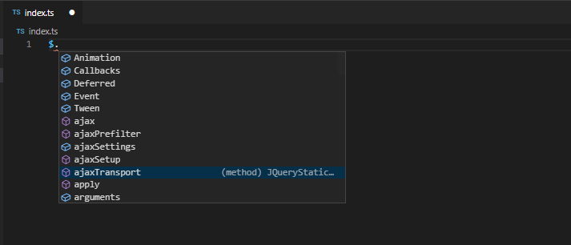
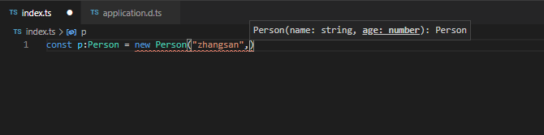
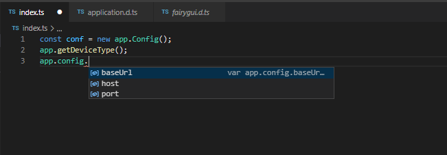
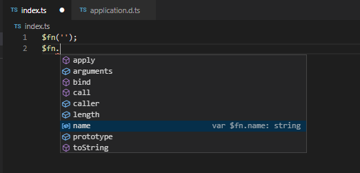
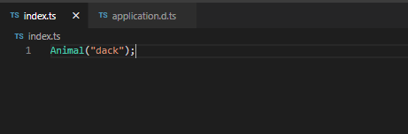
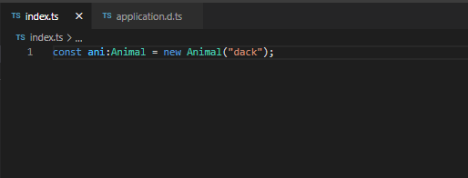
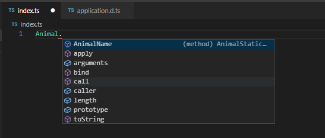

### 概述
[深入理解 TypeScript](https://jkchao.github.io/typescript-book-chinese/project/modules.html#%E5%85%A8%E5%B1%80%E6%A8%A1%E5%9D%97)

>`TypeScript `具有类型系统,  且是`JavaScript`的超集. 它可以编译成普通的 `JavaScript`代码. `TypeScript` 是一个比 `JavaScript` 更 `Java` 的 `Script`;

### 安装

```bash
npm install typescript -g

tsc

#   Version 3.9.7
#   Syntax:   tsc [options] [file...]
#   
#   Examples: tsc hello.ts
#             tsc --outFile file.js file.ts
#             tsc @args.txt
#             tsc --build tsconfig.json
```

### 数据类型

`typescript` 中为了使编写的代码更规范, 更有利于维护, 增加了类型校验;

+ 布尔类型 (boolean)

```typescript
//  布尔类型 boolean
var flag:boolean = true;
```
+ 数字类型 (number)

```typescript
//  数字类型
let num:number = 123;
```
+ 字符串类型 (string)

```typescript
//  字符串类型
let str:string = "aaa";
```
+ 数组类型 (array)

```typescript
/*
 *  数组类型有两种方式
 */

// 指定数组类型为 number 类型
var arr:number[] = [];

// 泛型的方式定义数组, 指定数组元素为 number 类型
var arr:Array<number> = [];
```
+ 元组类型 (tuple)

```typescript
//  元组类型, 也是数组的一种, 
var arr:[string,number,boolean] = ["",123,true];
```
+ 枚举类型 (enum)

```typescript
//  枚举类型  enum 默认情况下键值从 0 开始; 如果不给属性赋值就从 0 累加;
enum Flag{
    success = 1,
    error = 0
}
var f:Flag = Flag.success;

enum Color{ red, blue, green }
var c:Color = Color.red;
console.log(c);         // 0
```
+ 任意类型 (any)

```typescript
//  任意类型, 可以重复修改值类型
var a:any = 123;
a = "hello";
a = false;
```
+ null 和  undefined

```typescript
//  默认情况下 null 和 undefined 是所有类型的子类型;
var num:number | undefined;
console.log(num);       // undefined

num = 123;
```
+ void 类型

```typescript
//  表示没有任何类型, 常用于函数的返回值类型
function print(str:string):void{
    console.log(str);
}
print("hello");
```

#### 类型断言

类型断言和其他强类型语言里面的类型转换一样, 但是不进行特殊的数据检查和解构; 

```typescript
// str 为 any 类型;
var str:any = "this is a string";
// 把 any 类型的 str 转换为 string 类型, 取 string 的 length;
let len:number = (<string>str).length;

```
上面的写法也可以使用 `as` 语法:

```typescript
var str:any = "this is a string";
var len:number = (str as string).length;
```

### 类

#### es5 里面类的定义和继承

回顾一下 es5 里面类的定义;

```typescript
// 类的构造函数
function Person(){
    // 类的属性
    this.name = "xxx";
    this.age = 24;

    // 类的方法
    this.run = function(){
        alert(this.name + "在运动~");
    }
}

// 还可以通过原型链的方式添加类的属性和方法
Person.prototype.sex = "male";
Person.prototype.working = function(){
    alert(this.name + "在工作~");
}

// 类的静态属性
Person.getInfo = function(){
    console.log("这是类的静态属性~");
}

var p = new Person();
p.run();

Person.getInfo();

// 类的继承   原型链和对象冒充的方式继承
function Student(){
     // 对象冒充实现继承, 对象冒充的方式只能继承自构造函数内定义的属性和方法, 没办法继承原型链上面的属性和方法;
    Person.call(this);  
}
var w = new Student();
w.run();
w.working();            //  error

// 原型链的方式继承, 原型链可以继承构造函数里面的属性和方法, 也可以继承原型链上面的属性和方法; 
// 但是如果父类的构造函数需要传递参数的时候, 实例化子类的时候就没办法给父类传参数
Student.prototype = new Person();
```
组合方式实现类的继承

```javascript
function Person(name, age){
    this.name = name;
    this.age = age;

    this.run = function(){
        alert(this.name + "在运动~");
    }
}

Person.prototype.sex = "Male";
Person.prototype.working = function(){
    alert(this.name + "在工作~");
}
Person.getInfo = function(){
    alert("这是类的静态方法~");
}

function Student(name, age){

    Person.call(this,name,age);
}
// Student.prototype = new Person();
Student.prototype = Person.prototype;

var s = new Student("Tonny",25);
s.run();
s.working();
```

#### typescript 类的定义和继承

`typescript` 中类的定义;

```typescript
class Person{
    name:string;
    age:number;
    constructor(name:string,age:number){
        this.name = name;
        this.age = age;
    }

    run():void{
        alert(this.name + "在运动~");
    }

    getName():string{
        return this.name;
    }

    setName(name:string):void{
        this.name = name;
    }
}

var p:Person = new Person("Tom",26);
p.run();

class Student extends Person{
    constructor(name:string,age:number){
        super(name,age);
    }

    working():void{
        alert(this.name + "在工作~");
    }
}

var s:Student = new Student("Kangkang",25);
s.run();
s.setName("Hope");
```

#### 类修饰符

在 `typescript` 里面定义属性的时候, 给我们提供了访问修饰符;

+ public    :  公有的, 在类里面, 子类, 类外面都可以访问到;
+ protected :  保护类型, 在类里面, 子类里面可以访问, 在类外部不能访问;
+ private   :  私有的, 只能在当前类内部访问;

如果不加任何修饰符, 默认为 `public` 访问级别;


```typescript
class Person{
    private name:string;
    private age:number;
    //  `static` 关键字, 可以将类里面的属性和方法定义为类的静态属性和方法
    public static sex:string = "Male";
    constructor(name:string,age:number){
        this.name = name;
        this.age = age;
    }
    public run():void{
        alert(this.name + "在运动~");
    }

    public setName(name:string):void{
        this.name = name;
    }
}

var p:Person = new Person("Tonny",22);
console.log(Person.sex);
```

#### 抽象类

`abstract` 关键字定义的抽象类, 这个类要求继承它的之类必需实现抽象类的抽象方法;

```typescript
abstract class Animal{
    abstract eat():void;
}

class Dog extends Animal{
    constructor(){
        super();
    }

    eat():void{
        
    }
}
```
抽象类作为其他派生类的基类使用, 语法有点类似接口方法, 两者都是定义方法签名但不包含方法体, 例如上面的 `Animal` 抽象类, 定义了 `eat` 抽象方法, 继承自它的子类必须实现 `eat` 方法;


### 接口

在面向对象的程序设计中, 接口是一种规范的定义, 它定义了行为和动作的规范, 在程序设计中, 接口起到一种限制和规范作用, 接口定义了某一批类所需要遵守的规范, 接口不关心这些类的内部状态数据, 也不关心这些类里方法的实现细节, 它只规定这批类里必须提供某些方法, 提供这些方法的类就可以满足实际需要; 

`typescript` 中的接口类似 `java`, 同时还增加了更灵活的接口类型, 包含属性, 函数, 可索引和类等.


#### 属性接口

```typescript
interface FullName{
    firstName:string,
    secondName:string,
    age?:number
}

function printName(name:FullName){
    console.log(name.firstName + "---" + name.secondName);
}

var obj:FullName = {
    firstName:"zhang",
    secondName:"san"
}

printName(obj);
```

`interface` 关键字可以对函数参数进行约束, 上面的代码中我们需要 `printName` 函数接收一个包含 `firstName`, `secondName` 的 json 对象; 如果传入的参数不包含这两个字段程序就会提示错误; 

另外, 可以看到 `age?` 为可选参数, 不是非必须传入的;


#### 函数类型接口

函数类型接口: 对方法传入的参数以及返回值进行约束;

````typescript
interface Encrypt{
    (key:string, value:string): string
}

var md5:Encrypt = function(key:string,value:string):string{

    return encodeURI(key + "%$?^(*@&" + value);
}

console.log(md5("name","zhangsan"));
````

#### 可索引接口

可索引接口是对数组和对象进行约束的接口;

```typescript
// 对数组的约束
var arr1:number[] = [1,2,3,5];

var arr2:Array<string> = ['1','hahe','akon'];


interface UserArray{
    // 数组的索引为 number 类型, 索引值为 string 类型
    [index:number]:string
}

var arr:UserArray = ["jiakang","kongkon"];
var arr:UserArray = [12,56];            // 报错
```

#### 类类型接口

对类的约束, 和[抽象类](/docs/Web/Typescript/index?id=抽象类)有点类似;

```typescript
interface Animal{
    name:string,
    eat(str:string):void,
}

// 类需要实现类接口
class Dog implements Animal{
    name:string;

    constructor(name:string){
        this.name = name;
    }

    eat():void{

    }
}

var d:Dog = new Dog("xiaogou");
```
`implements` 关键字适用于类来实现接口的规范; 如上代码, `Dog` 类实现了 `Animal` 接口的定义;


### 泛型

在开发中, 我们不仅要考虑一致的定义良好的 `api`, 同时也要考虑可重用性;  组件不仅能够支持当前的数据类型, 同时也能支持未来的数据类型, 这在开发大型的系统时候可以提供十分灵活的功能;

通俗的理解泛型, 就是解决 类, 接口, 方法的复用性, 以及对不特定数据的支持;

```typescript
function GetData<T>(value:T):T{

    return value;
}

GetData<number>(123);
GetData<string>("aaa");
```
泛型函数要求在函数调用的时候指定类型, 上面的 `GetData` 函数表示传入的参数类型与返回的参数类型一致; 

#### 泛型类

```typescript
class MinxNum{
    public list:Array<number> = [];

    add(num:number):void{
        this.list.push(num);
    }

    min():number{
        var n = this.list[0];
        for(let i = 0; i < this.list.length; i++){
            if(n > this.list[i]){
                n = this.list[i];
            }
        }
        return n;
    }
}

var m:MinxNum = new MinxNum();

m.add(5);
m.add(3);
m.add(1);

console.log(m.min());       // 1
```
上面的 `MinxNum` 类可以获得传入参数中的最小值, 但是有一个缺陷就是只能返回 `number` 类型; 如果我们还需要 `a-z` 字符之间返回最小字符就需要重新修改一下这个工具类;

```typescript
class MinxNum<T>{
    public list:Array<T> = [];

    add(num:T):void{
        this.list.push(num);
    }

    min():T{
        var n = this.list[0];
        for(let i = 0; i < this.list.length; i++){
            if(n > this.list[i]){
                n = this.list[i];
            }
        }
        return n;
    }
}

var m = new MinxNum<number>();

m.add(5);
m.add(3);
m.add(1);

console.log(m.min());       // 1

var n = new MinxNum<string>();

n.add("n");
n.add("a");
n.add("d");

console.log(n.min());       // a
```

#### 泛型函数

```typescript
interface Config<T>{
    (value:T):T;
}

function GetData<T>(value:T):T{

    return value;
}

var d:Config<string> = GetData;

d("aaa");
```

#### 泛型类约束

泛型可以帮助我们避免重复的代码以及对不特定的数据类型的支持(类型校验), 我们可以把类当做参数的泛型类;

+ 定义一个类
+ 把类作为参数来约束数据传入的类型

```typescript

/**
 *  定义一个 user 类, 这个类的作用就是映射数据库的表字段
 *  定义一个 Mysql 类, 这个类用来操作数据库
 *  把 user 类作为参数传入到 Mysql 中
 */

class User{
    username:string;
    password:string;
}

class Mysql{

    add(user:User):boolean{
        // mysql query
        return true;
    }
}

var u:User = new User();
u.username = "zhangsan";
u.password = "aaa12345";


var db:Mysql = new Mysql();
db.add(u);
```
如此来如果我们还需要增加一个文章的类, 并且也需要将文章插入到数据库中, 这样 `Mysql` 类就不能将 `User` 类作为参数传递进去了; 可以使用泛型, 将 `Mysql` 类做成一个通用的工具类, 来对数据库进行操作;

```typescript
class User{
    username:string;
    password:string;
}

class ArticleCate{
    title:string | undefined;
    desc:string | undefined;
    status:number | undefined;
}

class Mysql<T>{

    add(info:T):boolean{
        // mysql query
        return true;
    }
}

var u:User = new User();
u.username = "zhangsan";
u.password = "aaa12345";


var art:ArticleCate = new ArticleCate();
art.title = "新闻大爆炸";
art.desc = "这是一条爆炸性的新闻";
art.status = 0;


var db:Mysql<User> = new Mysql<User>();
db.add(u);


var artc:Mysql<ArticleCate> = new Mysql<ArticleCate>();
artc.add(art);
```

#### Typescript 封装 DB 

* 功能: 定义一个操作数据库的类, 支持 Mysql, MongoDb;
* 要求: 功能一样, 都有 add, delete, update, find 方法;
* 注意: 代码的重用性和约束统一的规范
* 思路: 需要约束规范, 所以要定义接口, 需要代码重用, 所以需要使用泛型

```typescript
interface DBI<T>{
    add(info:T):boolean;
    update(info:T,id:number):boolean;
    delete(id:number):boolean;
    get(id:number):any[];
}

class MySql<T> implements DBI<T>{
    add(info: T): boolean {
        return true;
    }
    update(info: T, id: number): boolean {
        return true;
    }
    delete(id: number): boolean {
        return true;
    }
    get(id: number): any[] {
        return [];
    }
}

class MongoDB<T> implements DBI<T>{
    add(info: T): boolean {
        return true;
    }
    update(info: T, id: number): boolean {
        return true;
    }
    delete(id: number): boolean {
        return true;
    }
    get(id: number): any[] {
        return [];
    }
}

// 定义一个 User 类
class User{
    username:string | undefined;
    password:string | undefined;
}

var u:User = new User();
u.username = "zhangsan";
u.password = "aa123456";


// mysql 
var oMysql:MySql<User> = new MySql<User>();
oMysql.add(u);


// mongodb
var oMongo:MongoDB<User> = new MongoDB<User>();
oMongo.add(u);
```

### 命名空间

在代码量较大的情况下, 为了避免各种变量名冲突, 可以将相似的功能的函数, 类, 接口等都放置在命名空间内;

同 `Java` 的包, `.net` 的命名空间一样, `typescript` 的命名空间可以将代码包裹起来, 只对外暴露需要在外部访问的对象, 命名空间内的对象通过 `export` 关键字导出; 调用方法使用命名空间的命名调用;

命名空间和模块的区别: 命名空间属于内部模块, 主要用于组织代码, 防止代码命名冲突; 模块则偏重代码的复用性, 一个模块里面可能会有多个命名空间;

```typescript
namespace A{
    interface DBI<T>{
        add(info:T):boolean;
        update(info:T,id:number):boolean;
        delete(id:number):boolean;
        get(id:number):any[];
    }
    
    export class MySql<T> implements DBI<T>{
        add(info: T): boolean {
            return true;
        }
        update(info: T, id: number): boolean {
            return true;
        }
        delete(id: number): boolean {
            return true;
        }
        get(id: number): any[] {
            return [];
        }
    }
    
    export class MongoDB<T> implements DBI<T>{
        add(info: T): boolean {
            return true;
        }
        update(info: T, id: number): boolean {
            return true;
        }
        delete(id: number): boolean {
            return true;
        }
        get(id: number): any[] {
            return [];
        }
    }
    
    // 定义一个 User 类
    export class User{
        username:string | undefined;
        password:string | undefined;
    }
}


var u:A.User = new A.User();
u.username = "zhangsan";
u.password = "aa123456";


var oMysql:A.MySql<A.User> = new A.MySql<A.User>();
oMysql.add(u);


var oMongo:A.MongoDB<A.User> = new A.MongoDB<A.User>();
oMongo.add(u);
```

### 装饰器
装饰器允许向一个现有的对象添加新的功能, 同时又不改变其结构, 这种类型的设计模式属于结构型模式, 它是作为一个现有的类的包装;

这种模式创建了一个装饰类, 用来包装原有的类, 并在保持类方法签名的完整性的前提下, 提供了额外的功能;

#### 装饰器原理
装饰器, 本质上就是一个函数, 它会在运行时被调用, 被装饰的声明信息做为参数传入; 理论上忽略参数的话, 任何函数都可以当做装饰器使用;

````typescript
import * as Koa from 'koa';

function decrator(method){
    return (target,property,descriptor)=>{
        console.log('method',method);
        console.log('arguments',arguments);
        console.log('target',target);
        console.log('property',property);
        console.log('descriptor',descriptor);
    }
    /*
     *      method /get
     *      arguments [Arguments] { '0': '/get' }
     *      target User {}
     *      property list
     *      descriptor {
     *          value: [Function: list],
     *          writable: true,
     *          enumerable: false,
     *          configurable: true
     *      }
     * 
     */
}

export default class User {
    @decrator('/get')
    public list(ctx:Koa.Context){
        ctx.body = { ok:1 }
    }
}
````
#### 装饰器适用场景
装饰器能够被附加到类声明, 方法, 属性或参数上, 可以修改类的行为;

+ AOP 切面应用:
    + 静态注入方式
    + 反射机制

+ 开放封闭原则, 类的解耦:
    + MVC 权限判断
    + 注解

#### 装饰器类型
常见的装饰器有: 类装饰器、属性装饰器、方法装饰器、参数装饰器

装饰器的写法: 普通装饰器 (无法传参) 、 装饰器工厂(可传参)

##### 类装饰器

+ 1. 无参数装饰器

````typescript
function logClass(category:any){
    console.log('category',category);
    category.prototype.apiUrl = 'http://www.baidu.com';
    category.prototype.func = function(){};
}

@logClass
class HttpClient{
    constructor(){}
}

const http = new HttpClient();
console.log(http['apiUrl']);

//  category [Function: HttpClient]
//  http://www.baidu.com
````
+ 2. 有参数装饰器(工厂模式)

````typescript
function logClass(params:any){
    console.log('params',params);
    return (target)=>{
        target.prototype.apiUrl = params;
        target.prototype.func = function(){};
    }
}

@logClass('http://www.baidu.com')
class HttpClient{
    constructor(){}
}

const http = new HttpClient();
console.log(http['apiUrl']);

//  params http://www.baidu.com
//  http://www.baidu.com
````

##### 方法装饰器

+ 1. 无参数装饰器

````typescript
function logClass(target, name, descriptor){
    var oldValue = descriptor.value;
    descriptor.value = function(){
        console.log(`Calling "${name}" with`, arguments);
        return oldValue.apply(null, arguments);
    }
}

class Maths{
    constructor(){

    }

    @logClass
    add(a,b){
        return a + b;
    }
}

const user = new Maths();
console.log(user.add(3,5));

//  Calling "add" with [Arguments] { '0': 3, '1': 5 }
//  8
````
+ 2. 装饰器工厂(可传参)

````typescript
function fnMethod(params){
    return (target, property, descriptor)=>{
        // 保存一下旧的方法
        const oMthod = descriptor.value;
        // 改写旧的方法
        descriptor.value = function(a,b){
            // 调用未改写的方法
            //oMthod.apply(null,...arguments);
            return (a + b) * params;
        }
    }
}

class Maths{
    constructor(){}

    @fnMethod(5)
    add(a,b){
        return a + b;
    }
}

const fnObj = new Maths();
console.log(fnObj.add(3,5));

//  40
````
##### 属性装饰器

属性装饰器表达式会在运行时当作函数被调用, 传入下列2个参数:
+ 对于静态成员来说是类的构造函数, 对于实例成员是类的原型对象;
+ 属性名;

````typescript
function fnProperty(value:any){
    return (target,attr)=>{
        console.log('target',target);
        console.log('attr',attr);
        target[attr] = value;
    }
}

class Person{
    @fnProperty('laowang')
    public name:string
}

const p = new Person();
console.log(p.name);

//  target Person {}
//  attr name
//  laowang
````
#### 装饰器执行顺序

````typescript
function anotationClass(args:any){
    console.log("anotationClass evaluated",args);
    return (target)=> console.log('anotationClass executed',target);
}

function anotationMethods(args:any){
    console.log('anotationMethods evaluated', args);
    return (target, property, descriptor) => console.log('anotationMethods executed',target);
}

function anotationProperty(args:any){
    console.log('anotationProperty evaluated', args);
    return (target, attr) => console.log('anotationProperty executed',target);
}

@anotationClass(0)
@anotationClass(1)
class Person{

    @anotationProperty('0')
    @anotationProperty('1')
    public name:string

    @anotationMethods(0)
    @anotationMethods(1)
    getName(){
        return this.name
    }
}

const p = new Person();

/*
 *      anotationProperty evaluated 0
 *      anotationProperty evaluated 1
 *      anotationProperty executed Person {}
 *      anotationProperty executed Person {}
 *      anotationMethods evaluated 0
 *      anotationMethods evaluated 1
 *      anotationMethods executed Person {}
 *      anotationMethods executed Person {}
 *      anotationClass evaluated 0
 *      anotationClass evaluated 1
 *      anotationClass executed [Function: Person]
 *      anotationClass executed [Function: Person]
 */
````
执行顺序: 属性 -->  方法 -->  类

#### Typescript 装饰器实践

`NodeJs` + `Typescript` + `Koa` 装饰器实现后台 `api` 开发;

##### 项目初始化
````bash
npm init -y
npm install typescript ts-node-dev tslint @types/node -D
````
修改 `package.json` 为:
````json
"scripts": {
    "start": "ts-node-dev ./src/index.ts -P tsconfig.json --no-cache",
    "build": "tsc -P tsconfig.json && node ./dist/index.js",
    "tslint": "tslint --fix -p tsconfig.json"
}
````
在根目录下创建 `tsconfig.json`:
````json
{
    "compilerOptions": {
        "outDir": "./dist",
        "target": "es2017",
        "module": "commonjs",                   //组织代码方式
        "sourceMap": true,
        "moduleResolution": "node",             // 模块解决策略
        "experimentalDecorators": true,         // 开启装饰器定义
        "allowSyntheticDefaultImports": true,   // 允许es6方式import
        "lib": [
            "es2015"
        ],
        "typeRoots": [
            "./node_modules/@types"
        ],
    },
    "include": [
        "src/**/*"
    ]
}
````
##### 项目基础代码

+ 1. 安装依赖:

````bash
npm i koa koa-static koa-body koa-xtime glob -S
````

+ 2. 在 src 目录下面新建 `index.ts`:

***src/index.ts***
````typescript
import * as Koa from 'koa';
import koaBody, * as bodify from 'koa-body';
import * as serve from 'koa-static';
import * as timming from 'koa-xtime';

const app:Koa = new Koa();

app.use(timming());
app.use(serve(`${__dirname}/public`));

app.use(bodify());
app.use((ctx:Koa.Context)=>{
    ctx.body = "Hello ts-koa";
})

app.listen(3001,()=>{
    console.log("服务器启动成功~");
});
````
````bash
npm start
````
##### 实现路由定义和发现

需求: 定义一个装饰器, 实现 router 的自动注册; 
要求: `@get` 的时候, 路由的请求方式为 `get`, `@post` 路由的请求方式为 `post`; 当传进去 `prefix`, 对用的路由规则为 `prefix/xxx`, 例如:`api/users`;

+ 1. 路由发现及注册, 在 src 目录下面创建 `util/route-decors.ts`:

***src/util/route-decors.ts***
````typescript
import * as glob from 'glob';
import * as Koa from 'koa';
import * as KoaRouter from 'koa-router';
type HTTPMethod = 'get' | 'put' | 'del' | 'post' | 'patch';
type LoadOptions = {
    /**
    * 路由文件扩展名，默认值是`.{js,ts}`
    */
    extname?: string;
};
type RouteOptions = {
    /**
    * 适用于某个请求比较特殊，需要单独制定前缀的情形
    */
    prefix?: string;
    /**
    * 给当前路由添加一个或多个中间件
    */
    middlewares?: Array<Koa.Middleware>;
};
const router = new KoaRouter();
const decorate = (method: HTTPMethod, path: string, options: RouteOptions = {}, router: KoaRouter) => {
    return (target, property: string) => {
        const url = options.prefix ? options.prefix + path : path
        router[method](url, target[property])
    }
}
const method = method => (path: string, options?: RouteOptions) => decorate(method, path, options, router);

export const get = method('get');
export const post = method('post');
export const put = method('put');
export const del = method('del');
export const patch = method('patch');

export const load = (folder: string, options: LoadOptions = {}): KoaRouter => {
    const extname = options.extname || '.{js,ts}';
    glob.sync(require('path').join(folder,`./**/*${extname}`)).forEach((item) => require(item))
    return router;
}
````
+ 2. 创建路由, 在 src 下新建 `routes/user.ts`:

***src/routes/user.ts***
````typescript
import * as Koa from 'koa';
import { get , post} from '../util/route-decors';

export default class User {
    @get('/list',{ prefix:'/user' })
    public pageList(ctx:Koa.Context){
        ctx.body = {
            state:"success",
            message:"请求成功~",
            data:{}
        }
    }
}
````
+ 3. 使用, 将 `routes` 目录下面的所有的路由用 `loader` 读取出来, 并注册到 app 上:

***index.ts***
````typescript
import * as Koa from 'koa';
import { load } from './util/route-decors';
import { resolve } from 'path';

const app:Koa = new Koa();

const router = load(resolve(__dirname,'./routes'));
app.use(router.routes());

app.listen(3001,()=>{
    console.log("服务器启动成功~");
});
````
````bash
npm start

# http://127.0.0.1:3001/user/list
````

##### 数据校验

上面我们对路由的装饰器保留了一个 `middlewares` 参数, 可以利用中间件的机制实现对数据的校验;

+ 1. 首先对 `route-decors`进行改造:

````typescript
//...
const decorate = (method: HTTPMethod, path: string, options: RouteOptions = {}, router: KoaRouter) => {
    return (target, property: string) => {
        const middlewares = [];
        // 如果装饰器里面有传过来中间件
        if(options.middlewares){
            middlewares.push(...options.middlewares);
        }
        
        const url = options.prefix ? options.prefix + path : path
        // 还需要将正常业务的中间件放进去
        middlewares.push(target[property]);
        router[method](url, ...middlewares);
    }
}
//...
````
+ 2. 直接在路由里面就可以传入 `middleware` 参数了:

***src/routes/user.ts***
````typescript
import * as Koa from 'koa';
import { get , post} from '../util/route-decors';

export default class User {
    @get('/list',{ 
        prefix:'/user',
        middlewares:[
            async function valitation(ctx:Koa.Context,next:()=> Promise<any>){
                // 校验参数里面是否有 name 字段
                const { name } = ctx.query;
                if(!name) throw "unkonw name property";
                await next();
            }
        ]
    })
    public pageList(ctx:Koa.Context){
        ctx.body = {
            state:"success",
            message:"请求成功~",
            data:{}
        }
    }
}
````
##### 路由守卫(鉴权)

通常开发情况下, 我们需要对某些 api 进行鉴权, 也可以使用装饰器来完成功能;

***src/util/route-decors.ts***
````typescript
//...
const decorate = (method: HTTPMethod, path: string, options: RouteOptions = {}, router: KoaRouter) => {
    return (target, property: string) => {
        // 这里使用 nexttick 是因为方法装饰器比类装饰器先执行
        process.nextTick(()=>{
            const middlewares = [];
            // 如果类上面有装饰器就把 类的装饰器也放进去
            if(target.middlewares){
                middlewares.push(...target.middlewares);
            }

            // 如果装饰器里面有传过来中间件
            if(options.middlewares){
                middlewares.push(...options.middlewares);
            }
    
            const url = options.prefix ? options.prefix + path : path
            // 还需要将正常业务的中间件放进去
            middlewares.push(target[property]);
            router[method](url, ...middlewares);
        })
    }
}
export const middlewares = function middlewares(middlewares:Koa.Middleware[]) {
    return function (target) {
        target.prototype.middlewares = middlewares;
    };
};
````
***src/routes/user.ts***
````typescript
//...
@middlewares([
    async function guard(ctx: Koa.Context, next: () => Promise<any>) {
        if (ctx.header.token) {
            await next();
        } else {
            throw "请登录";
        }
    }
])
export default class User {}
````
##### 数据库整合
[sequelize-typescript 使用文档](https://www.jianshu.com/p/e6e6dde76094)

安装依赖:
````bash
$  npm install -S sequelize sequelize-typescript reflect-metadata mysql2 @types/bluebird @types/node @types/validator
````

***index.ts***
````typescript
//...
import { Sequelize } from 'sequelize-typescript';

const database = new Sequelize({
    port:3306,
    database:'test',
    username:"root",
    password:'root',
    dialect:'mysql',
    // 添加这个之后会自动遍历 model 目录下面的所有文件, 并创建模型
    modelPaths:[`${__dirname}/model`]
})
database.sync({force:true});
````
创建模型: src 目录下新建 `model/user.ts`:
````typescript
import { Table, Column, Model, DataType } from 'sequelize-typescript';

@Table({modelName : 'users'})
export default class User extends Model<User>{
    @Column({
        primaryKey: true,
        autoIncrement: true,
        type: DataType.INTEGER
    })
    public id:number;

    @Column(DataType.CHAR)
    public name: string;
}
````
使用模型: `routes/user.ts`:
````typescript
import model from '../model/user';

export default class User {
    @get('/users')
    public async list(ctx: Koa.Context) {
        const users = await model.findAll()
        ctx.body = { ok: 1, data: users };
    }
}
````
[Typescript 中台开发开源库](https://github.com/su37josephxia/smarty-end)

### ts 类型文件定义

在开发ts时, 有时会遇到没有 `d.ts` 文件的库, 同时在老项目迁移到ts项目时也会遇到一些文件需要自己编写声明文件, 但是在需要的声明文件比较多的情况, 就需要自动生产声明文件;

- 1. 为整个包添加声明文件; 使用微软的 `dts-gen`

```bash
npm install -g dts-gen   # 先全局安装dts-gen
npm install -g yargs     # 然后在全局安装你需要生产声明文件的库
dts-gen -m yargs         # 执行命令生成文件
```

- 2. 为单个文件生成声明文件; 使用 `dtsmake`

```bash
npm i dtsmake -g   # 先全局安装dtsmake
dtsmake -s /path/name.js  # 需要生成的文件地址
```
> 生成的文件一般都会有一些问题, 需要自己稍微修改一下, 如果不想写类型直接用 `any`; 执行的时候可能会报错 `tern` 没有按装, 就需要在安装一下, 在项目目录 `npm i tern --save-dev`;


### .d.ts 编写

一些常用的描述文件(.d.ts) 都可以直接使用 npm 下载, 例如 jquery 的, `npm install @types/jquery`; 但还是有一些开发中内部使用的库或者是 js 代码需要手动去描述文件, 上面的生成工具有时候并不能完全正确的生成 js 代码的描述文件;

`.d.ts` 在实际开发过程中也会增强代码提示; 例如, 当我们安装了 jquery 的描述文件之后;



#### 全局类型

在 `d.ts` 文件里面, 在最外层声明变量或者函数或者类要在前面加上 `declare` 这个关键字. 在 `typescript` 的规则里面, 如果一个 `.ts`、`.d.ts`文件如果没有用到 `import` 或者 `export` 语法的话, 那么最顶层声明的变量就是全局变量;

+ 1. 变量 or 常量

```typescript
// 变量
declare var a:number | string;

// 常量
declare const PI:3.14;
```

+ 2. 函数

```typescript
// 无参数无返回值
declare function getName():void;

// 函数重载
declare function getName(name:string):string;
declare function getName(id:number,name:string):string;

// 参数可有可无
declare function render(callback?:()=>void): string;
```

+ 3. 类 class

```typescript
declare class Person{
    static maxAge:number;
    constructor(name:string,age:number);
    getName(id:number):string;
}
```
;

`constructor` 表示的是构造方法, `static` 为静态属性, 只能通过类来访问, 例如: `Person.maxAge`;

+ 4. 对象

```typescript
declare namespace fgui{
    
}
```
当然, 这个对象上面可能有属性, 方法, 类等, 其实就是把上面的写法放在了 `namespace` 关键字里面, 但是不需要 `declare` 关键字了;

```typescript
declare namespace app{
    namespace config{
        var baseUrl:string;
        var host:string;
        var port:string;
    }
    function getDeviceType():string;
    class Config{
        constructor();
    }
}
```


#### 混合类型
有时候有些值既是函数又是 `class` 又是对象的复杂对象. 比如我们常用的 `jquery` 有各种用法;

```typescript
new $()
$.ajax()
$()
```

+ 1. 即是函数也是对象

```typescript
declare function $fn(s:string):void;
declare namespace $fn{
    var name:string;
}
```
`.d.ts` 会将同名的 `namespace` 和 `function` 合并到一起;



+ 2. 即是函数又是类

```typescript
interface Animal{
    name:string;
    getName():string;
}
interface AnimalStatic{
    new (name:string):Animal;
    AnimalName():string;
    (w:number):number;
}
declare var Animal:AnimalStatic;
```
作为函数使用:



作为类使用:



类的静态属性:



#### 模块化(CommonJS)

除了上面的方式, 我们有时候还是通过 `require()`  的方式引入模块化的代码;

```typescript
declare module "abcd"{
    export var a:number;
    export function ajax():void;
    export namespace global{
        var url:string;
    }
}
```
其实就是在外层嵌套了一个 `module`, 里面的写法和上面的定义差不多, 把 `declare` 换成了 `export`;
