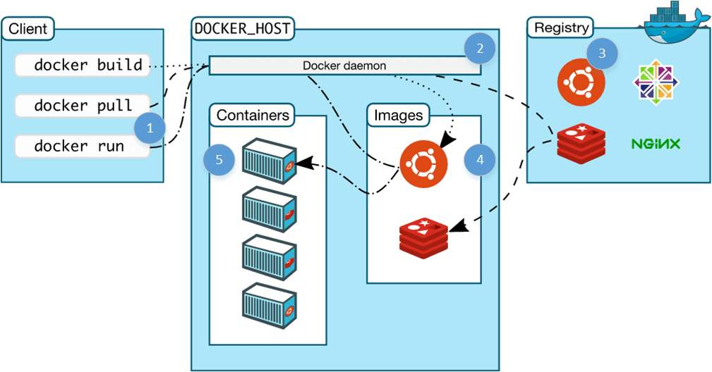
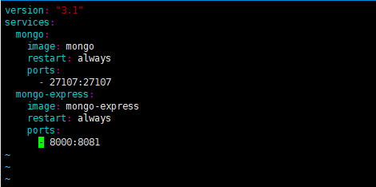
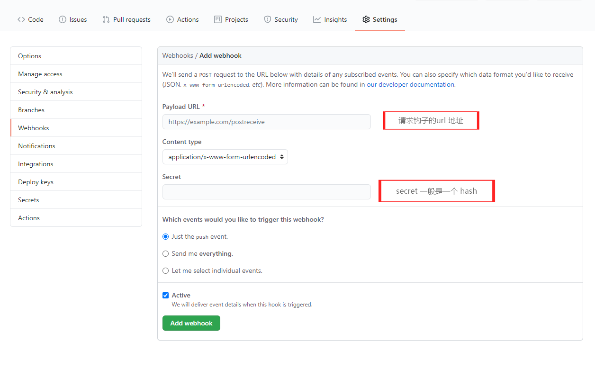

### 初识 Docker
+ 1. Docker 是什么: 
    - Build, Ship and Run Any App, Anywhere — 一次封装, 到处执行;
    - 基于Linux的高效、敏捷、轻量级的容器 (轻量虚拟) 方案;
    - 虚拟技术:
        - 完全虚拟化 VMware Workstation , VirtualBox;
        - 硬件辅助虚拟化 InterVT AMD-V
        - 超虚拟化 Xen
        - 操作系统级 Docker LXC 容器
        

+ 2. 特点
    - 高效的利用系统资源
    - 快速的启动时间
    - 一致的运行环境
    - 持续交付和部署
    - 更轻松的迁移

+ 3. 对比传统虚拟机总结

    <table>
        <thead>
            <tr>
                <th>特性</th>
                <th>容器</th>
                <th>虚拟机</th>
            </tr>
        </thead>
        <tbody>
            <tr>
                <td>启动</td>
                <td>秒级</td>
                <td>分钟级</td>
            </tr>
            <tr>
                <td>硬盘使用</td>
                <td>一般为  MB</td>
                <td>一般为  GB</td>
            </tr>
            <tr>
                <td>性能</td>
                <td>接近原生</td>
                <td>弱于</td>
            </tr>
            <tr>
                <td>系统支持量</td>
                <td>单机支持上千个容器</td>
                <td>一般几十个</td>
            </tr>
        </tbody>
    </table>

### Docker 安装

[Xsehll](https://pan.baidu.com/s/1hAmDPXpfbqvKv9MuVGv77g)  提取码：sjxu

首先使用 `xsehll` 连接上 `Linux` 主机, 连接成功之后键入 ：

```bash
yum install -y yum-utils device-mapper-persistent-data lvm2
```

设置阿里云镜像:

```bash
yum-config-manager --add-repo https://mirrors.aliyun.com/docker-ce/linux/centos/docker-ce.repo 
```

为了开发人员或小团队创建基于容器的应用,与团队成员分享和自动化的开发管道. `docker-ce` 提供了简单的安装和快速的安装, 以便可以立即开始开发: 安装 `docker-ce`;

```
yum install docker-ce
```
安装 `docker-ce` 的时候如果有报错, 就需要检查一下是否有低版本的 `docker` 安装过了:

```bash
# 1、查看安装过的docker：
yum list installed | grep docker
docker.x86_64                           2:1.13.1-74.git6e3bb8e.el7.centos
docker-client.x86_64                    2:1.13.1-74.git6e3bb8e.el7.centos
docker-common.x86_64                    2:1.13.1-74.git6e3bb8e.el7.centos

# 2、卸载docker：
yum remove -y docker-ce.x86_64 docker-client.x86_64 docker-common.x86_64

# 3、删除容器镜像：
rm -rf /var/lib/docker

# 4、 重新安装docker
yum install docker-ce
```

启动 `docker`:

```bash
# 开机自启
systemctl enable docker 

# 启动docker服务  
systemctl start docker
```
一般我们使用 `root` 权限比较高, 通常都不会直接使用 `root` 用户, 所以需要新加一个 `docker` 的组;

```bash
# 1. 建立 Docker 用户组
groupadd docker

# 2.添加当前用户到 docker 组
usermod -aG docker $USER
```
测试 `docker` 能不能使用:
```bash
docker run hellowrold
# docker 里面自带一个测试镜像, 如果没有, 运行 run 的时候会自动下载镜像
```

通常情况下, 国内的用户下载镜像是比较慢的, 所以我们可以使用：

[Azure中国镜像](https://github.com/Azure/container-service-for-azure-china/blob/master/aks/README.md#22-container-registry-proxy)
[七牛云镜像](https://kirk-enterprise.github.io/hub-docs/#/user-guide/mirror)
 
```bash
vi /etc/docker/daemon.json

# 输入
{
    "registry-mirrors": [
        "https://dockerhub.azk8s.cn",
        "https://reg-mirror.qiniu.com"
    ]
}

# 输入完成之后  写入并退出
:wq
```
### Nginx 服务

拉取 Nginx 官方的最新版本的镜像:

```bash
docker pull nginx:latest
```

查看是否已经安装了 Nginx:

```bash
docker images
 
# REPOSITORY          TAG                 IMAGE ID            CREATED             SIZE
# nginx               latest              8cf1bfb43ff5        12 hours ago        132MB
```

安装成功之后, 可以启动一下 Nginx 服务:

```bash
# 新建一个 www 文件夹, 往里面写入 index.html
mkdir www
echo "Hello Docker~" >> www/index.html

# 查看 index.html 文件内容
cat www/index.html

# 启动服务
docker run -p 8000:80 -v $PWD/www:/usr/share/nginx/html nginx
#   -p  端口映射, 将本地 8080 端口映射到容器内部的 80 端口(nginx 默认启动的端口是 80) 
#   /usr/share/nginx/html   Nginx 安装完成之后会默认将这个文件夹的网页发布出去
#   nginx   表示使用镜像的名称是 nginx  

# 启动成功之后, 可以使用链接的服务器地址:8000 端口访问到写入 www/index.html 的内容;

# 后台启动
docker run -p 8000:80 -v $PWD/www:/usr/share/nginx/html -d nginx
# 后台启动成功之后会输入一个  2dbf058bb16a171d05076aa7701e950c9d06ee53cd4ce2f12e338f52e9848db6  hash 码, 标识当前容器的id
```

### Docker 的常用命令
docker 客户端非常简单, 我们可以直接输入 docker 命令来查看到 Docker 客户端的所有命令选项;

```bash
docker
```
- 获取镜像:

```bash
# 获取一个Nginx镜像 :latest 参数为最新版本
docker pull nginx:latest
```

- 查看镜像列表

```bash
docker images
```

- 启动nginx容器:

```bash
docker run -p 8000:80 -v $PWD/www:/usr/share/nginx/html nginx
```

- 启动已停止的容器

```bash
# 先查看所有
docker ps -a
# CONTAINER ID        IMAGE               COMMAND                  CREATED             STATUS                      PORTS               NAMES
# 2dbf058bb16a        nginx               "/docker-entrypoint.…"   9 minutes ago       Exited (0) 5 seconds ago                        zen_snyder
# f6fd371b5278        nginx               "/docker-entrypoint.…"   18 minutes ago      Exited (0) 10 minutes ago                       naughty_ardinghelli

# 使用 docker start 启动一个已停止的容器(通常只需要输入 CONTAINER ID 的前面几位字符就可以) 
docker start 2dbf
```

- 停止容器

```bash
docker stop 2dbf

# 停止的容器可以通过 restart 重启
docker restart 2dbf
```

- 进入容器内部

```bash
docker exec it 2dbf /bin/bash
cd usr/share/nginx/html
ls
```

- 退出容器

```bash
exit
```

- 删除容器

```bash
docker rm 2dbf
```

- 查看 Nginx 容器日志

```bash
docker logs -f 2dbf
```

- 查看容器状态和配置

```bash
# zen_snyder 对用的是容器的 NAMES 字段
docker inspect zen_snyder
```

### Docker 运行过程

- 镜像 (images) : 面向Docker的只读模板
- 容器 (container): 镜像的运行实例
- 仓库 (registry): 存储镜像的服务器

运行 `docker pull` 命令的时候, 就会向服务端 `docker daemon` 发送一个命令, 服务端由 `docker daemon` 来负责管理 `containers` 和 `images`; `registry` 是远程注册中心, 用来提供各种各样的官方或者第三方镜像文件




### Docker 定制镜像
镜像的定制实际上就是定制每一层所添加的配置、文件. 我们可以把每一层修改、安装、构建、操作的命令都写入一个脚本, 用这个脚本来构建、定制镜像; 这个脚本就是 `Dockerfile`; `Dockerfile` 是一个文本文件, 其内包含了一条条的指令(Instruction), 每一条指令构建一层,  因此每一条指令的内容, 就是描述该层应当如何构建;


定制 web 服务器

```bash
mkdir nginx

# 编辑镜像文件
vi Dockerfile

# 键入
FROM nginx
RUN echo "<h1>这是自定义的镜像文件~</h1>" > /usr/share/nginx/html/index.html

# esc  :wq  保存并退出

# 将文件移动到 nginx 目录下
mv Dockerfile nginx/
cd nginx

# 定制镜像    nginx:hope 定制后的镜像名称和版本号  . 代表镜像的定制文件在当前目录下
docker build -t nginx:hope .

# 试验一下是否定制成功   ip:8000 访问网址就能看见定制的 web 页
docker run -p 8000:80 nginx:hope
```

***Dockerfile编写命令***
```
FROM:               指定基础镜像
RUN：               构建镜像过程中需要执行的命令。可以有多条。
CMD：               添加启动容器时需要执行的命令。多条只有最后一条生效。可以在启动容器时被覆盖和修改。
ENTRYPOINT：        同CMD，但这个一定会被执行，不会被覆盖修改。
LABEL ：            为镜像添加对应的数据。
MLABELAINTAINER：   表明镜像的作者。将被遗弃，被LABEL代替。
EXPOSE：            设置对外暴露的端口。
ENV：               设置执行命令时的环境变量，并且在构建完成后，仍然生效
ARG：               设置只在构建过程中使用的环境变量，构建完成后，将消失
ADD：               将本地文件或目录拷贝到镜像的文件系统中。能解压特定格式文件，能将URL作为要拷贝的文件
COPY：              将本地文件或目录拷贝到镜像的文件系统中。
VOLUME：            添加数据卷
USER：              指定以哪个用户的名义执行RUN, CMD 和ENTRYPOINT等命令
WORKDIR：           设置工作目录
ONBUILD：           如果制作的镜像被另一个Dockerfile使用，将在那里被执行Docekrfile命令
STOPSIGNAL：        设置容器退出时发出的关闭信号。
HEALTHCHECK：       设置容器状态检查。
SHELL：             更改执行shell命令的程序。Linux的默认shell是[“/bin/sh”, “-c”]，Windows的是[“cmd”, “/S”, “/C”]
```

### 定制 NodeJS 镜像
上面我们定制了一个简单的 `nginx` 服务的镜像, 还可以来定制一下 `nodejs` 的镜像:

首先, 安装 `node`:

```bash
# 下载 nodejs 安装包
wget https://nodejs.org/dist/v12.18.1/node-v12.18.1-linux-x64.tar.xz

# 解压
tar xf node-v12.18.1-linux-x64.tar.xz

# 解压文件, 进入目录查看 node 版本号
cd node-v12.18.1-linux-x64
./bin/node -v 

# 设置软连接, 将 node 作为全局命令
ln -s /usr/software/nodejs/bin/npm /usr/local/bin
ln -s /usr/software/nodejs/bin/node /usr/local/bin
```

初始化 node 环境：

```bash
mkdir node
cd node

# 初始化一个 nodejs 环境
npm init -y

# 安装 koa
npm install koa -s

# 查看 package.json 里面是否已经添加 koa
cat package.json

# 创建 nodejs 入口文件
vi app.js

#  const Koa = require("koa");
#  const app = new Koa();
#  
#  app.use(ctx =>{
#      ctx.body = "Hello Nodejs In Docker"
#  });
#  
#  app.listen(3000,()=>{
#      console.log("server listen on localhost:3000")
#  })

# 定制镜像
vi Dockerfile

#  FROM node:12-alpine
#  ADD . /app/                          copy 程序代码到 app 目录下面
#  WORKDIR /app                         进入到 app 工作目录
#  RUN npm install                      运行 npm install
#  EXPOSE 3000                          设置启动端口为 3000
#  CMD ["node","app.js"]                执行 node app.js

# 构建
docker build -t mynode .

# 启动node镜像   ip:3000 就可以查看
docker run -p 3000:3000 mynode
```

### 定制 PM2 镜像
通常使用 node 做服务器的情况下, 很少有直接用到 node 去启动服务, 一般都是使用 pm2 来启动进程守护; 下面我们就可以定制一个 pm2 镜像;

```bash
# pm2 镜像其实和 node 的差不多, 所以直接拷贝 node 的目录
cp -R node pm2
cd pm2

# pm2 运行的时候, 一般都会使用一个 process.yml 去描述
vi process.yml

#   apps:
#    - script : app.js                  app.js 启动文件
#      instances: 2                     起两个进程
#      watch : true                     监听
#      env  :
#      NODE_ENV: production             环境

# 重新定制镜像
vi Dockerfile

#   FROM keymetrics/pm2:latest-alpine                           
#   WORKDIR /usr/src/app
#   ADD . /usr/src/app
#   RUN npm config set registry https://registry.npm.taobao.org/ && npm i
#   EXPOSE 3000
#   #pm2在docker中使用命令为pm2-docker
#   CMD ["pm2-runtime", "start", "process.yml"]

# 构建
docker build -t mypm2 .

# 运行
docker run -p 3000:3000 mypm2
```

### 安装 docker-compose

[docker-compose](https://www.cnblogs.com/minseo/p/11548177.html)

`Docker-Compose` 项目是 `Docker` 官方的开源项目, 负责实现对 `Docker` 容器集群的快速编排; 白话就是如果有好几个 `Docker` 容器需要一起工作, 就可以使用 `Docker-compose`;

```bash
yum install docker-compose -y
```
使用 `docker-compose` 启动 `mongo` 服务:

```bash
# 新建 mongo 目录, 用来存放 mongodb 镜像
cd source/docker
mkdir mongo
vi docker-compose.yml

#   version: "3.3"
#   services:
#     mongo:
#       image: mongo
#       restart: always
#       ports:
#         - 27107:27107
#     mongo-express:
#       image: mongo-express
#       restart: always
#       ports:
#         - 8000:8081

# 启动 启动的时候会自动下载服务内所需要的依赖
docker-compose up

```
> 需要注意的是 `.yml` 文件是有严格的格式要求的, 我们可以使用[yml 在线格式验证](http://www.bejson.com/validators/yaml_editor/) 工具去验证; 

还可以使用 `vim` 工具, 在编写 `yml` 文件的时候会有代码变色, 如果没有颜色, 说明有语法错误;

```bash
# 安装 vim
yum install vim

# vim 编辑 docker-compose
vim docker-compose
```



### Nginx 实战
用 `docker` 启动一个 `Nginx` 的前端的服务;

假设服务器上前端构建出来的项目放在了名为 `webui` 的目录下; 后端的项目在 `webapi` 目录; 

```txt
|-- webapi
|-- └── app.js 
|-- webui
|-- |-- index.html
|-- └── static 
|-- conf.d      
|-- └── docker.conf   
└── docker-compose.yml
```

```bash
# 创建 docker.conf 文件
mkdir conf.d
cd conf.d
vim docker.conf

#   server {
#       listen 80;
#       location / {
#           root /var/www/html;
#           index index.html index.htm;
#       }
#       location ~ \.(gif|jpg|png)$ {
#           root /static;
#           index index.html index.htm;
#       }
#   }

# 定制 docker 服务
cd ..
vim docker-compose.yml

#   version: '3.1'
#   services: 
#     nginx: 
#       restart: always
#       image: nginx
#       ports: 
#         - 8091:80
#       volumes: 
#         - ./conf.d/:/etc/nginx/conf.d
#         - ./webui/:/var/www/html
#         - ./webui/static:/static

# 启动服务   访问 ip:8091 就可以看到 webui 目录下面的静态页了
docker-compose up -d
```

### 实战 Node + Mongodb
上面用 `docker` 启动了一个 `Nginx` 的前端静态服务, 接下来还需要将 `webapi` 服务也挂起来;

```bash
# 创建 process.yml 文件
cd webapi
vim process.yml
#   apps:
#     - script : app.js
#       instances: 2
#       watch : true
#       env  :
#         NODE_ENV: production

# 创建 .dockerignore  docker 的忽略文件, 过滤掉目录里面的 node_modules
vim .dockerignore
#   node_modules

# 定制镜像
vim Dockerfile
#   FROM keymetrics/pm2:latest-alpine
#   WORKDIR /usr/src/app
#   ADD . /usr/src/app
#   RUN npm config set registry https://registry.npm.taobao.org/ && \ 
#       npm i
#   EXPOSE 3000
#   #pm2在docker中使用命令为pm2-docker
#   CMD ["pm2-runtime", "start",  "process.yml"]

# 修改代码里面的数据库配置  
# "mongodb://localhost:27017"  -->  "mongodb://mongo:27017"  mongo 是 docker 启动数据库的内置域名
# conf/config.js
module.exports = {
    url: "mongodb://mongo:27017",
    dbName: 'taro',
}


# Nginx 里面添加反向代理
#   server {
#       listen 80;
#       location / {
#           root /var/www/html;
#           index index.html index.htm;
#       }
#       location ~ \.(gif|jpg|png)$ {
#           root /static;
#           index index.html index.htm;
#       }
#       location /api {
#           proxy_pass  http://app-pm2:3000;
#           proxy_redirect   off;
#           proxy_set_header  Host       $host;
#           proxy_set_header  X-Real-IP     $remote_addr;
#           proxy_set_header  X-Forwarded-For  $proxy_add_x_forwarded_for;
#       }
#   }


# docker-compose 里面添加 pm2 和 mongodb 的服务

#   version: '3.1'
#   services: 
#     nginx: 
#       restart: always
#       image: nginx
#       ports: 
#         - 8091:80
#       volumes: 
#         - ./conf.d/:/etc/nginx/conf.d
#         - ./webui/:/var/www/html
#         - ./webui/static:/static
#     app-pm2:
#       container_name: app-pm2
#       build: ./webapi
#       ports: 
#         - 3000:3000
#     mongo:
#       image: mongo
#       restart: always
#       ports: 
#         - 27107:27107

# 启动镜像   这个时候就可以看到几个服务一起跑起来了
docker-compose up 
```

### WebHook 持续集成

通常情况开发项目的过程中都是使用 `git` 或者是 `gitlab` 来做版本控制和自动化运维系统; 我们想要做到的是一旦代码进行 `push` 操作了, 就主动将代码拉取到服务器上;

实现这个目的有很多种方法, 在这里面使用的是 `github` 提供的 `webhook` 来做;

`webhook` 可以提供一个 `push` 动作的钩子, 每当你 `push` 成功的时候, 会请求一个你指定的URL;



添加之后你还可以在这个 `webhook` 的页面中查看之前 git 的请求, 与返回情况, 便于调试;

接下来, 我们用 node 做一个接收请求的程序: 在根目录下面新建一个 `webhooks.js` 文件:

```javascript
const http = require("http");
// 这里使用的 github webhook 扩展
const createHandler = require("github-webhook-handler");
const handler = createHandler({
    path:"/docker",     // 对应的就是 github webhooks 里面的 Payload Url
    secret:"hash"       // 对应的就是 github webhooks 里面的 Secret
})

// 例如 Payload URL 里面填写的是:  https://192.168.1.30:7777/docker

http.createServer((req,res)=>{
    handler(req,res,err =>{
        res.stateCode = 404;
        res.end("no such location")
    })
}).listen(7777,()=> console.log("webhook listen at 7777"));

handler.on('error',err =>{
    console.log("Error",err.message);
})

// * 代表所有的 webhook 请求   push 代表只接受 push 的请求
handler.on('push',event =>{
    console.log("Resave", event.payload)
    runCmd("sh",["./deploy-dev.sh"],function(text){
        console.log(text);
    })
})

// 执行 shell 脚本, 将监听到 push 操作之后的内容同步到服务器
const { spawn } = require("child_process");
function runCmd(cmd,args,callback){
    const child = spawn(cmd,args);
    let resp = '';
    child.stdout.on("data",buffer =>{
        resp += buffer.toString();
    })
    child.stdout.on("end",()=>{
        callback(resp);
    })
}
```

***deploy-dev.sh***
```bash
echo Deploy Project

# 获取最新版代码
git pull

# 强制重新编译容器
docker-compose down
docker-compose up -d --force-recreate --build
```


```txt
|-- webapi
|-- |-- .dockerignore
|-- |-- docker.conf
|-- |-- process.yml
|-- |-- Dockerfile
|-- |-- app.js 
|-- └── conf
|-- |-- └── config.js
|-- webui
|-- |-- index.html
|-- └── static 
|-- conf.d      
|-- └── docker.conf   
|-- deploy-dev.sh
|-- webhooks.js
└── docker-compose.yml
```


