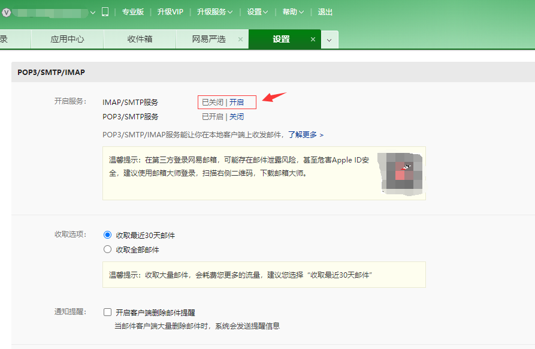
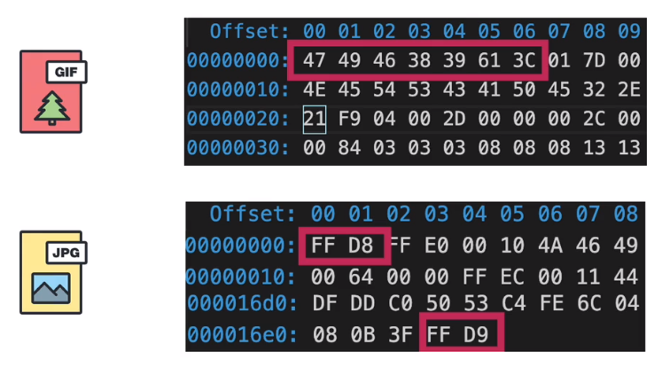

### 全栈项目实战

技术选型:
+ Vue + Nuxt + Egg
+ 埋点系统(用户行为监控), 发布(gitlab), 性能测试(Chrome performance)
+ 报错 Sentry, 错误监控系统

### 项目搭建
[Nuxt中文网](https://zh.nuxtjs.org/guide/installation)

+ 1. 初始化:

```bash
npx create-nuxt-app node-nuxt-client
```
`create-nuxt-app` 在安装的时候提供了很多的选项, 这里我们选用:
```
Programming language :  javascript
Package manager      :  npm
UI framework         :  Element
Nuxt.js modules      :  axios
Testing framework    :  jest
Rendering mode       :  Universal (SSR / SSG)
Deployment target    :  Server (Node.js hosting)
Development tools    :  jsconfig.json
```
`nuxt` 默认启动端口是 `3000`, 如果我们想自定义启动端口就直接修改 `package.json`:

````json
// package.json
"scripts": {
    "dev": "nuxt --hostname 127.0.0.1 --port 8005",
    "build": "nuxt build",
    "start": "nuxt start",
    "export": "nuxt export",
    "serve": "nuxt serve",
    "test": "jest"
}
````

+ 2. `egg`脚手架初始化服务端:

````bash
npm init egg --type=simple node-egg-server
npm install svg-captcha

cd node-egg-server
npm install 
npm start
````

### 验证码功能

+ 1. client 端: `layouts` 目录下新建 `Login.vue`;  [Nuxt 布局](https://zh.nuxtjs.org/guide/views#%E5%B8%83%E5%B1%80)

````bash
# nuxt 里面安装 sass 不需要做任何配置, 只需要安装就行了
npm install node-sass sass-loader

# 注册的时候密码需要 md5 加密一下
npm install md5
````

````html
<template>
    <nuxt/>
</template>

<script>
export default {

}
</script>
````
`pages` 目录下新建 `Register.vue` 页面:

````html
<template>
    <div class="register-container">
        <el-form label-width="80px" :rules="rules" ref="registForm" :model="form">
            <el-form-item label="用户名" prop="username">
                <el-input v-model="form.username" placeholder="请输入邮箱或手机号"></el-input>
            </el-form-item>
            <el-form-item label="昵称" prop="nickname">
                <el-input v-model="form.nickname" placeholder="请输昵称"></el-input>
            </el-form-item>
            <el-form-item label="密码" prop="password">
                <el-input v-model="form.password" placeholder="请输入密码" show-password></el-input>
            </el-form-item>
            <el-form-item label="确认密码" prop="repassword">
                <el-input v-model="form.repassword" placeholder="请再次输入密码" show-password></el-input>
            </el-form-item>
            <el-form-item label="验证码" prop="captcha">
                <div class="captcha-container">
                    <el-input v-model="form.captcha" placeholder="请输入验证码"></el-input>
                </div>
                
            </el-form-item>
            <el-form-item >
                <el-button type="primary" @click="onSubmit">注册</el-button>
            </el-form-item>
        </el-form>
    </div>
</template>

<script>
import md5 from 'md5';
export default {
    layout:"Login",
    data(){
        return{
            form:{
                username:"",
                nickname:'',
                password:'',
                repassword:'',
                captcha:''
            },
            rules:{
                username:[
                    { required: true, message: '请输入用户名', trigger: 'blur' }
                ],
                nickname:[
                    { required: true, message: '请输入用户昵称', trigger: 'blur' },
                    { min: 3, max: 6, message: '长度在 3 到 6 个字符', trigger: 'blur' }
                ],
                password:[
                    { required: true, message: '请输入6 - 12 位密码', trigger: 'blur',pattern: /^[\w_]{6,12}$/g}
                ],
                repassword:[
                    { required: true, message: '请再次输入密码'},
                    { validator:(rule,value,callback)=>{
                        if(value !== this.form.password){
                            callback(new Error("两次输入的密码不一致~"));
                        }
                        callback();
                    }}
                ],
                captcha:[
                    { required: true, message: '请输入正确的验证码' }
                ]
            },
            captcha:'/api/captcha?rd='+ Math.random()
        }
    },
    methods:{
        changeCaptcha(){
            this.captcha = '/api/captcha?rd='+ Math.random();
        },
        onSubmit(){
            this.$refs.registForm.validate(async valid =>{
                if(!valid) return console.log("校验失败~");
                const obj = {
                    username:this.form.username,
                    nickname:this.form.nickname,
                    password:md5(this.form.password),
                    captcha:this.form.captcha
                }
                const res = await this.$http.post('/user/register',obj);
                if(res.data.code == 0){
                    this.$alert('注册成功~','成功',{
                        confirmButtonText:"去登录",
                        callback:()=>{
                            this.$router.push('/Login');
                        }
                    });
                }else{
                    this.$alert(res.data.message);
                }
            })
        }
    }
}
</script>

<style lang="scss" scoped>
.register-container{
    width: 600px;
    margin: 150px auto;
}
</style>
````
这里我们请求验证码的地址是 `/api/captcha`, 并没有指定域名, 其实这里需要用到 `proxy` 代理功能, `nuxt` 里面配置代理只需要修改 `nuxt.config.js`:

````javascript
//...
modules: [
    // Doc: https://axios.nuxtjs.org/usage
    '@nuxtjs/axios',
    '@nuxtjs/proxy'
],
//...
proxy:{
    '/api/':{
        target:'http://localhost:7001',
        secure:false,
        pathRewrite:{
            '^/api':""
        }
    }
},
//...
````
`this.$http` 这个是我们将 axios 挂载到 Vue 实例上, 这里其实 `nuxt` 也有对 axios 做一些简单的封装; [nuxt 基本模块](https://zh.nuxtjs.org/guide/modules#%E5%9F%BA%E6%9C%AC%E6%A8%A1%E5%9D%97)

因为项目开发常用的一些用户 token 处理, 或者是 action 里面调用异步接口等, 所以我们可以将 `axios` 当做一个插件来使用, 修改 `nuxt.config.js`:

````javascript
//...
plugins: [
    '@/plugins/element-ui',
    '@/plugins/axios'
],
````
初始化 `nuxt` 项目的时候, nuxt 就已经将 `element-ui` 当做插件放在 `plugins` 目录下了, 所以这里我们也需要在 `plugins` 目录下面新建一个 `axios.js`:

````javascript
import Vue from 'vue';
import axios from 'axios';

const service = axios.create({
    timeout:5,
    baseURL:'/api',
})

Vue.prototype.$http = service;

export const http = service;

````

+ 2. Server 端: 

安装 `svg-captcha`:

```bash
npm install svg-captcha
```
`controller` 目录下面新建一个 `common.js`(验证码拿出来单独放在公用的路由里面):

***app/controller/common.js***
```javascript
const Controller = require('egg').Controller;
const svgCaptcha = require('svg-captcha');

class ConmonController extends Controller{
    /**
     * 生成验证码
     */
    async captcha(){
        const captcha = svgCaptcha.create({
            size:4,                 // 生成 4 个字符的验证码
            ignoreChars:'0o1i',     // 过滤掉 0o1i 这种容易混淆的数字和字母
            noise:3,                // 噪点
            color:true,             // 默认为灰色背景, 开启这个选项之后就读取 background 背景 
            background:'#cc9966',   // 背景颜色
            width:100,              // 图片宽度
            height:40,              // 图片高度
            fontSize:40             // 文字大小   
        })
        console.log('captcha=>',captcha.text);
        
        this.ctx.session.captcha = captcha.text;
        this.ctx.response.type = 'image/svg+xml';
        this.ctx.body = captcha.data;
    }
}

module.exports = ConmonController;
```
创建好 `controller` 之后还需要在 `router.js` 里面去配置路由:

```javascript
module.exports = app => {
    const { router, controller } = app;
    router.get('/', controller.home.index);
    router.get('/captcha',controller.common.captcha);
};
```

### 注册功能

前面其实前端已经实现了注册发送请求的功能, 后端只需要做相应的路由就行了, 不过如果 `user` 下面对应有很多个接口, 例如 : `user/login`, `user/register`, `user/info` 等, 我们就可以使用 `egg` 的 `egg-router-group` 来对路由进行分组了;

+ 1. Server端:

```bash
# egg-router-group  路由分组管理
# egg-mongoose      mogoodb 管理工具
# egg-validate      后端参数校验
# jsonwebtoken      jwt签名
npm install egg-router-group egg-mongoose egg-validate jsonwebtoken md5
```
在使用 node 做接口的时候, 我们需要考虑一个接口的规范, 例如:

```javascript
{
    code:0,
    message:"请求成功~",
    data:{}
}

// code  0      表示请求成功
// code  -1     表示请求失败
```
在 `controller` 目录下新建 `base.js`, 当做每一个请求返回给前端的中间件, 定义统一的接口规范:

```javascript
const Controller = require('egg').Controller;

class BaseController extends Controller{
    success(data,message = "请求成功~"){
        this.ctx.body = {
            code:0,
            data:data,
            message:message
        }
    }

    error(message,code = -1, errors = {}){
        this.ctx.body = {
            code,
            message,
            errors
        }
    }
}

module.exports = BaseController;
```
后面所有的 `Controller` 都可以继承自 `BaseController` 了; 例如:

```javascript
const BaseController = require('./base');

class UserController extends BaseController{
    async login(){

    }

    async register(){

    }
}
```
#### egg-router-group 插件使用
首先, 我们需要修改 `config/plugin.js`: [egg-router-group 文档](https://github.com/zzzs/egg-router-group)

```javascript
exports.mongoose = {
    enable:true,
    package:"egg-mongoose"
}

exports.routerGroup = {
    enable:true,
    package:"egg-router-group"
}

exports.validate = {
    enable:true,
    package:"egg-validate"
}
```
修改 `router.js`:

```javascript
module.exports = app => {
    const { router, controller } = app;
    router.get('/', controller.home.index);
    router.get('/captcha', controller.common.captcha);

    // 路由组
    router.group({ name: "user", prefix: "/user" }, router => {
        const { login, register, verify } = controller.user;

        router.post('/login', login);
        router.post('/register', register);
        router.get('/verify', verify);
    })
};
```
如果前端提交过来的请求是 `post`, `egg` 会默认做 `csrf` 校验, 这里我们在开发环境可以暂时先关闭掉:

```javascript
// config/config.default.js

//...
return {
    ...config,
    ...userConfig,
    security:{
        csrf:{
            enable:false
        }
    },
    mongoose:{
        url: 'mongodb://127.0.0.1:27017/nuxthub',
        options: {
            // useMongoClient: true,
            autoReconnect: true,
            reconnectTries: Number.MAX_VALUE,
            bufferMaxEntries: 0,
        },
    }
};
```
#### mongoose 插件使用

`egg` 三层规范是将数据库操作放在 `model` 里面, 在 `app` 目录下新建 `model/user.js`, 用来放 `user`模型;

***app/model/user.js***
```javascript
module.exports = app =>{
    const mongoose = app.mongoose;
    const Schema = mongoose.Schema;

    const UserSchema = new Schema({
        username:{
            type:String,
            required:true
        },
        password:{
            type:String,
            required:true
        },
        nickname:{
            type:String,
            required:true
        },
        avatar:{
            type:String,
            required:false,
            default:'/user.png'
        }
    },{ timestamps:true })
    return mongoose.model("User",UserSchema);
}
```
然后修改 `controller/user.js`, 让前端 post 的注册接口能正常使用:

```javascript
//...
async register(){
    const { ctx } = this;
    const { username, nickname, password, captcha } = ctx.request.body;

    // 验证码是否与 session 存储的验证码一致
    if(captcha && captcha.toLocaleLowerCase() !== ctx.session.captcha.toLocaleLowerCase()) return this.error("验证码输入错误");

    // 用户名是否存在
    if(await this.checkUserName(username)) return this.error("用户名已存在");

    const ret = await ctx.model.User.create({
        username,
        password:md5(password + HashSalt),      // 前端传过来的密码再一次进行 md5
        nickname
    })

    return ret._id ? this.success("注册成功~") : this.error("注册失败,请重试~");
}
async checkUserName(username){
    return await this.ctx.model.User.findOne({username});
}
// ...
```
### 登录功能实现
登录与注册的功能前端实现上基本一致, 不一样的就是服务端需要使用 `jsonwebtoken` 生成令牌, 前端需要将 token 存储起来;

+ 1. server 端:

```javascript
const jwt = require('jsonwebtoken');

//... 
async login(){
    const { ctx, app } = this;
    const { username, password, captcha } = ctx.request.body;

    // 验证码是否与 session 存储的验证码一致
    if(captcha && captcha.toLocaleLowerCase() !== ctx.session.captcha.toLocaleLowerCase()) return this.error("验证码输入错误");

    const user = await ctx.model.User.findOne({
        username,
        password:md5(password + HashSalt)
    })

    if(!user) return this.error("用户名或密码错误~");

    // 将用户信息加密成 token 返回给前端
    const token = jwt.sign({
        id:user._id,
        username:user.username
    },app.config.jwt.secret,{
        expiresIn:"1h"          // 表示设置 token 的过期时间为 1小时
    })

    this.success({token:token,nickname:user.nickname});
}
```
`app.config` 就是 `config/config.default.js`, `egg` 将配置文件挂载到了全局的 `app` 上; 这里我们将 `jwt` 加密字符串放在了全局配置里面, 因为后面还有地方需要用到:

```javascript
// config/config.default.js

//...
return {
    ...config,
    ...userConfig,
    security:{
        csrf:{
            enable:false
        }
    },
    mongoose:{
        url: 'mongodb://127.0.0.1:27017/nuxthub',
        options: {
            // useMongoClient: true,
            autoReconnect: true,
            reconnectTries: Number.MAX_VALUE,
            bufferMaxEntries: 0,
        },
    },
    jwt:{
        secret:"@:hope*&HGF~!"
    }
};
```
### 邮件验证码
通常项目开发中, 如果要做到较高安全等级的验证, 还需要利用第三方的一些工具, 例如: 邮箱验证, 短信验证码验证; 而邮箱验证也是比较常用的一种;

`npm` 库里面也提供了 `nodemailer` [nodemailer](https://www.npmjs.com/package/nodemailer) 这样的工具, 它的功能也是比较完善的;

+ 1. server 端:
```bash
npm install nodemailer
```

发送邮件同验证码一样, 属于一个独立的功能, 可以将路由放在 `common.js` 里面:

***app/controller/common.js***
```javascript
//...

/**
* 发送邮件验证码
*/
async sendEmail(){
    const { ctx } = this;
    const { email } = ctx.query;
    let code = Math.random().toString().slice(2,6);

    console.log('邮箱:' + email + '验证码:' + code);
    ctx.session.emailcode = code;

    const subject = "Nuxt 管理后台验证码~";
    const text = "看看随便写点什么";
    const html = `
        <h1>hope的管理后台</h1>
        <a href="https://scorpio-nan.github.io/#/">${code}</a>
    `;
    const res = await this.service.tools.sendEmail(email,subject,text,html);
    return res ? ctx.body = {
        code : 0,
        message:"发送成功~"
    } : ctx.body = {
        code: -1,
        message: "发送失败, 请 60 秒后重试~"
    }
}
```
通常, `controller` 只提供数据, 业务层的处理都会放在 `service` 层, 在 `app` 目录新建 `service/tools.js`:

***app/service/tools.js***
```javascript
const Service = require('egg').Service;
const nodeMail = require('nodemailer');

const userEmail = 'user_nan@126.com';
const transport = nodeMail.createTransport({
    host:'smtp.126.com',
    port:465,
    secure:true,
    auth:{
        user:userEmail,
        // 这里的 password 并不是邮箱的登录密码, 邮箱开启 smtp 服务之后, 就需要用授权码登录邮箱
        pass:"XNRNWJBIUKDWRZNI"
    }
})

class ToolService extends Service{
    async sendEmail(email,subject,text,html){
        const mailOptions = {
            from:userEmail,       // 发送邮件的邮箱,通常这里会用公司固定的邮箱
            to:email,             // 需要发送给
            subject:subject,      // 邮件主题
            text:text,            
            html:html             // 邮件内容
        }
        try {
            return await transport.sendMail(mailOptions);
        } catch (error) {
            return false
        }   
    }
}

module.exports = ToolService;
```
需要注意的是, 首先我们要进到邮箱服务里面去开启 `smtp` 服务, 例如: 126 邮箱:



```bash
# http://127.0.0.1:7001/sendEmail?email=374505085@qq.com
```

### token 认证管理

用户通过登录接口登录成功之后, 服务端会签发一个 token 返回个给前端, 前端需要将 token 存储在客户端 (localStorage 、cookie 等);

```javascript
//...
const res = await this.$http.post('/user/login',obj);
if(res.data.code == 0){
    // 登录成功需要前端存储一下 token
    localStorage.setItem('token',res.data.data.token);

    this.$alert('登录成功~','成功',{
        confirmButtonText:"确认",
        callback:()=>{
            this.$router.push('/UserCenter');
        }
    });
}
```
然后需要在 `axsio` 里面请求拦截的地方将 token  设置在请求头里面传递给后端：

```javascript
// axsio.js

import Vue from 'vue';
import axios from 'axios';

const service = axios.create({
    baseURL:'/api',
})

//请求拦截器
service.interceptors.request.use( async config =>{
    const token = localStorage.getItem('token');
    if(token) config.headers.common['Authorization'] = 'Hope ' + token;
    return config;
})

//...
```
登录成功之后跳转到用户详情页, 详情页面会去后端读取用户信息, 当然, 这里就需要校验 `token` 的合法性了; 我们可以把这个操作交给中间件去处理, 因为后面可能还有其他的接口会用到鉴权的中间件;

在 `app` 目录下面新建 `middleware/jwt.js`:

```javascript
// 解析 token 的中间件, 也可以使用 egg-jwt

const jwt = require('jsonwebtoken');

module.exports = ({app}) =>{
    return async function verity(ctx,next){
        if(!ctx.request.header.authorization){
            return ctx.body = {
                code:-1,
                message:'登录已过期,请重新登录~'
            }
        }
        const token = ctx.request.header.authorization.replace('Hope ','');
        try {
            const ret = await jwt.verify(token,app.config.jwt.secret);
            ctx.state.username = ret.username;
            ctx.state.userid = ret.id;

            await next();

        } catch (error) {
            if(error.name == 'TokenExpiredError'){
                ctx.body = {
                    code:466,
                    message:"登录过期~"
                }
            }else{
                ctx.body = {
                    code:-1,
                    message:'用户信息出错~'
                }
            }
        }
    }
}
```
创建好中间件, 可以在注册路由的地方, 先把中间件的结果返回出来, 如果符合规则就进到下一个中间件, 修改 `router.js`:

```javascript
// router.js

module.exports = app => {
    const { router, controller } = app;
    const jwt = app.middleware.jwt({app});

    router.get('/', controller.home.index);

    // 验证码
    router.get('/captcha', controller.common.captcha);

    // 邮件验证
    router.get('/sendEmail',controller.common.sendEmail);

    // 路由组
    router.group({ name: "user", prefix: "/user" }, router => {
        const { login, register, verify, info } = controller.user;

        router.post('/login', login);
        router.post('/register', register);

        // 获取用户信息的路由需要jwt鉴权中间件;
        router.get('/info',jwt,info);

        router.get('/verify', verify);
    })
};
```

```javascript
// app/comtroller/user.js

//...

/**
* 用户信息接口
*/
async info(){
    const { ctx } = this;
    
    // 从 token 里面去读取用户数据, 这一步交给中间件 jwt 去处理, 因为后面很多路由可能会用到这个中间件;
    const { username, userid} = ctx.state;
    const ret = await ctx.model.User.findOne({username,_id:userid});
    this.success(ret);
}
```
当前端调用 `user/info` 接口的时候, 就会把数据库里面的 user 信息返回给前端, 但是这里需要注意的是, 在 `findOne` 操作这里并没有做任何的数据过滤, 所以连用户的密码都会返回给前端, 这个时候我们只需要在 `model` 层修改用户模型就行了：

```javascript
// app/model/user.js

//...
password:{
    type:String,
    required:true,
    select:false
},
```
给不需要查询出来的数据添加一个 `select:false` 的属性;

### 文件上传

node 自带的 `fs` 模块可以操作文件和目录, 第三方的 `fs-extra` 更好用:

```bash
npm install fs-extra
```
+ 1. client 端:

```html
<template>
    <div class="upload-file">
        <el-form>
            <el-form-item>
                <input type="file" name="file" id="" @change="handleFileChange">
            </el-form-item>
            <el-form-item>
                <el-button type="primary" @click="uploadFile">上传</el-button>
            </el-form-item>
        </el-form>
    </div>
</template>
<script>
export default {
    data(){
        return{
            file:''
        }
    },
    methods:{
        handleFileChange(e){
            const [file] = e.target.files;
            if(!file) return;
            this.file = file;
        },
        async uploadFile(){
            const form = new FormData();
            form.append('name','file');
            form.append('file',this.file);

            const ret = await this.$http.post('/uploadFile',form);
            console.log(ret);
        }
    }
}
</script>
```

+ 2. Server 端:

```javascript
// app/controller/common.js

//...
/**
* 文件上传
*/
async uploadFile(){
    const { ctx } = this;
    const file = ctx.request.files[0];
    const { name } = ctx.request.body;

    await fse.move(file.filepath, this.app.config.uploadDir + '/' + file.filename);
    ctx.body = {
        code:0,
        message:"上传成功~",
        data:{
            url:'/public/' + file.filename
        }
    }
}

// app/config.default.js

const path = require('path');
// 打开文件上传
config.multipart = {
    mode:'file',
    // 文件白名单, 返回 true 表示任何文件都可以上传
    whitelist:()=> true,
    fileSize:655360000000
}

// 自定义文件上传的路径
config.uploadDir = path.resolve(__dirname,'..','app/public');
```
这个只是简单的实现了文件 copy 功能, 也是文件上传的基本版本; 接下来继续完善文件上传的操作;

#### 拖拽上传
通常, PC端的文件上传不只是选择文件, 还可以使用拖拽的方式上传文件, 可以对文件上传做一些更改, 使其可以拖拽上传:

```html
<template>
    <div class="upload-file">
        <el-form>
            <el-form-item>
                <div class="drag-container" ref="drag">
                    <input type="file" name="file" id="" @change="handleFileChange">
                </div>
            </el-form-item>
            <el-form-item>
                <el-progress :stroke-width="15" :text-inside="true" :percentage="progress"></el-progress>
            </el-form-item>
            <el-form-item>
                <el-button type="primary" @click="uploadFile">上传</el-button>
            </el-form-item>
        </el-form>
    </div>
</template>
<script>
export default {
    data(){
        return{
            file:'',
            progress:0
        }
    },
    mounted(){
        this.bindEvent();
    },
    methods:{
        bindEvent(){
            const drag = this.$refs.drag;
            drag.addEventListener('dragover', e =>{
                drag.style.borderColor = "#ff00f0";
                e.preventDefault();
            })

            drag.addEventListener('draglive',e =>{
                drag.style.borderColor = "#ccc";
                e.preventDefault();
            })

            drag.addEventListener('drop',e =>{
                drag.style.borderColor = "#ccc";
                const fileList = e.dataTransfer.files;
                this.file = fileList[0];
                e.preventDefault();
            })

        },
        handleFileChange(e){
            const [file] = e.target.files;
            if(!file) return;
            this.file = file;
        },
        async uploadFile(){
            const form = new FormData();
            form.append('name','file');
            form.append('file',this.file);

            // 上传的过程中可以计算出上传的进度;
            const ret = await this.$http.post('/uploadFile',form,{
                onUploadProgress:progress =>{
                    this.progress = Number(((progress.loaded / progress.total) * 100).toFixed(2));
                }
            });
            console.log(ret);
        }
    }
}
</script>
<style lang="scss" scoped>
.drag-container{
    width: 400px;
    height: 200px;
    border: 1px dashed #ccc;
    text-align: center;
    line-height: 200px;
    &:hover{
        border: 1px dashed #ff00f0;
    }
}
</style>
```

#### 文件校验
通常情况下, 做文件上传我们都是通过文件的后缀名来做文件校验, 例如: `.jpg`, `.png` 等, 但是这样的校验, 其实是有隐患的, 如果说有人将恶意的文件后缀修改为 `.png`, 这个时候传到服务器的文件就是恶意文件了;

[根据文件识别头信息](https://www.jianshu.com/p/45c0f85c47ed);

实际上, 图片的内容是一个二进制的源文件(`vscode hexdump` 插件可以查看图片的二进制编码), 例如:



因此, 前端可以根据文件的二进制流信息来判断当前文件是否符合上传的规范:

```javascript
// upload.vue

// ...
methods:{
    // 通过文件流来判断当前文件是否是图片
    async isImage(file){
        return await this.isGif(file) || await this.isPng(file) || await this.isJpeg(file);
    },

    async isGif(file){
        // GIF89a  GIF87a
        // 前面6个16进制是  47 49 46 38 39 61  或  47 49 46 38 37 61
        // 16 进制转换
        const ret = await this.blobToString(file.slice(0,6));
        console.log('isGif',ret);
        return (ret == '474946383961') || (ret == '474946383761');
    },

    async isPng(file){
        // 89 50 4E 47 0D 0A 1A 0A
        const ret = await this.blobToString(file.slice(0,8));
        return ret == "89504E470D0A1A0A";
    },

    async isJpeg(file){
        // 前两个  FF D8   后两个 FF D9
        const len = file.size;
        const start = await this.blobToString(file.slice(0,2));
        const end = await this.blobToString(file.slice(-2,len));
        return start == 'FFD8' && end == 'FFD9';
    },

    async blobToString(blob){
        return new Promise(resolve =>{
            const reader = new FileReader();
            reader.onload = function(){
                const ret = reader.result.split('')
                            .map(v => v.charCodeAt())
                            .map(v => v.toString(16).toUpperCase())
                            .map(v => v.padStart(2,'0'))
                            .join('');
                resolve(ret);
            }
            reader.readAsBinaryString(blob);
        })
    },

    async uploadFile(){
        if(!await this.isImage(this.file)) return this.$alert('文件格式不对~');

        const form = new FormData();
        form.append('name','file');
        form.append('file',this.file);

        const ret = await this.$http.post('/uploadFile',form,{
            onUploadProgress:progress =>{
                this.progress = Number(((progress.loaded / progress.total) * 100).toFixed(2));
            }
        });
        console.log(ret);
    }
}
```

#### 切片上传
前端可以通过 `blob` 的方式可以将文件切片, 分块上传; 将一个较大的文件切分成若干个小文件流进行上传, 为后面的断点续传做基础;

+ 1. client 端:

安装 `spark-md5` 库, [npm spark-md5](https://www.npmjs.com/package/spark-md5)

```bash
npm install spark-md5
```
首先抛开文件上传的逻辑, 如果上传的文件比较大的时候, 计算 md5 会消耗很多的时间, 可以使用 `webwroker` 来计算:

***webworker hash计算***
```html
// upload.vue

<script>
const CHUNCK_SIZE = 1 * 1024 * 1024;
export default {
    data(){
        return{
            file:'',
            progress:0,
            chunks:null,
            worker:null,
            hashProgress:0
        }
    },
    methods:{
        handleFileChange(e){
            const [file] = e.target.files;
            if(!file) return;
            this.file = file;
        },

        // 文件碎片, size 为每一个区块的大小
        async createFileChunck(file,size = CHUNCK_SIZE){
            const chunks = [];
            let cur = 0;
            while(cur < this.file.size){
                chunks.push({index:cur,file:this.file.slice(cur,cur + size)});
                cur += size;
            }
            return chunks;
        },

        // webworker 计算 md5
        async calculateHashWorker(){
            return new Promise(resolve =>{
                this.worker = new Worker('./hash.js');
                this.worker.postMessage({chunks: this.chunks});
                this.worker.onmessage = e =>{
                    const { progress, hash } = e.data;
                    this.hashProgress = Number(progress.toFixed(2));
                    if(hash) resolve(hash);
                }
            })
        },

        async uploadFile(){
            //if(!await this.isImage(this.file)) return this.$alert('文件格式不对~');

            this.chunks = await this.createFileChunck(this.file);
            const hash = await this.calculateHashWorker();

            console.log(this.chunks);
            console.log('文件hash值:', hash);

            return;
            const form = new FormData();
            form.append('name','file');
            form.append('file',this.file);

            const ret = await this.$http.post('/uploadFile',form,{
                onUploadProgress:progress =>{
                    this.progress = Number(((progress.loaded / progress.total) * 100).toFixed(2));
                }
            });
            console.log(ret);
        }
    }
}
</script>
```
使用 `webwroker` 有一定的局限性, 不能和 npm 更好的结合起来, 所以我们需要将前面安装的 `spark-md5` 源码拷贝一份到 `static` 目录下, 然后在 `static` 目录下新建 `hash.js`:

```javascript
self.importScripts('spark-md5.min.js');

self.onmessage = e =>{
    const { chunks } = e.data;
    const spark = new self.SparkMD5.ArrayBuffer();

    let progress = 0;
    let count = 0;

    const loadNext = index =>{
        const reader = new FileReader();
        reader.readAsArrayBuffer(chunks[index].file);
        reader.onload = e =>{
            count ++;
            spark.append(e.target.result);
            if(count == chunks.length){
                self.postMessage({
                    progress:100,
                    hash:spark.end()
                })
            }else{
                progress += 100 / chunks.length;
                self.postMessage({
                    progress:progress
                })
                loadNext(count);
            }
        }
    }

    loadNext(0);
}
```
还可以用 `requestIdleCallback` 的方式来计算:
***requestIdleCallback hash计算***
```html
<script>
import sparkMd5 from 'spark-md5';

const CHUNCK_SIZE = 0.1 * 1024 * 1024;
export default {
    data(){
        return{
            file:'',
            progress:0,
            chunks:null,
            worker:null,
            hashProgress:0
        }
    },
    methods:{

        handleFileChange(e){
            const [file] = e.target.files;
            if(!file) return;
            this.file = file;
        },
        // 文件碎片, size 为每一个区块的大小
        async createFileChunck(file,size = CHUNCK_SIZE){
            const chunks = [];
            let cur = 0;
            while(cur < this.file.size){
                chunks.push({index:cur,file:this.file.slice(cur,cur + size)});
                cur += size;
            }
            return chunks;
        },
        // 时间切片的方式
        async calculateHashIdle(){
            return new Promise(resolve =>{
                const spark = new sparkMd5.ArrayBuffer();
                let count = 0;

                const appendToSpark = async file =>{
                    return new Promise(res =>{
                        const reader = new FileReader();
                        reader.readAsArrayBuffer(file);
                        reader.onload = e =>{
                            spark.append(e.target.result);
                            res();
                        }
                    })
                }

                const wrokLoop = async deadline =>{
                    while(count < this.chunks.length && deadline.timeRemaining() > 1){
                        // 空闲时间, 且有任务
                        await appendToSpark(this.chunks[count].file);
                        count ++;
                        if(count < this.chunks.length){
                            this.hashProgress = Number(((100 * count) / this.chunks.length).toFixed(2))
                        }else{
                            this.hashProgress = 100;
                            resolve(spark.end());
                        }
                    }
                    window.requestIdleCallback(wrokLoop);
                }
                window.requestIdleCallback(wrokLoop);
            })
        },

        async uploadFile(){
            //if(!await this.isImage(this.file)) return this.$alert('文件格式不对~');

            this.chunks = await this.createFileChunck(this.file);
            const hash = await this.calculateHashIdle();

            console.log(this.chunks);
            console.log('文件hash值:', hash);

            return;
            const form = new FormData();
            form.append('name','file');
            form.append('file',this.file);

            const ret = await this.$http.post('/uploadFile',form,{
                onUploadProgress:progress =>{
                    this.progress = Number(((progress.loaded / progress.total) * 100).toFixed(2));
                }
            });
            console.log(ret);
        }
    }
}
</script>
```
***抽样 hash计算***
```html
<script>
import sparkMd5 from 'spark-md5';
const CHUNCK_SIZE = 1 * 1024 * 1024;
export default {
    data(){
        return{
            file:'',
            progress:0,
            chunks:null,
            worker:null,
            hashProgress:0
        }
    },
    methods:{
        // 文件碎片, size 为每一个区块的大小
        async createFileChunck(file,size = CHUNCK_SIZE){
            const chunks = [];
            let cur = 0;
            while(cur < this.file.size){
                chunks.push({index:cur,file:this.file.slice(cur,cur + size)});
                cur += size;
            }
            return chunks;
        },
        // 抽样 hash 计算, 提高效率, 会损失一定精度
        async calculcateHashSample(){
            return new Promise(resolve =>{
                const spark = new sparkMd5.ArrayBuffer();
                const reader = new FileReader();

                const file = this.file;
                const size = file.size;

                // 每 2M 切成一片
                const offset = 2 * 1024 * 1024;

                // 第一个区块 2M, 最后一个数据全要, 中间的取前后各两个字节
                let chunks = [file.slice(0,offset)];

                let cur = offset;
                while(cur < size){
                    if(cur + offset >= size){
                        // 最后一个区块
                        chunks.push(file.slice(cur,cur + offset));
                    }else{
                        // 中间区块
                        const mid = cur + offset / 2;
                        const end = cur + offset;
                        chunks.push(file.slice(cur,cur + 2));
                        chunks.push(file.slice(mid,mid + 2));
                        chunks.push(file.slice(end -2 , end));
                    }
                    cur += offset;
                }
                reader.readAsArrayBuffer(new Blob(chunks));
                reader.onload = e =>{
                    spark.append(e.target.result);
                    this.hashProgress = 100;
                    resolve(spark.end());
                }
            })
        },

        async uploadFile(){
            //if(!await this.isImage(this.file)) return this.$alert('文件格式不对~');

            this.chunks = await this.createFileChunck(this.file);
            const hash = await this.calculcateHashSample();

            console.log(this.chunks);
            console.log('文件hash值:', hash);

            return;
            const form = new FormData();
            form.append('name','file');
            form.append('file',this.file);

            const ret = await this.$http.post('/uploadFile',form,{
                onUploadProgress:progress =>{
                    this.progress = Number(((progress.loaded / progress.total) * 100).toFixed(2));
                }
            });
            console.log(ret);
        }
    }
}
</script>
```

### 文件合并

大文件上传, 就是将大文件切分成若干个小区块的文件进行上传, 上传完成之后告诉服务端已经上传完成, 服务端进行文件合并操作;

+ 1. client 端:

````html
<script>
import sparkMd5 from 'spark-md5';
const CHUNCK_SIZE = 1 * 1024 * 1024;
export default {
    data(){
        return{
            file:'',
            progress:0,
            chunks:[],
            worker:null,
            hashProgress:0,
            hash:null,
        }
    },
    mounted(){
        this.bindEvent();
    },
    computed:{
        cubeWidth(){
            return Math.ceil(Math.sqrt(this.chunks.length)) * 16;
        },
        uploadProgress(){
            if(!this.file || this.chunks.length) return 0;
            const loaded = this.chunks.map(item => item.chunk.size * item.progress).reduce((acc,cur) => acc + cur , 0);
            return Number(((loaded * 100) / this.file.size).toFixed(2));
        }
    },
    methods:{
        handleFileChange(e){
            const [file] = e.target.files;
            if(!file) return;
            this.file = file;
        },
        // 文件碎片, size 为每一个区块的大小
        async createFileChunck(file,size = CHUNCK_SIZE){
            const chunks = [];
            let cur = 0;
            while(cur < this.file.size){
                chunks.push({index:cur,file:this.file.slice(cur,cur + size)});
                cur += size;
            }
            return chunks;
        },

        // webworker 计算 md5
        async calculateHashWorker(){
            return new Promise(resolve =>{
                this.worker = new Worker('./hash.js');
                this.worker.postMessage({chunks: this.chunks});
                this.worker.onmessage = e =>{
                    const { progress, hash } = e.data;
                    this.hashProgress = Number(progress.toFixed(2));
                    if(hash) resolve(hash);
                }
            })
        },

        async uploadFile(){
            //if(!await this.isImage(this.file)) return this.$alert('文件格式不对~');
            this.chunks = await this.createFileChunck(this.file);
            const hash = await this.calculateHashWorker();
            this.hash = hash;

            this.chunks = this.chunks.map((chunk,index)=>{
                // 上传的时候不能直接上传原文件了, 需要改为上传 chunks, 后端进行合并
                const name = hash + '-' + index;
                return {
                    hash,
                    name,
                    index,
                    chunk:chunk.file,
                    progress:0
                }
            })

            await this.uploadChunks(this.chunks);
        },

        async uploadChunks(chunks){
            const request = chunks.map((chunk,index)=>{
                // 转成 promise 对象
                const form = new FormData();
                form.append('chunk',chunk.chunk);
                form.append('hash',chunk.hash);
                form.append('name',chunk.name);

                return form;

                // 每个区块的上传进度
            }).map((form,index) => this.$http.post('/uploadFile', form, {
                onUploadProgress:progress =>{
                    chunks[index].progress = Number(((progress.loaded / progress.total) * 100).toFixed(2));
                }
            }))

            await Promise.all(request);
            await this.mergeRequest();
        },

        // 文件上传完成之后, 执行合并文件操作
        async mergeRequest(){
            this.$http.post('/merge',{
                ext:this.file.name.split('.').pop(),
                size:CHUNCK_SIZE,
                hash:this.hash
            })
        }
    }
}
</script>
````

+ 2. server 端:

***app/controller/common.js***
```javascript

const fse = require('fs-extra');
const path = require('path');

//...
async uploadFile(){
    const { ctx } = this;
    // 文件切片存放在 public/hash/(hash + index);
    const file = ctx.request.files[0];
    const { hash , name } = ctx.request.body;
    const chunkpath = path.resolve(this.app.config.uploadDir,hash);
    
    // 如果文件不存在,就新建一个文件夹
    if(!fse.existsSync(chunkpath)) await fse.mkdir(chunkpath);

    await fse.move(file.filepath, `${chunkpath}/${name}`);

    ctx.body = {
        code:0,
        message:"上传成功~",
        data:{
            url:chunkpath + '/' + name
        }
    }
}

async mergeFile(){
    const { ctx } = this;
    const { ext, name, hash, size} = ctx.request.body;
    const filepath = path.resolve(this.app.config.uploadDir,`${hash}.${ext}`);

    await this.ctx.service.tools.mergeFile(filepath,hash,size);

    ctx.body = {
        code:0,
        message:"上传成功~",
        data:{
            url:'/public/' + hash + '.' + ext
        }
    }
}
```

***app/service/tools.js***
```javascript
const path = require('path');
const fse = require('fs-extra');

//...
async mergeFile(filepath,hashpath,size){
    const chunkDir = path.resolve(this.app.config.uploadDir,hashpath);  //切片的文件夹
    let chunks = await fse.readdir(chunkDir);
    chunks.sort((a,b) => a.split('-')[1] - b.split('-')[1]);
    chunks = chunks.map(cp => path.resolve(chunkDir,cp));

    await this.mergeChunks(chunks,filepath,size,chunkDir);
}

async mergeChunks(files,dest,size,chunkDir){
    const pipStream = (filepath,writeStream)=> new Promise((resolve)=>{
        const readStream = fse.createReadStream(filepath);
        readStream.on('end',() =>{
            // 合并成功之后把之前的切片文件都删除掉
            fse.unlink(filepath,()=>{
                fse.rmdir(chunkDir);
            });
            resolve();
        })
        readStream.pipe(writeStream);
    })

    await Promise.all(
        files.map((file,index)=>{
            pipStream(file,fse.createWriteStream(dest,{
                start:index * size,
                end:(index + 1) * size
            }))
        })
    )
}
```

### 断点续传
断点续传的原理其实也是比较简单的, 就是在前端选择文件, 计算完 `hash` 值之后, 先向服务端发起一次请求, 看一下服务端已存在哪些文件碎片, 然后把剩余的碎片上传上去;

+ 1. client:

```javascript
//...
methods:{
    async uploadFile(){
        //if(!await this.isImage(this.file)) return this.$alert('文件格式不对~');
        this.chunks = await this.createFileChunck(this.file);
        const hash = await this.calculateHashWorker();
        this.hash = hash;

        // 计算完 hash 之后询问一下后端文件是否有上传过, 如果没有, 是否有文件的切片
        const {data : { uploaded, uploadedList }} = await this.$http.post('/checkfile',{
            hash:hash,
            ext:this.file.name.split('.').pop()
        })

        // 如果 uploaded 是 true, 就是已经上传过了
        if(uploaded) return this.$message.success('秒传成功~');

        this.chunks = this.chunks.map((chunk,index)=>{
            // 上传的时候不能直接上传原文件了, 需要改为上传 chunks, 后端进行合并
            const name = hash + '-' + index;
            return {
                hash,
                name,
                index,
                chunk:chunk.file,
                // 已经上传过的设置为 100
                progress: uploadedList.indexOf(name) > -1 ? 100 : 0
            }
        })
        console.log(this.chunks);
        console.log(uploadedList);

        await this.uploadChunks(this.chunks,uploadedList);
    },

    async uploadChunks(chunks,uploadedList){
        // 如果后端返回的hash名已存在, 那就说明这段是已经传过了的, 过滤掉
        const request = chunks.filter(chunk => uploadedList.indexOf(chunk.name) == -1).map((chunk,index)=>{
            // 转成 promise 对象
            const form = new FormData();
            form.append('chunk',chunk.chunk);
            form.append('hash',chunk.hash);
            form.append('name',chunk.name);

            return { form, index:chunk.index };

            // 每个区块的上传进度
        }).map(({form,index}) => this.$http.post('/uploadFile', form, {
            onUploadProgress:progress =>{
                chunks[index].progress = Number(((progress.loaded / progress.total) * 100).toFixed(2));
            }
        }))

        await Promise.all(request);
        await this.mergeRequest();
    },
}
```

+ 2. server端:

````javascript
// app/controller/common.js

/**
* 查看文件是否有切片
*/
async checkfile(){
    const { ctx } = this;
    const { ext, hash } = ctx.request.body;
    const filepath = path.resolve(this.app.config.uploadDir,`${hash}.${ext}`);

    let uploaded = false;
    let uploadedList = [];

    // 判断文件是否存在
    if(fse.existsSync(filepath)){
        uploaded = true;
    } else{
        uploadedList = await this.getUploadedList(path.resolve(this.app.config.uploadDir,hash));
    }
    ctx.body = {
        code:0,
        uploaded:uploaded,
        uploadedList:uploadedList
    }
}

/**
* 获取文件碎片
*/
async getUploadedList(dirpath){
    return fse.existsSync(dirpath) ? 
            // 过滤隐藏文件  .DS_Store
           fse.readdirSync(dirpath).filter(name => name[0] !== '.') : []
}
````

### 异步并发数控制
文件切片上传的过程中, 如果是稍大一些的文件, 会产生很多的切片, 同时发送很多个 `http` 上传的请求, 也会造成浏览器的卡顿; 这个时候就需要对并发数量进行控制了;

```javascript

//...
methods:{
    async uploadChunks(chunks,uploadedList){
        const request = chunks.filter(chunk => uploadedList.indexOf(chunk.name) == -1).map((chunk,index)=>{
            // 转成 promise 对象
            const form = new FormData();
            form.append('chunk',chunk.chunk);
            form.append('hash',chunk.hash);
            form.append('name',chunk.name);

            return { form, index:chunk.index,error:0};

            // 每个区块的上传进度
        })
        // .map(({form,index}) => this.$http.post('/uploadFile', form, {
        //     onUploadProgress:progress =>{
        //         chunks[index].progress = Number(((progress.loaded / progress.total) * 100).toFixed(2));
        //     }
        // }))

        //await Promise.all(request);
        await this.sendRequest(request);
        await this.mergeRequest();
    },
    // 上传可能报错, 报错之后进度条变红,开始重试, 如果重试三次失败整体全部失败;  limit 标识一起发送多少个请求;
    async sendRequest(chunks,limit = 4){
        return new Promise((resolve,reject) =>{
            const len = chunks.length;
            let count = 0;
            let isStop = false;
            const start = async ()=>{
                if(isStop) return;
                const task = chunks.shift();
                if(task) {
                    const { form, index } = task;
                    try {
                        await this.$http.post('/uploadFile', form, {
                            onUploadProgress:progress =>{
                                this.chunks[index].progress = Number(((progress.loaded / progress.total) * 100).toFixed(2));
                            }
                        })
                        if(count == len -1){
                            resolve();
                        }else{
                            count++;
                            start();
                        }
                    } catch (error) {
                        this.chunks[index].progress = -1;
                        if(task.error < 3){
                            task.error ++;
                            chunks.unshift(task);
                            start();
                        }else{
                            isStop = true;
                            reject();
                        }
                    }
                }
            }
            while(limit > 0){
                start();
                limit -= 1;
            }
        })
    },
}
```


