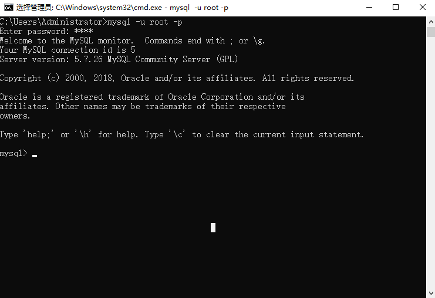
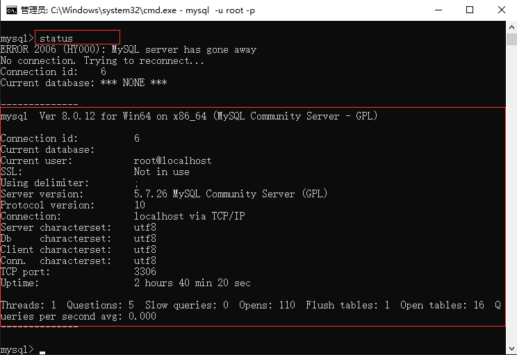

### 数据库基础

#### 数据库定义

数据库 `(Database) `是按照数据结构来组织、存储和管理数据的建立在计算机存储设备上的仓库, 通俗的讲, 数据库就是存储数据的地方, 就像冰箱是存储食物的地方一样;

##### 1 . 关系型数据库

关系型数据库是建立在关系模型基础上的数据库, 借助于集合代数等数学概念和方法来处理数据库中的数据. 简单说, 关系型数据库是由多张能互相连接的表组成的数据库;

优点:
- 都是使用表结构, 格式一致, 易于维护;
- 使用通用的 SQL 语言操作, 使用方便, 可用于复杂查询;
- 数据存储在磁盘中, 安全;

缺点:
- 读写性能比较差, 不能满足海量数据的高效率读写;
- 不节省空间, 因为建立在关系模型上, 就要遵循某些规则, 比如数据中某字段值即使为空仍要分配空间;
- 固定的表结构, 灵活度较低;

常见的关系型数据库有: ` MySQL `  ` Oracle `  ` SqlServer ` ...

##### 2 . 非关系型数据库
非关系型数据库又被称为 NoSQL（Not Only SQL ), 意为不仅仅是 SQL. 通常指数据以对象的形式存储在数据库中, 而对象之间的关系通过每个对象自身的属性来决定. 

优点:
- 非关系型数据库存储数据的格式可以是 key-value 形式、文档形式、图片形式等; 使用灵活, 应用场景广泛, 而关系型数据库则只支持基础类型; 
- 速度快, 效率高;  NoSQL 可以使用硬盘或者随机存储器作为载体, 而关系型数据库只能使用硬盘; 
- 海量数据的维护和处理非常轻松; 
- 非关系型数据库具有扩展简单、高并发、高稳定性、成本低廉的优势; 
- 可以实现数据的分布式处理; 

缺点:
- 非关系型数据库暂时不提供 SQL 支持, 学习和使用成本较高; 
- 非关系数据库没有事务处理, 没有保证数据的完整性和安全性; 适合处理海量数据, 但是不一定安全; 
- 功能没有关系型数据库完善; 

常见的非关系型数据库有 : `MongoDB`  `Redis`  ...


#### Mysql 安装启动

这里推荐使用 [phpstudy](https://www.xp.cn/) 的集成环境; 内置 `Nginx`, `Apache`, `Mysql` 服务;

安装完成之后, 还可以将 `mysql` 加入环境变量, 具体步骤: 我的电脑 --> 属性 --> 高级系统设置 --> 环境变量 --> 找到 path, 编辑  --> D:\phpstudy_pro\Extensions\MySQL8.0.12\bin

链接数据库之前, 需要先启动数据库服务, 可以先检测一下数据库服务是否运行正常:

```bash
# mysql 启动的端口默认为 3306 如果出现下面输出则为服务正常
netstat -an|find "3306"

# TCP    0.0.0.0:3306           0.0.0.0:0              LISTENING
# TCP    [::]:3306              [::]:0                 LISTENING

# 链接 mysql： 用户名  密码  服务ip(可以省略)
mysql -u[username] -p[password] -h[127.0.0.1]
```


登录完成之后输入 `status` 查看 `mysql` 版本信息:



##### Mysql 启动

图形化工具: `phpstudy` 内置一键启动;

dos命令启动:

```bash
net start mysql
```

### Mysql数据库基本操作

在写 `sql` 语句时候, 只需要遵守以下规则, 就可以避免很多错误：

- SQL 语句需要以 `;` 结尾: SQL 语句是逐条执行的, 一条 SQL 语句代表着一个数据库的操作, 以 `;` 结尾;
- SQL 语句不区分大小写:  不管写成 `SELECT` 或是 `select`, 解释都是一样的, 表名和列名也是如此;
- 常数的书写是固定的: SQL 语句常常需要直接书写字符串 (`'abc'`)、日期 (`'2020-07-26'`) 或者数字. 例如, 书写向表中插入字符串、日期或者数字等数据的 SQL 语句;

> 数据库操作, 推荐使用 `Navicat` 图形化管理工具; 

#### 查看数据库

`SHOW DATABASES` 语句来查看或显示当前用户权限范围以内的数据库;

```sql
show database [like <数据库名>];
```
查看所有数据库：

```sql
show database;
```
查看某一个数据库, 使用 `like` 从句:

```sql
-- 查看 test 数据库(完全匹配)
show database like "test";

-- 查看名字包含 test 的数据库(模糊匹配)
show database like "%test%";

-- 查看以 test 字符名开头的数据库
show database like "test%";

-- 查看以 test 字符名结尾的数据库
show database like "%test";
```

#### 创建数据库

`CREATE DATABASE` 语句创建数据库;

```sql
create database [if not exists] <数据库名> [default character set <字符集>];
```

```sql
-- 创建数据库
create database db;

-- if not exists 从句是避免数据库重复创建而报错, 如果数据库不存在就新建, 否则就跳过
create database if not exists db;

-- 创建数据库并指定字符集为 utf8
create database if not exists db default character set utf8;
```

#### 修改数据库

`ALTER DATABASE` 来修改已经被创建或者存在的数据库的相关参数;

```sql
alter database <数据库名> default character set <字符集>;
```

```sql
-- 将 db 数据库的字符集修改为 gb2312
alter database db default character set gb2312;
```

#### 删除数据库

当需要删除已创建的数据库时, 可以使用 `DROP DATABASE` 语句;

```sql
drop database [if exists] <数据库名>; 
```

```sql
-- 删除 db 数据库
drop database if exists db; 
```

#### 选择数据库

`USE` 语句用来完成一个数据库到另一个数据库的跳转;

```sql
use <数据库名>
```

```sql
-- 使用 test 数据库来做后面的表操作
use test;
```

### Mysql 数据类型

数据类型 (data_type) 是指系统中所允许的数据的类型, `mysql` 数据类型定义了列中可以存储什么数据以及该数据怎样存储的规则; 

`mysql` 提供了多种数值型数据类型, 不同的数据类型提供不同的取值范围, 可以存储的值范围越大, 所需的存储空间也会越大;

#### 整数型

`mysql` 主要提供的整数型有 : `tinyint`, `smallint`, `mediumint`, `int`, `bigint`;

<table>
    <tbody>
        <tr>
            <th>类型名称</th>
            <th>所占字节</th>
            <th>取值范围</th>
            <th>用途</th>
        </tr>
        <tr>
            <td>tinyint</td>
            <td>1个字节</td>
            <td>-128 ~ 127</td>
            <td>小整数值</td>
        </tr>
        <tr>
            <td>smallint</td>
            <td>2个宇节</td>
            <td>-32768 ~ 32767</td>
            <td>大整数值</td>
        </tr>
        <tr>
            <td>mediumint</td>
            <td>3个字节</td>
            <td>-8388608 ~ 8388607</td>
            <td>大整数值</td>
        </tr>
        <tr>
            <td>int (integer)</td>
            <td>4个字节</td>
            <td>-214748368 ~ 214748367</td>
            <td>大整数值</td>
        </tr>
        <tr>
            <td>bigint</td>
            <td>8个字节</td>
            <td>+-9.22 * 10^18</td>
            <td>极大整数值</td>
        </tr>
    </tbody>
</table>

#### 小数类型(浮点数)

`mysql` 中使用浮点数和定点数来表示小数; 浮点类型有两种, 分别是单精度浮点数( `float` ) 和双精度浮点数( `double` ) , 定点类型只有一种, 就是 `decimal`;

浮点类型和定点类型都可以用 `(M, D) `来表示, 其中 `M `称为精度, 表示总共的位数; `D` 称为标度, 表示小数的位数; 

<table>
    <tbody>
        <tr>
            <th>类型名称</th>
            <th>所占字节</th>
            <th>用途</th>
            <th colspan="2">取值范围 (有符号/无符号)</th>
        </tr>
        <tr>
            <td>float</td>
            <td>4 个字节</td>
            <td>单精度浮点数值</td>
            <td>-3.402823466E+38～-1.175494351E-38</td>
            <td>0 和 -1.175494351E-38～-3.402823466E+38</td>
        </tr>
        <tr>
            <td>double</td>
            <td>8 个字节</td>
            <td>双精度浮点数值</td>
            <td>-1.7976931348623157E+308～-2.2250738585072014E-308</td>
            <td>0 和 -2.2250738585072014E-308～-1.7976931348623157E+308</td>
        </tr>
        <tr>
            <td>decimal (M, D), dec</td>
            <td> M+2 个字节</td>
            <td> 小数值</td>
            <td> 依赖于M和D的值</td>
            <td> 依赖于M和D的值</td>
        </tr>
    </tbody>
</table>

不论是定点还是浮点类型, 如果用户指定的精度超出精度范围, 则会四舍五入进行处理; 浮点数相对于定点数的优点是在长度一定的情况下, 浮点数能够表示更大的范围; 缺点是会引起精度问题;

#### 日期和时间类型

`mysql` 中有多处表示日期的数据类型: `year`, `time`, `date`, `datetime`, `timestamp`;

<table>
    <tbody>
        <tr>
            <th>类型名称</th>
            <th>日期格式</th>
            <th>日期范围</th>
            <th>所占字节</th>
            <th>用途</th>
        </tr>
        <tr>
            <td>year</td>
            <td>YYYY</td>
            <td>1901 ~ 2155</td>
            <td>1 个字节</td>
            <td>年份值</td>
        </tr>
        <tr>
            <td>time</td>
            <td>HH&#58;MM&#58;SS</td>
            <td>-838&#58;59&#58;59 ~ 838&#58;59&#58;59</td>
            <td>3 个字节</td>
            <td>时间值或持续时间</td>
        </tr>
        <tr>
            <td>date</td>
            <td>YYYY-MM-DD</td>
            <td>1000-01-01&nbsp;~ 9999-12-3</td>
            <td>3 个字节</td>
            <td>日期值</td>
        </tr>
        <tr>
            <td>datetime</td>
            <td>YYYY-MM-DD HH&#58;MM&#58;SS</td>
            <td>1000-01-01 00&#58;00&#58;00 ~ 9999-12-31 23&#58;59&#58;59</td>
            <td>8 个字节</td>
            <td>混合日期和时间值</td>
        </tr>
        <tr>
            <td>timestamp</td>
            <td>YYYY-MM-DD HH&#58;MM&#58;SS</td>
            <td>1980-01-01 00&#58;00&#58;01 UTC ~ 2040-01-19 03&#58;14&#58;07 UTC</td>
            <td>4 个字节</td>
            <td>混合日期和时间值, 时间戳</td>
        </tr>
    </tbody>
</table>

#### 字符类型

`mysql` 中的字符串类型有 `char`, `varchar`, `tinytext`, `text`, `tinyblob`, `blob`, `mediumblob`, `mediumtext`, `longblob`, `longtext`;

<table class="reference">
    <tbody>
        <tr>
            <th width="20%">类型</th>
            <th width="25%">大小</th>
            <th width="55%">用途</th>
        </tr>
        <tr>
            <td>char</td>
            <td>M 字节, 1 <= M <= 255</td>
            <td>定长字符串</td>
        </tr>
        <tr>
            <td>varchar</td>
            <td>L+1 字节, 在此, L <= M 和 1 <= M <= 255</td>
            <td>变长字符串</td>
        </tr>
        <tr>
            <td>tinyblob</td>
            <td>L+1 字节, 在此, L < 2^8 </td>
            <td>不超过 255 个字符的二进制字符串</td>
        </tr>
        <tr>
            <td>tinytext</td>
            <td>L+1 字节, 在此, L < 2^8 </td>
            <td>短文本字符串</td>
        </tr>
        <tr>
            <td>blob</td>
            <td>L+2 字节, 在此, L < 2^16 </td>
            <td>二进制形式的长文本数据</td>
        </tr>
        <tr>
            <td>text</td>
            <td>L+2 字节, 在此, L < 2^16 </td>
            <td>长文本数据</td>
        </tr>
        <tr>
            <td>mediumblob</td>
            <td>L+3 字节, 在此, L < 2^24 </td>
            <td> 二进制形式的中等长度文本数据</td>
        </tr>
        <tr>
            <td>mediumtext</td>
            <td> L+3 字节, 在此, L < 2^24 </td>
            <td>中等长度文本数据</td>
        </tr>
        <tr>
            <td>longblob</td>
            <td>L+4 字节, 在此, L < 2^32 </td>
            <td>二进制形式的极大文本数据</td>
        </tr>
        <tr>
            <td> longtext</td>
            <td>L+4 字节, 在此, L < 2^32 </td>
            <td>极大文本数据</td>
        </tr>
    </tbody>
</table>

`varchar` 和 `text` 类型是变长类型, 其存储需求取决于列值的实际长度(在前面的表格中用 L 表示), 而不是取决于类型的最大可能尺寸;

例如一个 `varchar(10)` 列能保存一个最大长度为 10 个字符的字符串, 实际的存储需要字符串的长度 L 加上一个字节以记录字符串的长度; 对于字符 `abcd`, L 是 4, 而存储要求 5 个字节;

### Mysql数据表基本操作

数据表是数据库的重要组成部分, 每一个数据库都是由若干个数据表组成的; 例如: 在电脑中创建一个空的文件夹, 如果要把一段文字放在文件夹中, 必须先要把它写在 `txt` 或者是其他的文档中, 这里的空文件夹就相当于是数据库, 存放文本的文档就是数据表;

#### 创建表

`CREATE TABLE` 语句创建表, 其语法格式为:

```sql
create table <表名> ([<列名1><类型1>...<列名n><类型n>])[表选项][分区选项]
```

数据表属于数据库, 在创建数据表之前, 应使用语句 `USE<数据库>` 指定操作在哪个数据库中进行:

```sql
-- 使用哪个数据库
use test

-- 建表
create table if not exists tb_temp(
    id int(11),
    name varchar(25),
    deptId int(11),
    salary float,
    primary key (id)
) default charset=utf8;
```
语句执行完成之后就成功创建了一个名为 `tb_temp` 的表, 并且设置表主键为 `id`, 字符为 `uft8` 类型;

在 `mysql` 中, 使用 `SQL` 语句创建好表之后, 可以查看表的字段信息, 包括字段名、字段数据类型、是否为主键、是否有默认值等;

```sql
desc <表名>

--eg:
desc tb_temp;
```

其中, 各个字段的含义如下:
- Null: 表示该列是否可以存储 NULL 值;
- Key: 表示该列是否已编制索引. `PRI` 表示该列是表主键的一部分, `UNI` 表示该列是 `UNIQUE` 索引的一部分, `MUL` 表示在列中某个给定值允许出现多次;
- Default: 表示该列是否有默认值, 如果有, 值是多少;
- Extra: 表示可以获取的与给定列有关的附加信息, 如 `AUTO_INCREMENT` 等;

#### 修改数据表

`ALTER TABLE` 语句来改变原有表的结构, 例如增加或删减列、更改原有列类型、重新命名列或表等;

```sql
alter table <表名>[修改项]
```

##### 修改表名
```sql
alter table <旧表名> rename to <新表名>;
```
```sql
-- 将名为 tb_temp 的表名修改为 tb_salary
alter table tb_temp rename to tb_salary;
```

##### 修改表字符集
```sql
alter table <表名> [default] character set <字符集> [default] collate <校对规则名>;
```
```sql
-- 将数据表 tb_salary 的字符集修改为 gb2312, 校对规则为 gb2312_chinese_ci
alter table tb_salary default character set gb2312 default collate gb2312_chinese_ci;
```

#### 修改/删除 字段名

修改表字段名的语法规则如下：

```sql
alter table <表名> change <旧字段名> <新字段名> <新数据类型>;
```

```sql
-- 将 tb_salary 里面的 deptId 字段更换为 descId, 并设置数据类型为 char
alter table tb_salary change deptId descId char(11);
```

##### 修改字段数据类型

修改字段的数据类型就是把字段的数据类型转换成另一种数据类型;

```sql
alter table <表名> modify <字段名> <数据类型>;
```

```sql
-- 将 tb_salary 里面的 descId 更改为 int 类型
alter table tb_salary modify descId int(11);
```

##### 删除表字段

删除字段是将数据表中的某个字段从表中移除, 语法:

```sql
alter table <表名> drop <字段名>;
```

```sql
-- 将 tb_salary 表的 descId 字段删除
alter table tb_salary drop descId;
```

#### 删除数据表

`DROP TABLE` 语句可以删除一个或多个数据表, 语法:

```sql
drop table [if exists] <表名1>....<表名n>;
```

```sql
-- 删除 tb_salary 表;
drop table if exists tb_salary;
```

#### 删除被关联的主表

数据表之间经常存在外键关联的情况, 这时如果直接删除父表, 会破坏数据表的完整性, 也会删除失败;

```sql
-- 创建关联表
create table tb_temp4(
    id int(11) primary key,
    name varchar(25),
    location varchar(50)
);

create table tb_temp5(
    id int(11) primary key,
    name varchar(25),
    deptId int(11),
    salary float,
    constraint fk_emp4_emp5 foreign key (deptId) references tb_temp4(id)
);
```
如果这个时候直接删除 `tb_temp4` 时, 会提示外键约束, 不能被直接删除; 下面解除字表 `tb_temp5` 的外键约束:

```sql
-- 解除 tb_temp5 表约束
alter table tb_temp5 drop foreign key fk_emp4_emp5;

-- 删除 tb_temp4 表
drop table tb_temp4;
```

#### 添加字段

数据表是由行和列构成的， 通常把表的 "列" 称为字段(Field), 把表的 "行" 称为记录(Record). 随着业务的变化, 可能需要在已有的表中添加新的字段.

##### 末尾添加字段

一个完整的字段包括字段名、数据类型和约束条件, 语法:

```sql
alter table <表名> add <新字段名> <数据类型> [约束条件];
```
```sql
-- 在表 tb_temp 添加 discont 字段;
alter table tb_temp add discont int(15);
```

##### 开头添加字段

`mysql` 默认在表的最后位置添加新字段, 如果希望在开头位置 (第一列的前面) 添加新字段, 那么可以使用 `first` 关键字, 语法:

```sql
alter table <表名> add <新字段名> <数据类型> [约束条件] first;
```
```sql
-- 在表 tb_temp 开头添加 infomation 字段
alter table tb_temp add infomation varchar(30) first;
```

##### 在中间添加字段

除了在表的开头位置和末尾位置添加字段外, 还可以在中间位置(指定的字段之后) 添加字段, 此时需要使用 `after` 关键字;

```sql
alter table <表名> add <新字段名> <数据类型> [约束条件] after <已经存在的字段名>;
```
```sql
-- 在表 tb_temp 的 name 字段后面添加 address 字段;
alter table tb_temp add address varchar(50) after name;
```

### 操作表数据

`mysql` 提供了功能丰富的数据库管理语句, 包括向数据库中插入数据的 `INSERT` 语句, 更新数据的 `UPDATE` 语句, 以及当数据不再使用时, 删除数据的 `DELETE` 语句;

#### 查询数据

可以使用 `SELECT` 语句来查询数据, 语法:

```sql
select { * | <字段列名> } from <表1>...<表n> [where <表达式>] [group by <字段>] [order by <字段>] [limit[<offset>] <列数>];
```

```sql
-- 查询表中的所有字段 * 通配符的方法
select * from tb_temp;

-- 查询表中所有字段, 将字段名全列出来
select id, name, deptId, salary from tb_temp;

-- 查询指定字段的值
select name from tb_temp;
```
> 一般情况下, 除非需要使用表中所有的字段数据, 否则最好不要使用通配符 `*`, 获取不需要的列数据通常会降低查询和所使用的应用程序的效率; 通配符的优势是当不知道所需列的名称时可以使用 `*`;

#### 去重

`mysql` 中使用 `SELECT` 语句执行简单的数据查询时, 返回的是所有匹配的记录; 如果表中的某些字段没有唯一性约束, 那么这些字段就可能存在重复值; 

`DISTINCT` 关键字的主要作用就是对数据表中一个或多个字段重复的数据进行过滤, 只返回其中的一条数据给用户; 语法:

```sql
select distinct <字段名> from <表名>;
```
使用 `distinct` 关键字时需要注意以下几点:
- distinct 关键字只能在 select 语句里面使用;
- 在对多个字段去重时, distinct 关键字必须在所有字段的最前面;
- 如果 distinct 关键字后面有多个字段, 则会对多个字段组合去重, 也就是说, 只有多个字段组合起来完全是一样的情况下才会被去重;

```sql
-- 对 students 表里面的 age 字段进行去重
select distinct age from students;

-- 对 students 表里面的 age 和 name 字段去重
select distinct age, name from students;

-- 对 students 表里面的所有字段去重
select distinct * from students;
```
因为 `DISTINCT` 只能返回它的目标字段, 而无法返回其它字段, 所以在实际情况中, 我们经常使用 `DISTINCT` 关键字来返回不重复字段的条数:

```sql
select count(distinct name, age) from students;
```

#### 设置别名

`mysql` 提供了 `as` 关键字来为表和字段指定别名; 当表名或者是字段名很长的时候, 为了方便操作, 可以指定一个别名来代替原来的名称;


##### 为表指定别名

```sql
-- as 关键字可以省略, 省略后需要将表名和别名用空格分开
<表名> [as] <别名>
```

```sql
create table if not exists students(
    id int(11) primary key auto_increment,
    name varchar(10),
    age int(10),
    deptId int(10),
    sex varchar(10),
    height int(10)
)

insert into students (id,name,age,deptId,sex,height) values (1,"张三",25,001,"F",150);

-- 将表 students 设置别名为 s;
select s.name, s.age from students as s;
```

##### 为字段指定别名

```sql
-- as 关键字可以省略, 省略后需要将字段名和别名用空格分开
<字段名> [as] <别名>
```

```sql
-- 将 name 字段指定别名为 student_name, age 字段指定别名为 student_age;
select name as student_name, age as student_age from students;
```
> 表别名只在执行查询时使用, 并不在返回结果中显示; 而字段定义别名之后, 会返回给客户端显示, 显示的字段为字段的别名;

#### 限制查询结果中的条数

当数据表中有上万条数据时, 一次性查询出表中的全部数据会降低数据返回的速度, 同时给数据库服务器造成很大的压力. 这时就可以用 `LIMIT` 关键字来限制查询结果返回的条数;

`LIMIT` 关键字有 3 种使用方式, 即指定初始位置、不指定初始位置以及与 `OFFSET` 组合使用;

##### 指定初始位置

`LIMIT` 关键字可以指定查询结果从哪条记录开始显示, 显示多少条记录, 语法:

```sql
limit 初始位置, 记录数;
```
```sql
-- 查询 students 表里面第三条到第五条之间的数据, 索引0开始
select * from students limit 3,5;
```

##### 不指定初始位置

`LIMIT` 关键字不指定初始位置时, 记录从第一条记录开始显示. 显示记录的条数由 `LIMIT` 关键字指定, 语法:

```sql
limit 记录数;
```
```sql
-- 只查询前面5条数据
select * from students limit 5;
```

##### limit 和 offset 组合

`LIMIT` 可以和 `OFFSET` 组合使用, 语法:

```sql
limit 记录数 offset 初始位置
```

```sql
-- 从第二条开始往后面查询 3 条
select * from students limit 3 offset 2;
```

#### 查询结果排序

`ORDER BY` 关键字主要用来将查询结果中的数据按照一定的顺序进行排序, 语法:

```sql
-- 字段名有多个的时候, 可以用逗号隔开;  asc 表示字段按照升序排序, desc 按照降序排序, 默认值 asc;
order by <字段名> [asc|desc]
```
```sql
-- 按照 students 表的 height 字段排序
select * from students order by height;

-- 多字段排序
select name, height from students order by height, name;
```
> 在对多个字段进行排序时, 排序的第一个字段必须有相同的值, 才会对第二个字段进行排序. 如果第一个字段数据中所有的值都是唯一的, `mysql` 将不再对第二个字段进行排序;

默认情况下, 查询数据按字母升序进行排序( A～Z ), 但数据的排序并不仅限于此, 还可以使用 `ORDER BY` 中的 `DESC` 对查询结果进行降序排序( Z～A );

```sql
-- 按照 height 字段降序排序, 按照 name 字段升序
select name, height from students order by height desc, name asc;
```

#### 条件查询

如果需要有条件的从数据表中查询数据, 可以使用 `WHERE` 关键字来指定查询条件; 语法:

```sql
where 查询条件
```
查询条件可以是:
- 带比较运算符和逻辑运算符的查询条件;
- 带 BETWEEN AND 关键字的查询条件;
- 带 IS NULL 关键字的查询条件;
- 带 IN 关键字的查询条件;
- 带 LIKE 关键字的查询条件;

```sql
/*
 * 单一条件查询
 */
-- 查询 height = 150 的所有数据
select name, height from students where height=150;

-- 查询 age <= 25 的所有数据
select name, height from students where age <= 25;

/*
 * 多条件查询
 */
-- 查询 age = 25, 并且 height = 150 的数据
select name, height from students where age = 25 && height = 150;

-- 查询 age > 20 或者是 height >= 150 的数据
select name, height from students where age > 20 || height >= 150;

-- 查询 (age > 21 并且 height < 170)  和  (age < 21 并且 height >= 170) 的所有数据;
select name, height from students where age > 21 xor height >= 170; 
```

#### 模糊查询

在 `mysql` 中, `LIKE` 关键字主要用于搜索匹配字段中指定的内容; 语法:

```sql
[not] like "字符串";
```
`LIKE` 关键字支持百分号 `%` 和下划线 `_` 通配符; 当不知道真正字符或者懒得输入完整名称时, 可以使用通配符来代替一个或多个真正的字符;

```sql
/*
 * % 通配符
 */
-- 查找所 name 字段中以 T 开头的数据
select name from students where name like "T%";

-- 查找所有字母中不以 T 开头的 name 字段
select name from students where name not like "T%";

-- 查找所有 name 字段包含 e 字符的数据
select name from students where name like "%e%";
```


```sql
/*
 * _ 通配符
 */
-- 查找 name 字段中以字母 y 结尾, 并且前面只有 2 个字符的数据
select name from students where name like "__y";
```

##### LIKE 区分大小写

默认情况下, `LIKE` 关键字匹配字符的时候是不区分大小写的. 如果需要区分大小写, 可以加入 `BINARY` 关键字;

```sql
-- 以小写字母 t 开头的 name 字段
select name from students where name like binary "t%";
```
通配符使用技巧:
- 注意大小写, `mysql` 默认是不区分大小写的, 如果要区分大小写, 需要使用 `BINARY` 关键字;
- 注意尾部空格, 尾部空格会干扰通配符的匹配, 例如 `"t%"`, `"t% "` 匹配结果是不一样的;
- 注意 NULL, `%` 通配符可以匹配任意字符, 但是不能匹配 NULL;


#### 范围查询

`BETWEEN AND` 关键字, 用来判断字段的数值是否在指定范围内; 语法:

```sql
[not] between 取值1 and 取值2;
```

```sql
-- 查询 age 字段在 20 - 25 之间的数据
select * from students where age between 20 and 25; 


-- 查询 age 不在 20 - 25 之间的数据
select * from students where age not between 20 and 25; 
```

#### 空值查询

`IS NULL` 关键字, 用来判断字段的值是否为空值 (NULL); 空值不同于 0 , 也不同于字符串为空; 语法:

```sql
is [not] null;
```

```sql
-- 查询 login_date 字段不为空的数据
select * from students where login_date is not null;
```

#### 分组查询

`GROUP BY` 关键字可以根据一个或多个字段对查询结果进行分组, 语法:

```sql
group by <字段名>;
```

```sql
/*
 * group by 单独使用
 */
-- 对表中的 sex 字段进行分组查询  查询结果会只显示每个分组的第一条记录
select "name", "sex" from students group by sex;

/*
 * group by 与 group_concat() 把每个分组的字段值都显示出来
 */
-- 对表中的 sex 字段进行分组查询, 将每个分组的 name 字段的值都显示出来;   结果为对 sex 字段进行分组, 女为一组, 男为一组, 并把 name 字段都展示出来
select "sex", group_concat(name) from students group by age, sex;

-- 先按照 age 字段进行分组, 当 age 字段值相等时, 再把 age 字段值相等的记录按照 sex 字段进行分组;
select age, sex, group_concat(name) from students group by age, sex;

/*
 * group by 与 聚合函数
 * 聚合函数包括 COUNT(), SUM(), AVG(), MAX() 和 MIN();
 * COUNT()  用来统计记录的条数
 * SUM()    用来计算字段值的总和
 * AVG()    用来计算字段值的平均值
 * MAX()    用来查询字段的最大值
 * MIN()    用来查询字段的最小值
 */
-- 对表中的 sex 进行分组查询, 并使用 count() 函数计算每一组的记录数;
select sex, count(sex) from students group by sex;

/*
 * group by 与 with rollup   with rollup 关键字用来在所有记录上加一条记录, 这条记录就是上面的所有记录的总和; 即统计记录数量;
 */
--  对表中的 sex 字段进行分组查询, 并使用 WITH ROLLUP 显示记录的总和;
select sex, group_concat(name) from students group by sex with rollup;
```
#### 过滤分组

在 `mysql` 中, 可以使用 `HAVING` 关键字对分组后的数据进行过滤; 语法:

```sql
having <查询条件>;
```
`HAVING` 关键字和 `WHERE` 关键字都可以用来过滤数据, 且 `HAVING` 支持 `WHERE` 关键字中所有的操作符和语法;

但是 WHERE 和 HAVING 关键字也存在以下几点差异:
- 一般情况下, WHERE 用于过滤数据行, 而 HAVING 用于过滤分组; 
- WHERE 查询条件中不可以使用聚合函数, 而 HAVING 查询条件中可以使用聚合函数; 
- WHERE 在数据分组前进行过滤, 而 HAVING 在数据分组后进行过滤; 
- WHERE 针对数据库文件进行过滤, 而 HAVING 针对查询结果进行过滤; 也就是说, WHERE 根据数据表中的字段直接进行过滤, 而 HAVING 是根据前面已经查询出的字段进行过滤; 
- WHERE 查询条件中不可以使用字段别名, 而 HAVING 查询条件中可以使用字段别名; 

```sql
-- 查找表中 height > 150 的 name, age, sex
select name, sex, height from students having height > 150;

-- 对表中的数据进行分组, 并使用 having 关键字查询出分组后 height 平均大于 150 的数据;
select group_concat(name), height from students group by height having avg(height) > 150;
```

#### 交叉连接

上面的查询语句都是针对一个表的, 但是在关系型数据库中, 表与表之间是有联系的, 所以在实际应用中, 经常使用多表查询. 多表查询就是同时查询两个或两个以上的表;

`CROSS JOIN` 一般用来返回连接表的[笛卡尔积](https://baike.baidu.com/item/%E7%AC%9B%E5%8D%A1%E5%B0%94%E4%B9%98%E7%A7%AF); 语法:

```sql
select <字段名> from <表1> cross join <表2> [where 子句];
-- 或者
select <字段名> from <表1>, <表2> [where 子句];
```
这里方便测试使用 nodejs 来连接数据库, 插入数据:

```javascript
const mysql = require('mysql');
const con = mysql.createConnection({
    host:"localhost",
    user:"root",
    password:"root",
    database:"test"
})
con.connect();

var users = ["张三","李四","王五","Tony", "Tom", "Jerry", "Andy", "Smise"];
var sours = ["Java","JavaScript","C++", "Csharp", "Lua","Python", "Go", "Mysql", "Typescript"];

async function init(){
    return Promise.all([
        await con.query(
        `create table if not exists coruse(
            id int(11) primary key auto_increment,
            coruseName varchar(25)
        )`,
        (err,result,fields)=>{
            for(var i = 0; i < sours.length; i++){
                con.query(`insert into coruse (coruseName) values ("${sours[i]}")`,(err,result,fields)=>{
                    if(err) console.log(err);
                    return Promise.resolve("success");
                })
            }
        }),

        await con.query(
        `create table if not exists students(
            id int(11) primary key auto_increment,
            name varchar(10),
            age int(10),
            deptId varchar(10),
            sex varchar(10),
            height int(10)
        )`,
        (err,result,fields)=>{
            if(err) console.log(err);
            for(var i = 0; i < users.length; i++){
                con.query(`insert into students (name,age,deptId,sex,height) values ("\${users[i]}",\${20 + i}, "00\${i}", "\${Math.random() > 0.5 ? 'F' : 'M'}", \${150 + i * 1.2})`,(err,result,fields)=>{
                    if(err) console.log(err);
                    return Promise.resolve("success");
                })
            }
        })
    ])  
} 

init().then(()=>{ console.log("success") });
```

```sql
-- 交叉链接查询
select * from coruse cross join students;   
```

可以看到交叉连接查询后, 返回了 72 条数据, 可以想象, 当数据量大的时候, 得到的运行结果会非常的长, 而且结果也没多大意义; 通过交叉连接的方式进行多表查询的这种方法并不常用

```sql
-- 查询 course 表中的 id 字段和 students 表中的 id 字段相等的内容;
select * from coruse as a cross join students as b where a.id = b.id;
```

#### 内连接

`INNER JOIN` 主要通过设置连接条件的方式, 来移除查询结果中某些数据行的交叉连接; 简单来说, 就是利用条件表达式来消除交叉连接的某些数据行; 语法:

```sql
-- 内连接中可以省略 inner 关键字, 只用关键字 join
select <字段名> from <表1> inner join <表2> [on 子句];
```

```sql
-- 使用内连接查询学生姓名和相对应的课程名称;
select s.name, c.coruseName from students as s inner join coruse as c on s.id = c.id;
```

#### 外连接

内连接的查询结果都是符合连接条件的记录, 而外连接会先将连接的表分为基表和参考表, 再以基表为依据返回满足和不满足条件的记录; 外连接可以分为左外连接和右外连接;

##### 左连接

`LEFT OUTER JOIN` 关键字连接两个表, 并使用 `ON` 子句来设置连接条件; 语法:

```sql
-- 左连接中可以省略 OUTER 关键字, 只使用关键字 LEFT JOIN;  ON 用来设置左连接的连接条件, 不能省略;
select <字段名> from <表1> left outer join <表2> <on 子句>;
```

```sql
-- 先看一下两个表中的数据
select * from coruse;
+----+-------------+
| id | courseName |
+----+-------------+
|  1 | Java       |
|  2 | JavaScript |
|  3 | C++        |
|  4 | Csharp     |
|  5 | Lua        |
|  6 | Python     |
|  7 | Go         |
|  8 | Mysql      |
|  9 | Typescript |
+----+-------------+

select * from students;
+----+--------+------+------+--------+-----------+
| id | name   | age  | sex  | height | courseId |
+----+--------+------+------+--------+-----------+
|  1 | 张三   |   20 | M    |    160 |         1 |
|  2 | 李四   |   21 | F    |    158 |         3 |
|  3 | 王五   |   22 | M    |    185 |         5 |
|  4 | Tony   |   23 | F    |    162 |         2 |
|  5 | Tom    |   24 | F    |    175 |         2 |
|  6 | Jerry  |   25 | F    |    172 |         4 |
|  7 | Andy   |   26 | M    |    165 |         6 |
|  8 | Smise  |   27 | F    |    170 |      null |
+----+--------+------+------+--------+-----------+

-- 表中查询所有学生姓名和相对应的课程名称，包括没有课程的学生
select s.name, c.coruseName from students as s left outer join coruse as c on s.coruseId = c.id;
+----+---------------+
| name  | courseName |
+----+---------------+
|  张三 | Java       |
|  李四 | C++        |
|  王五 | Lua        |
|  Tony | JavaScript |
|  Tom  | C++        |
|  Jerry| Csharp     |
|  Andy | Python     |
|  Smise| Null       |
+----+---------------+
```

#### 子查询

通过子查询可以实现多表查询; 子查询指将一个查询语句嵌套在另一个查询语句中; 子查询可以在 `SELECT`、`UPDATE` 和 `DELETE` 语句中使用, 而且可以进行多层嵌套; 在实际开发时, 子查询经常出现在 `WHERE` 子句中;

```sql
--  其中, 操作符可以是比较运算符和 IN、NOT IN、EXISTS、NOT EXISTS 等关键字;
where <表达式> <操作符> (子查询);
```

- 1. IN | NOT IN

```sql
/*
 * in 
 */
-- 在 students 表和 course 表中查询学习 Java 课程的学生姓名
select name from students where coruseId in (select id from coruse where coruseName="Java");

-- 上面的一句查询语句其实可以是下面两个查询语句的拆分
select id from coruse where coruseName = "Java";    --  1
select name from students where coruseId in (1);


/*
 * not in 
 */
-- 在 SELECT 语句中使用 NOT IN 关键字, 查询没有学习 Java 课程的学生姓名;
select name from students where coruseId not in (select id from coruse where coruseName="Java");
```
- 2. `= `| `<>`

```sql
/*
 * =
 */
-- 在 course 表和 students 表中查询出所有学习 Python 课程的学生姓名;
select name from students where coruseId = (select id from coruse where coruseName="Python");


/*
 * <>
 */
-- 在 course 表和 students 表中查询出没有学习 Python 课程的学生姓名;
select name from students where coruseId <> (select id from coruse where coruseName="Python");
```

- 3. EXISTS | NOT EXISTS

```sql
/*
 * exists
 */
-- course 表中存在 id=1 的记录, 因此 EXISTS 表达式返回 TRUE, 外层查询语句接收 TRUE 之后对表 students 进行查询, 返回所有的记录
select * from students where exists (select coruseName from coruse where id = 1);
```
`EXISTS` 关键字可以和其它查询条件一起使用, 条件表达式与 `EXISTS` 关键字之间用 `AND` 和 `OR` 连接;

```sql
-- course 表中是否存在 id=1 的课程, 如果存在, 就查询出 students 表中 age 字段大于 24 的记录;
select * from students where age > 24 and exists (select coruseName from coruse where id = 1);

-- 结果显示, 从 students 表中查询出了一条记录, 这条记录的 age 字段取值为 25. 
-- 内层查询语句从 course 表中查询到记录, 返回 TRUE.
-- 外层查询语句开始进行查询.根据查询条件, 从 students 表中查询 age 大于 24 的记录;
```

##### 子查询注意事项

在完成较复杂的数据查询时, 经常会使用到子查询, 编写子查询语句时, 要注意如下事项:

- 1. 子查询语句可以嵌套在 SQL 语句中任何表达式出现的位置

在 `SELECT` 语句中, 子查询可以被嵌套在 `SELECT` 语句的列、表和查询条件中, 即 `SELECT` 子句，`FROM` 子句、`WHERE` 子句、`GROUP BY` 子句和 `HAVING` 子句;

```sql
-- 子查询结果为单行单列, 但不必指定列别名
select (子查询) from <表名>;

-- 必须为表指定别名. 一般返回多行多列数据记录, 可以当作一张临时表
select * from (子查询) as 表的别名;
```

- 2. 只出现在子查询中而没有出现在父查询中的表不能包含在输出列中

多层嵌套子查询的最终数据集只包含父查询(即最外层的查询 ) 的 `SELECT` 子句中出现的字段, 而子查询的输出结果通常会作为其外层子查询数据源或用于数据判断匹配;

```sql
select * from (select * from result) as temp;
```
#### 正则表达式

正则表达式主要用来查询和替换符合某个模式(规则) 的文本内容. 例如, 从一个文件中提取电话号码, 查找一篇文章中重复的单词、替换文章中的敏感语汇等, 这些地方都可以使用正则表达式;

使用 `REGEXP` 关键字指定正则表达式的字符匹配模式; 语法:

```sql
属性名 regexp "匹配方式";
```

<table>
    <caption>MySQL中常用的正则表达式</caption>
    <tbody>
        <tr>
            <th>选项</th>
            <th>说明</th>
            <th>例子</th>
            <th>匹配值示例</th>
        </tr>
        <tr>
            <td>^</td>
            <td>匹配文本的开始字符</td>
            <td>'^b' 匹配以字母 b 开头的字符串</td>
            <td>book、big、banana、bike</td>
        </tr>
        <tr>
            <td>\$</td>
            <td>匹配文本的结束字符</td>
            <td>'st\$' 匹配以 st 结尾的字符串</td>
            <td>test、resist、persist</td>
        </tr>
        <tr>
            <td>.</td>
            <td>匹配任何单个字符</td>
            <td>'b.t' 匹配任何&nbsp;b 和 t 之间有一个字符</td>
            <td>bit、bat、but、bite</td>
        </tr>
        <tr>
            <td>*</td>
            <td>匹配零个或多个在它前面的字符</td>
            <td>'f*n' 匹配字符 n 前面有任意个字符 f</td>
            <td>fn、fan、faan、abcn</td>
        </tr>
        <tr>
            <td>+</td>
            <td>匹配前面的字符 1 次或多次</td>
            <td>'ba+' 匹配以 b 开头，后面至少紧跟一个 a</td>
            <td>ba、bay、bare、battle</td>
        </tr>
        <tr>
            <td>&lt;字符串&gt;</td>
            <td>匹配包含指定字符的文本</td>
            <td>'fa' 匹配包含‘fa’的文本</td>
            <td>fan、afa、faad</td>
        </tr>
        <tr>
            <td>[字符集合]</td>
            <td> 匹配字符集合中的任何一个字符</td>
            <td>'[xz]' 匹配 x 或者 z</td>
            <td>dizzy、zebra、x-ray、extra</td>
        </tr>
        <tr>
            <td>[^]</td>
            <td> 匹配不在括号中的任何字符</td>
            <td>'[^abc]' 匹配任何不包含 a、b 或 c 的字符串</td>
            <td>desk、fox、f8ke</td>
        </tr>
        <tr>
            <td>字符串{n,}</td>
            <td>匹配前面的字符串至少 n 次</td>
            <td>'b{2}' 匹配 2 个或更多的 b</td>
            <td>bbb、bbbb、bbbbbbb</td>
        </tr>
        <tr>
            <td>字符串{n,m}</td>
            <td>匹配前面的字符串至少 n 次， 至多 m 次</td>
            <td>'b{2,4}' 匹配最少 2 个，最多 4 个 b</td>
            <td>bbb、bbbb</td>
        </tr>
    </tbody>
</table>

```sql
/*
 * ^ 用来匹配以特定字符或字符串开头的记录
 */
-- 查询 name 字段以 J 开头的记录;
select * from students where name regexp "^J";


/*
 * $ 用来匹配以特定字符或字符串结尾的记录
 */
-- 查询 name 字段以 y 结尾的记录;
select * from students where name regexp "y$";


/*
 * .  用来替代字符串中的任意一个字符
 */
-- 查询 name 字段值包含 n 和 y , 且两个字母之间只有一个字母的记录
select * from students where name regexp "n.y";


/*
 * * 和 +  匹配多个该符号之前的字符. 不同的是, + 表示至少一个字符, 而 * 可以表示 0 个字符;
 */
-- 查询 name 字段值包含字母 T, 且 T 后面出现字母 m 的记录;
select * from students where name regexp "^Tm*";

-- 查询 name 字段值包含字母T, 且 T 后面至少出现 m 一次的记录;
select * from students where name regexp "^Tm+";


/*
 * 匹配指定字符串
 */
-- 查询 name 字段里面包含 an 的数据
select * from students where name regexp "an";

-- 查询 name 字段里面包含 an | om 的数据
select * from students where name regexp "an|om";


/*
 * [] 匹配指定字符串中的任意一个
 */
-- 查询 name 字段里面包含 i | o 字符的数据;
select *  from students where name regexp "[io]";

-- 还可以指定字符区间, 例如 [a-z] 表示 a~z 之间的任意字符 , [0-9] 表示 0~9 之间的任意数字, [a-z0-9]...
select *  from students where name regexp "[a-z]";


/*
 * [^字符合集] 用来匹配不在指定集合中的任何字符
 */
-- 查询 name 字段值包含字母 a~t 以外的字符的记录;
select *  from students where name regexp "[^a-t]";


/*
 * {n,} | {n,m} 指定字符串连续出现的次数
 */
-- 查询 name 字段值出现字母 e 至少 2 次的记录;
select * from students where name regexp "e{2,}";

-- 查询 name 字段值出现字符串 i 最少 1 次, 最多 3 次的记录;
select * from students where name regexp "i{1,3}";
```

#### 插入数据

`INSERT` 语句有两种语法形式, 分别是 `INSERT…VALUES` 语句和 `INSERT…SET ` 语句; 语法:

- insert ... values 语句;

```sql
-- 列名: 指定需要插入数据的列名. 若向表中的所有列插入数据, 则全部的列名均可以省略, 直接采用 INSERT<表名> VALUES(…) 即可;
insert into <表名> [<列名1>...<列名n>] values (<值1>...<值n>);
```

- insert ... set 语句;

```sql
insert into <表名> set <列名1> = <值1>,  ... <列名n> = <值n>;
```
此语句用于直接给表中的某些列指定对应的列值, 即要插入的数据的列名在 SET 子句中指定, 指定的列名, 等号后面为指定的数据, 而对于未指定的列, 列值会指定为该列的默认值;

由 `INSERT` 语句的两种形式可以看出：
- 使用 `INSERT…VALUES` 语句可以向表中插入一行数据, 也可以插入多行数据;
- 使用 `INSERT…SET` 语句可以指定插入行中每列的值, 也可以指定部分列的值;
- `INSERT…SELECT` 语句向表中插入其他表的数据;
- 采用 `INSERT…SET` 语句可以向表中插入部分列的值, 这种方式更为灵活;
- `INSERT…VALUES` 语句可以一次插入多条数据;

##### 向表中的全部字段添加值

向表中所有字段插入值的方法有两种: 一种是指定所有字段名; 另一种是完全不指定字段名;

```sql
create table if not exists courses(
    id int primary key auto_increment,
    name char(40) not null,
    grade float not null,
    info char(100) not null
)

-- 指定列名插入数据, 列名顺序可以随便排, 值顺序与列保持一致
insert into courses (id, name, grade, info) values (1, "Network",3.0,"Computer Network");

-- 完全不指定字段名插入数据;
insert into courses values (2,"Database", 3 , "Mysql");
```

##### 向表中指定的字段添加值

为表的指定字段插入数据, 是在 INSERT 语句中只向部分字段中插入值, 而其他字段的值为表定义时的默认值;

```sql
insert into courses (name, grade, info) values ("System",3, "Operation System");
```

##### insert into ... from 复制表数据

`INSERT INTO…SELECT…FROM` 语句用于快速地从一个或多个表中取出数据, 并将这些数据作为行数据插入另一个表中;

`SELECT` 子句返回的是一个查询到的结果集, `INSERT` 语句将这个结果集插入指定表中, 结果集中的每行数据的字段数、字段的数据类型都必须与被操作的表完全一致;

```sql
-- 新建一个 coursesNew 表, 字段与 courses 表字段一致
create table if not exists coursesNew(
    id int primary key auto_increment,
    name char(40) not null,
    grade float not null,
    info char(100) not null
);

-- 将 courses 表查询出来所有记录插入到 coursesNew 表中;
insert into coursesNew (id,name,grade,info) select id, name, grade, info from courses;
```

#### 修改数据
可以使用 UPDATE 语句来修改、更新一个或多个表的数据; UPDATE 语句的基本语法:

```sql
update <表名> set <字段1> = <值1> ... <字段n> = <值n> [where 子句] [group by 子句] [limit 子句];

-- set : 用于指定表中要修改的列名及其列值.其中, 每个指定的列值可以是表达式, 也可以是该列对应的默认值.如果指定的是默认值, 可用关键字 DEFAULT 表示列值;
-- where : 可选项, 用于限定表中要修改的行, 若不指定, 则修改表中所有的行;
-- group by : 可选项, 用于限定表中的行被修改的顺序;
-- limit : 可选项, 用于限定被修改的行数;
```

- 修改表中的数据

```sql
-- 更新所有行的 grade 字段的值为 4;
update courses set grade = 4;
```

- 根据条件修改表中的数据

```sql
-- 更新 id 为 2 的行, 将 grade 字段的值修改为 5, 将 name 字段的值修改为 DB;
update courses set grade = 5, name = "DB" where id = 2;
```

#### 删除数据

`mysql` 中可以使用 `DELETE` 语句来删除表的一行或者多行数据; 语法:

```sql
delete from <表名> [where 子句] [group by 子句] [limit 子句];

-- where : 可选项, 表示删除时, 表中各行将按照子句中指定的顺序进行删除;
-- group by : 可选项, 表示为删除操作限定删除条件, 若省略该子句, 则代表删除该表中的所有行
-- limit : 可选项, 用于告知服务器在控制命令被返回到客户端前被删除行的最大值;
```

> 在不使用 `WHERE` 条件的时候, 将删除所有数据;

```sql
-- 删除单条数据
delete from courses where id = 3;

-- 删除所有数据
delete from courses;
```

#### 清空表记录
`mysql` 提供了 DELETE 和 TRUNCATE 关键字来删除表中的数据; TRUNCATE 关键字用于完全清空一个表的记录;

```sql
-- table 关键字可以省略
truncate [table] <表名>;
```

```sql
-- 清空表 courses 所有记录
truncate table courses;
```

TRUNCATE 和 DELETE 的区别:
- DELETE 是 DML 类型的语句; TRUNCATE 是 DDL 类型的语句; 它们都用来清空表中的数据; 
- DELETE 是逐行一条一条删除记录的; TRUNCATE 则是直接删除原来的表, 再重新创建一个一模一样的新表, 而不是逐行删除表中的数据, 执行数据比 DELETE 快; 因此需要删除表中全部的数据行时, 尽量使用 TRUNCATE 语句,  可以缩短执行时间;
- DELETE 删除数据后, 配合事件回滚可以找回数据; TRUNCATE 不支持事务的回滚，数据删除后无法找回; 
- DELETE 删除数据后, 系统不会重新设置自增字段的计数器; TRUNCATE 清空表记录后, 系统会重新设置自增字段的计数器; 
- DELETE 的使用范围更广, 因为它可以通过 WHERE 子句指定条件来删除部分数据；而 TRUNCATE 不支持 WHERE 子句, 只能删除整体; 
- DELETE 会返回删除数据的行数, 但是 TRUNCATE 只会返回 0, 没有任何意义;


### 函数和运算符

#### 算术运算符

`mysql` 支持的运算符包括加、减、乘、除和取余运算, 它们是最常用、最简单的一类运算符;

<table>
    <caption>
        MySQL中的算术运算符</caption>
    <tbody>
        <tr>
            <th>运算符</th>
            <th>作用</th>
            <th>使用方法</th>
        </tr>
        <tr>
            <td> +</td>
            <td>加法运算</td>
            <td>用于获得一个或多个值的和</td>
        </tr>
        <tr>
            <td>-</td>
            <td> 减法运算</td>
            <td>用于从一个值中减去另一个值</td>
        </tr>
        <tr>
            <td>*</td>
            <td>乘法运算</td>
            <td>使数字相乘，得到两个或多个值的乘积</td>
        </tr>
        <tr>
            <td>/</td>
            <td>除法运算，返回商</td>
            <td>用一个值除以另一个值得到商</td>
        </tr>
        <tr>
            <td>%，MOD</td>
            <td>求余运算，返回余数</td>
            <td>用一个值除以另一个值得到余数</td>
        </tr>
    </tbody>
</table>

例如: 定义数据类型为 `int` 的字段, 并插入值为 60, 对值进行计算;

```sql
-- 创建 tb_temp 表
create table tb_temp(
	num int(15) 
);

-- 初始化 tb_temp 表的 num 字段值为 60
insert into tb_temp value(60);

-- 对 num 运算
select num, num + 10, num - 5, num * 2, num / 15, num % 3 from tb_temp;
```
输出内容如下:

<table>
    <tbody>
        <tr>
            <th>num</th>
            <th>num + 10</th>
            <th>num - 5</th>
            <th>num * 2</th>
            <th>num / 15</th>
            <th>num % 3</th>
        </tr>
        <tr>
            <td>60</td>
            <td>70</td>
            <td>55</td>
            <td>120</td>
            <td>4.0000</td>
            <td>0</td>
        </tr>
    </tbody>
</table>

#### 逻辑运算符

逻辑运算符又称为布尔运算符, 用来确定表达式的真和假; `mysql` 中支持的逻辑运算符有: `not` 或 `!`, `and` 或 `&&`, `or` 或 `||`, `xor`;

`not` 和 `!` 都是逻辑非运算符, 返回和操作数相反的结果:
- 当操作数为 0 (假), 返回 1;
- 当操作数非零值时, 返回 0;
- 当操作数为 null 时, 返回 null;

```sql
select not 10, not (1,-1), not -5, not null, not 1 + 1;
```


